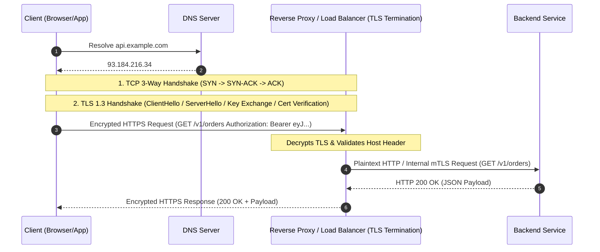

# HTTP vs HTTPS

## 1. One-minute explanation

HTTP (Hypertext Transfer Protocol) is an unencrypted, plaintext application-layer protocol for transferring data over TCP (port 80). Because it is plaintext, any intermediary on the network path can inspect, alter, or spoof traffic (Man-in-the-Middle attacks). HTTPS (HTTP Secure) runs standard HTTP over a cryptographic transport layer called TLS (Transport Layer Security, running over port 443). HTTPS provides three fundamental security guarantees: **Confidentiality** (symmetric encryption prevents eavesdropping), **Integrity** (cryptographic MACs/hashes detect tampering), and **Authentication** (digital certificates signed by Certificate Authorities verify server identity). In modern production backend architecture, HTTPS is non-negotiable for all external internet traffic and increasingly enforced internally via service meshes.

---

## 2. What is it?

**HTTP** is the foundational client-server protocol of the World Wide Web. When a client sends a request (e.g., `GET /users/42`), the payload travels across public routers, switches, and ISPs as clear text bytes.

**HTTPS** is not a distinct protocol; rather, it is HTTP traffic encapsulated inside a TLS connection. The application logic remains identical: HTTP verbs (`GET`, `POST`, `PUT`, `DELETE`), headers, and status codes are preserved, but all payload and header data are encrypted prior to network transmission.

| Attribute | HTTP | HTTPS |
| :--- | :--- | :--- |
| **Default Port** | 80 | 443 |
| **Security Layer** | None (Plaintext TCP) | TLS / SSL over TCP |
| **Encryption** | None | Symmetric encryption (e.g., AES-GCM, ChaCha20) |
| **Integrity Check** | TCP checksum only (errors, not attacks) | HMAC / AEAD cryptographic authentication |
| **Identity Verification**| None | X.509 Digital Certificates signed by Public CAs |
| **Performance Overhead**| Lower handshake latency (1 RTT TCP) | Additional TLS Handshake RTT (0-1 RTT in TLS 1.3) |

---

## 3. Why do we need it?

In the early internet, communications were largely assumed to occur within trusted networks. In modern distributed systems, data traverses untrusted public infrastructure. Without HTTPS:

1. **Eavesdropping (Loss of Confidentiality):** Passwords, session cookies, auth tokens (`Authorization: Bearer ...`), and PII are exposed to packet sniffers (Wireshark, public Wi-Fi rogue access points).
2. **Tampering (Loss of Integrity):** Malicious routers or ISPs can inject ads, malicious JavaScript, or alter API responses (e.g., changing destination account numbers in financial payloads).
3. **Impersonation (Loss of Authentication):** DNS spoofing or ARP poisoning can route client traffic to a fake server without the client's knowledge.

---

## 4. How does it work internally?

### The Protocol Stack
```
+----------------------------------------+
| HTTP Application Layer (Methods, JSON) |
+----------------------------------------+
| TLS Security Layer (Encryption, Auth)  |  <--- HTTPS inserts this layer
+----------------------------------------+
| TCP Transport Layer (Ports 80 / 443)   |
+----------------------------------------+
| IP Network Layer (IP Routing)          |
+----------------------------------------+
```

### Protocol Evolution: HTTP/1.1 vs HTTP/2 vs HTTP/3
- **HTTP/1.1:** Text-based. Supports persistent TCP connections (`Connection: keep-alive`), but suffers from **Head-of-Line (HoL) Blocking at the application layer** (requests on a single connection must be processed sequentially).
- **HTTP/2:** Binary framing protocol. Enables **Multiplexing** (multiple concurrent requests/responses over a single TCP stream), Header Compression (**HPACK**), and Server Push. Still suffers from TCP-level HoL blocking if a TCP packet is dropped.
- **HTTP/3:** Replaces TCP with **QUIC** (Quick UDP Internet Connections). Implemented over UDP. Solves TCP Head-of-Line blocking completely (independent streams), achieves 0-RTT connection resumption, and supports seamless connection migration when switching client networks (e.g., Wi-Fi to 5G).

---

## 5. Architecture / Flow



---

## 6. Simple Example

### Plaintext HTTP Request over Wire
```http
GET /v1/account HTTP/1.1
Host: api.example.com
Authorization: Bearer secret_token_12345
User-Agent: curl/7.88.1

HTTP/1.1 200 OK
Content-Type: application/json
Content-Length: 48

{"account_id": "987", "balance": 15000.00}
```
*Vulnerability:* Anyone monitoring network packets reads `secret_token_12345` directly.

### HTTPS Encrypted Wire Output
```
17 03 03 00 50 a1 f3 9e 4c b2 19 ... [Encrypted ciphertext bytes]
```

---

## 7. Production Example: HTTP to HTTPS Redirect & HSTS

In production web applications, all HTTP traffic on port 80 is immediately redirected to HTTPS on port 443 with a `301 Moved Permanently` status code and strict security headers.

### NGINX Configuration
```nginx
# 1. Redirect HTTP to HTTPS
server {
    listen 80;
    server_name api.example.com;
    return 301 https://$host$request_uri;
}

# 2. Production HTTPS Server
server {
    listen 443 ssl http2;
    server_name api.example.com;

    ssl_certificate /etc/letsencrypt/live/api.example.com/fullchain.pem;
    ssl_certificate_key /etc/letsencrypt/live/api.example.com/privkey.pem;
    ssl_protocols TLSv1.2 TLSv1.3;
    ssl_ciphers HIGH:!aNULL:!MD5;

    # HSTS (Strict-Transport-Security) Header: Enforces HTTPS for 1 year including subdomains
    add_header Strict-Transport-Security "max-age=31536000; includeSubDomains; preload" always;

    location / {
        proxy_pass http://internal_backend_upstream;
        proxy_set_header Host $host;
        proxy_set_header X-Real-IP $remote_addr;
        proxy_set_header X-Forwarded-Proto https;
    }
}
```

---

## 8. When should we use it?

- **All Public-Facing APIs & Websites:** Compulsory for search engine ranking, browser compatibility, and basic privacy laws (GDPR, HIPAA, PCI-DSS).
- **Internal Microservice Traffic:** Recommended in zero-trust architectures using internal certificates or service mesh mTLS.

---

## 9. When should we avoid it?

- **Never avoid for external traffic.**
- **Edge cases for unencrypted internal traffic:** Inside a single private VPC between a TLS-terminating load balancer and backend worker nodes *if and only if* internal network isolation is guaranteed and low-latency/low-compute constraints dominate (though modern crypto hardware acceleration makes TLS overhead negligible).

---

## 10. Tradeoffs

| Aspect | HTTP | HTTPS |
| :--- | :--- | :--- |
| **Compute Overhead** | Zero cryptographic processing | Minor CPU cost for symmetric encryption (AES-NI hardware acceleration reduces this to <1%) |
| **Latency** | 1 RTT TCP connection | 1 RTT TCP + 1 RTT TLS 1.3 (0 RTT with session resumption) |
| **Certificate Lifecycle**| No management required | Certificates expire (requires automated renewal via ACME / Let's Encrypt) |
| **Debugging** | Easy to inspect with Wireshark/tcpdump | Requires decrypting proxy (Charles/mitmproxy) or ephemeral key logging |

---

## 11. Common Mistakes

1. **Mixed Content:** Serving an HTTPS HTML page that loads insecure HTTP assets (`<script src="http://...">`), which triggers browser security blocks.
2. **Missing HSTS (Strict-Transport-Security):** Without HSTS, the initial redirect from `http://` to `https://` is susceptible to an SSL Stripping attack.
3. **Expired or Self-Signed Certificates in Production:** Causes client SSL verification failures and broken API integrations.
4. **Weak Cipher Suites:** Allowing deprecated protocols (SSL 3.0, TLS 1.0, TLS 1.1) or weak ciphers (RC4, 3DES, CBC mode ciphers susceptible to BEAST/POODLE).

---

## 12. Related Concepts

- [TLS Architecture & Handshake Details](./tls.md)
- [mTLS (Mutual TLS) for Microservices](./mtls.md)
- [REST API Design Best Practices](../02-api-design/rest-apis.md)
- [Load Balancing & TLS Termination](../09-scalability/load-balancing.md)

---

## 13. Interview Questions

### Q1. What are the three primary security pillars provided by HTTPS?
**Answer:** HTTPS guarantees:
1. **Confidentiality:** Encrypts data in transit so third parties cannot read messages.
2. **Integrity:** Uses cryptographic message authentication codes (MAC / AEAD) to ensure data is not tampered with in transit.
3. **Authentication:** Uses X.509 digital certificates signed by trusted Certificate Authorities (CAs) to ensure clients are speaking to the genuine server.  
**Example:** An API consumer sending credit card data is protected from sniffers (confidentiality), modifications of the amount (integrity), and phishing gateways (authentication).  
**Why this matters:** Fundamental security baseline for backend systems.  
**Possible follow-up:** How does the browser verify that a certificate is trustworthy?

### Q2. What is the difference between HTTP/1.1, HTTP/2, and HTTP/3?
**Answer:**
- **HTTP/1.1:** Text-based, supports persistent connections, but requests must be sent sequentially per connection (Application-layer Head-of-Line blocking).
- **HTTP/2:** Binary framing, introduces multiplexed streams over a single TCP connection and HPACK header compression. Still susceptible to TCP-level packet loss head-of-line blocking.
- **HTTP/3:** Built on top of QUIC over UDP. Multiplexes independent streams at the transport layer, eliminating TCP HoL blocking, and enables 0-RTT handshakes and connection migration.  
**Example:** Under 2% packet loss, HTTP/3 maintains high throughput because dropped packets on one stream do not pause other streams.  
**Why this matters:** Crucial for mobile APIs and global scale latency optimization.  
**Possible follow-up:** How does QUIC handle packet loss without TCP?

### Q3. Why do we use symmetric encryption for data transfer and asymmetric encryption for the handshake in HTTPS?
**Answer:** Asymmetric encryption (RSA/ECC) is computationally expensive and slow for large data streams. Symmetric encryption (AES-256-GCM, ChaCha20) is thousands of times faster and supported natively in CPU instruction sets (AES-NI). Therefore, asymmetric encryption is used exclusively during the handshake to authenticate identity and establish a shared secret, after which all bulk data is encrypted symmetrically.  
**Example:** Handshake exchanges keys via Diffie-Hellman, and the ensuing 50MB file transfer uses AES-GCM.  
**Why this matters:** CPU utilization and request throughput on high-traffic backend gateways.  
**Possible follow-up:** What is Perfect Forward Secrecy (PFS)?

### Q4. What is HSTS and why is a 301 redirect alone not enough?
**Answer:** A standard `301 Moved Permanently` redirect from HTTP to HTTPS sends the initial request over plaintext HTTP. An attacker performing a Man-in-the-Middle (MitM) attack can intercept that first HTTP request and downgrade the connection (SSL Stripping). HSTS (`Strict-Transport-Security: max-age=31536000; includeSubDomains; preload`) instructs the browser/client to force all future requests directly to HTTPS before touching the network.  
**Example:** When a user types `example.com`, the browser rewrites it internally to `https://example.com` without initiating an unencrypted port 80 request.  
**Why this matters:** Closes the vulnerability window between initial user input and server redirect.  
**Possible follow-up:** What is the HSTS preload list?

### Q5. What is the difference between TLS Termination and TLS Passthrough at a Load Balancer?
**Answer:**
- **TLS Termination:** The Load Balancer decrypts the TLS connection, inspects HTTP headers (for routing, rate limiting, or WAF rules), and forwards plaintext HTTP or re-encrypted traffic to backend instances.
- **TLS Passthrough:** The Load Balancer forwards raw encrypted TCP packets straight to backend servers without decrypting. The backend server manages its own certificates.  
**Example:** An API gateway using TLS termination can inspect the `Authorization` header and apply path routing (`/v1/orders` vs `/v1/users`).  
**Why this matters:** Dictates where CPU load is spent, where certificates are managed, and compliance constraints (e.g., end-to-end encryption in banking).  
**Possible follow-up:** When is TLS Passthrough strictly required?

---

## 14. Advanced Interview Questions

### Q6. How does TLS 1.3 reduce handshake latency compared to TLS 1.2?
**Answer:** TLS 1.2 requires 2 full round-trips (2-RTT) to complete the cryptographic handshake before application data can be sent. TLS 1.3 consolidates the key exchange and cipher negotiation into a single round-trip (1-RTT) by having the client proactively send Diffie-Hellman key shares in the `ClientHello`. Furthermore, for returning clients, TLS 1.3 supports 0-RTT session resumption (Early Data).

### Q7. What are the security risks associated with 0-RTT Early Data in TLS 1.3?
**Answer:** 0-RTT data is vulnerable to **Replay Attacks**. Because the client sends encrypted data before a new handshake key is negotiated, a network eavesdropper can capture the initial 0-RTT packet and replay it to the server. To defend against this, servers must ensure that 0-RTT is only permitted for idempotent HTTP methods (like `GET`), or use replay-cache mechanisms.

---

## 15. Production Scenarios

### Scenario 1: Intermittent SSL Handshake Failures Under High Concurrency
**Problem:** During a flash sale, 5% of incoming mobile client connections fail during TLS handshake with `SSL_ERROR_SYSCALL` or connection reset.
**Root Cause Investigation:** 
1. Check CPU utilization on load balancers (crypto operations saturation).
2. Check file descriptor limits (`ulimit -n`) and TCP backlog queue (`net.core.somaxconn`).
3. Verify session resumption cache configuration (e.g., Redis/distributed session tickets).
**Resolution:** Enable TLS Session Resumption with Session Tickets (RFC 5077), distribute TLS termination across auto-scaled load balancer instances, and tune `net.ipv4.tcp_max_syn_backlog`.

---

## 16. Debugging Scenarios

### Scenario: API Client Fails with `SSL: CERTIFICATE_VERIFY_FAILED`
**Diagnostic Steps:**
1. Run `openssl s_client -connect api.example.com:443 -servername api.example.com -showcerts`
2. Check if the intermediate certificate chain is missing in the server's certificate file (serving only `cert.pem` instead of `fullchain.pem`).
3. Check certificate expiry date: `openssl x509 -enddate -noout -in cert.pem`
4. Verify SNI (Server Name Indication) support on legacy clients.

---

## 17. Common Misconceptions

- *Misconception:* "HTTPS encrypts the destination IP address and port."
  - *Reality:* IP addresses and TCP port numbers exist at Layer 3 and Layer 4 and remain visible in packet headers so network routers can route traffic.
- *Misconception:* "HTTPS makes backend applications significantly slower."
  - *Reality:* Modern CPUs have dedicated hardware instructions for AES (AES-NI). Combined with TLS 1.3 and HTTP/2 multiplexing, HTTPS is often faster than legacy HTTP/1.1.

---

## 18. Quick Revision

- HTTP is port 80 (plaintext); HTTPS is port 443 (HTTP over TLS).
- HTTPS ensures **Confidentiality, Integrity, and Authentication**.
- TLS 1.3 takes 1-RTT for new handshakes (0-RTT for resumed).
- Always configure `301` redirects and the `Strict-Transport-Security` (HSTS) header.
- HTTP/2 provides binary multiplexing; HTTP/3 uses QUIC over UDP to eliminate transport-level Head-of-Line blocking.

---

## 19. Interview-Ready Answer

> "HTTP is an unencrypted text protocol running on port 80 where headers and data are vulnerable to sniffing, tampering, and spoofing. HTTPS encapsulates HTTP within TLS on port 443, providing confidentiality via symmetric encryption, integrity via cryptographic checksums, and authentication via CA-signed X.509 certificates. In modern production systems, we terminate TLS at the reverse proxy or load balancer using TLS 1.3, enforce HSTS to protect against downgrade attacks, and utilize HTTP/2 or HTTP/3 multiplexing for performance."
