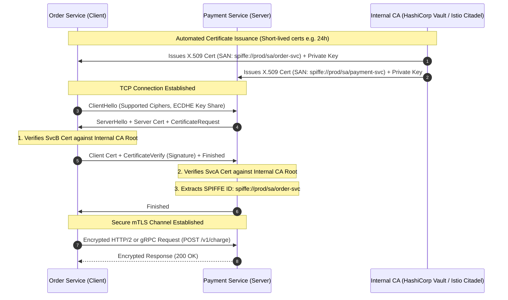

# Mutual TLS (mTLS)

## 1. One-minute explanation

Mutual TLS (mTLS) is an extension of standard TLS where **both** the client and the server authenticate each other's cryptographic identity using digital X.509 certificates. In standard one-way TLS, only the client verifies the server. In mTLS, the server additionally requests and verifies the client's certificate before completing the handshake. mTLS provides cryptographic client authentication, encryption in transit, and integrity at the transport layer, forming the cornerstone of **Zero Trust Architecture** and service mesh communication (e.g., Istio, Linkerd) in modern cloud-native backend environments.

---

## 2. What is it?

In conventional web traffic (one-way TLS), a browser validates that `api.stripe.com` belongs to Stripe, but the server has no cryptographic proof of the client's identity at the transport layer; client identity is handled at Layer 7 using bearer tokens, API keys, or cookies.

In **Mutual TLS (mTLS)**, both parties possess a private key and an X.509 certificate issued by a shared internal Public Key Infrastructure (Internal PKI / Private CA).

| Feature | Standard TLS (One-Way) | Mutual TLS (mTLS) |
| :--- | :--- | :--- |
| **Server Identity Verified?** | Yes (Client validates Server cert) | Yes (Client validates Server cert) |
| **Client Identity Verified?** | No (Transport layer is anonymous) | Yes (Server validates Client cert) |
| **Primary Use Case** | Public Web, Mobile Apps, External APIs | Microservice-to-microservice, B2B Fintech APIs |
| **Certificate Authority** | Public CAs (Let's Encrypt, DigiCert) | Internal Private CA (Vault, SPIFFE/SPIRE, Istio CA) |
| **Layer 7 Auth Required?** | Yes (Passwords, JWTs, OAuth2) | Optional / Complementary (End-user identity context) |

---

## 3. Why do we need it?

In monolithic architectures, all communication occurs in-memory. In microservice and Kubernetes architectures:
1. **Perimeter Defense is Broken:** An attacker breaching a single pod or edge proxy can pivot laterally across the internal flat network if internal traffic is plaintext.
2. **Man-in-the-Middle on Internal Networks:** Unencrypted internal traffic can be sniffed by compromised sidecars, network taps, or malicious multi-tenant neighbors.
3. **Spoofed Caller Identities:** Relying solely on IP whitelisting or unauthenticated HTTP headers (`X-Service-Name: payment-svc`) is trivial to spoof inside container networks.
4. **Zero Trust Mandate:** mTLS enforces the principle: *"Never trust, always verify."* Every microservice must cryptographically prove its identity for every single connection.

---

## 4. How does it work internally?

### 1. Certificate Issuance & Workload Identity (SPIFFE)
Modern cloud platforms assign cryptographic identities to workloads using SPIFFE IDs (Secure Production Identity Framework for Everyone), formatted as:
`spiffe://cluster.local/ns/production/sa/payment-service`

### 2. The mTLS Handshake Sequence
1. **ClientHello:** Client initiates TLS handshake.
2. **ServerHello + Certificate + CertificateRequest:** Server presents its certificate and explicitly sends a `CertificateRequest` packet specifying accepted Root CAs.
3. **Client Certificate + CertificateVerify:** Client presents its certificate and signs a hash of the previous handshake messages using its private key (`CertificateVerify`).
4. **Mutual Verification:** 
   - Client checks Server cert against its internal CA trust store.
   - Server checks Client cert against its internal CA trust store and verifies the client's digital signature.
5. **Encrypted Session Established:** Both nodes compute symmetric session keys and begin encrypted communication.

---

## 5. Architecture / Flow



---

## 6. Simple Example: Testing mTLS with `curl`

To authenticate against an mTLS-protected endpoint, the client must supply its client certificate and private key:

```bash
curl --cert /etc/certs/client-cert.pem \
     --key /etc/certs/client-key.pem \
     --cacert /etc/certs/internal-ca.pem \
     https://payment.internal.local:8443/v1/charge \
     -H "Content-Type: application/json" \
     -d '{"amount": 100, "currency": "USD"}'
```

If the client omits `--cert` or passes a certificate signed by an untrusted CA, the server aborts the TLS handshake immediately with `SSL alert number 42 (bad_certificate)` or `handshake_failure`.

---

## 7. Production Example: Service Mesh (Envoy Sidecar mTLS)

In production Kubernetes clusters, developers do not write mTLS code into application runtimes. Instead, an Envoy proxy sidecar handles transparent mTLS offloading.

### Istio PeerAuthentication Policy
```yaml
apiVersion: security.istio.io/v1beta1
kind: PeerAuthentication
metadata:
  name: default
  namespace: production
spec:
  # STRICT: Enforce mTLS for all incoming traffic; reject plaintext
  mtls:
    mode: STRICT
---
apiVersion: security.istio.io/v1beta1
kind: AuthorizationPolicy
metadata:
  name: payment-access-control
  namespace: production
spec:
  selector:
    matchLabels:
      app: payment-service
  action: ALLOW
  rules:
  - from:
    - source:
        # Only allow requests from the order-service service account
        principals: ["cluster.local/ns/production/sa/order-service-sa"]
    to:
    - operation:
        methods: ["POST"]
        paths: ["/v1/charge"]
```

---

## 8. When should we use it?

- **Zero-Trust Microservice Architectures:** Inter-service RPC / gRPC communication in Kubernetes and distributed clusters.
- **B2B / Partner API Integrations:** High-security financial APIs (banking gateways, payment processors, open banking PSD2 compliance).
- **IoT Device Authentication:** Manufacturing connected hardware devices with unique embedded X.509 client certificates provisioned at the factory.

---

## 9. When should we avoid it?

- **Public Consumer Web Traffic:** Browsers cannot easily manage individual private keys and certificates for millions of end users.
- **Simple Monolithic Applications:** If all components run inside a single process or private VPC without compliance/zero-trust mandates, mTLS adds operational complexity without immediate benefit.

---

## 10. Tradeoffs

| Pros | Cons |
| :--- | :--- |
| **Hardware-grade Transport Security:** Cryptographically proves caller identity before application layer runs. | **PKI Management Overhead:** Requires automated certificate lifecycle management (Vault, cert-manager). |
| **Prevents Lateral Movement:** Compromised nodes cannot spoof identity to other services. | **Debugging Complexity:** Packet captures (tcpdump) are fully encrypted and cannot be inspected without keys. |
| **Defense Against IP Spoofing:** Not reliant on brittle IP whitelists. | **Certificate Expiry Risk:** Misconfigured auto-renewals cause widespread system-wide catastrophic outages. |

---

## 11. Common Mistakes

1. **Long-Lived Certificates:** Issuing 5-year client certificates without a functional revocation list (CRL/OCSP). Best practice: Use short-lived certificates (e.g., 12–24 hours) renewed automatically.
2. **Confusing Authentication with Authorization:** mTLS verifies *who* the caller is (Service A). The application or gateway must still evaluate *what* Service A is permitted to do (Authorization Policy / RBAC).
3. **Ignoring End-User Identity:** mTLS proves the caller is `order-service`, but does not tell you *which end-user* clicked the button. Modern systems combine mTLS (service identity) with JWT Bearer tokens (end-user identity).

---

## 12. Related Concepts

- [HTTP vs HTTPS](file:///home/sameer/backendguide/01-networking/http-vs-https.md)
- [TLS Architecture](file:///home/sameer/backendguide/01-networking/tls.md)
- [Authentication vs Authorization](file:///home/sameer/backendguide/04-security/authentication-vs-authorization.md)
- [JWT vs Sessions](file:///home/sameer/backendguide/04-security/jwt-vs-sessions.md)

---

## 13. Interview Questions

### Q1. What is the fundamental difference between standard TLS and Mutual TLS (mTLS)?
**Answer:** Standard TLS is one-way authentication: the client validates the server's certificate, but the server accepts connections from any client without transport-layer authentication. In mTLS, both client and server present and validate X.509 certificates signed by a trusted Certificate Authority during the handshake.  
**Example:** In standard TLS, your browser checks google.com's cert. In mTLS, Google's internal billing service checks the order service's cert before accepting a TCP connection.  
**Why this matters:** Foundational knowledge for zero-trust microservice design.  
**Possible follow-up:** How does the server request the client certificate during the handshake?

### Q2. How is client identity extracted and utilized by the backend application in an mTLS connection?
**Answer:** During the TLS handshake, the server terminates the client certificate and inspects the certificate's **Subject Alternative Name (SAN)** or Common Name (CN). In microservices, this is typically formatted as a SPIFFE ID (`spiffe://domain/ns/prod/sa/order-service`). The server runtime or proxy forwards this validated principal into request context headers (e.g., `X-Forwarded-Client-Cert`) for downstream authorization checks.  
**Example:** NGINX config: `proxy_set_header X-Client-DN $ssl_client_s_dn;`  
**Why this matters:** Explains how transport-level identity bridges into application-level authorization.  
**Possible follow-up:** Is the `X-Forwarded-Client-Cert` header secure against spoofing?

### Q3. Why is mTLS preferred over API Keys or static Bearer tokens for microservice-to-microservice communication?
**Answer:**
1. **Cryptographic Proof of Possession:** A bearer token or API key is a bearer secret; if leaked or captured in logs, anyone can use it. In mTLS, the private key never leaves the client host; the client proves possession via cryptographic digital signatures (`CertificateVerify`).
2. **Automated Ephemeral Rotation:** Tools like SPIFFE/Vault rotate certificates every few hours transparently.
3. **Bi-directional Encryption & Integrity:** Enforces encryption on the wire natively at Layer 4/7 without custom application encryption logic.  
**Example:** If an attacker dumps service memory and finds an API key, they can impersonate the service. In mTLS, memory dump without the kernel-protected private key is useless.  
**Why this matters:** Security posture of enterprise microservice architectures.  
**Possible follow-up:** How do you handle certificate revocation in high-frequency microservice environments?

### Q4. How do service meshes like Istio or Linkerd implement mTLS transparently without code changes?
**Answer:** A service mesh injects an Envoy/Linkerd sidecar proxy container alongside each application container in the pod. The proxy intercepts all inbound and outbound pod network traffic using `iptables` rules.
- When App A calls App B, App A talks plaintext to its local sidecar over loopback `127.0.0.1`.
- Sidecar A initiates an mTLS connection across the network to Sidecar B.
- Sidecar B terminates mTLS, validates Sidecar A's certificate, and forwards plaintext HTTP/gRPC to App B over loopback.  
**Example:** Application code makes a standard HTTP request to `http://payment-service:8080/charge`, while wire traffic between nodes is fully encrypted mTLS on port 15006.  
**Why this matters:** Separates security infrastructure from business application code.  
**Possible follow-up:** What is the latency and CPU overhead of running sidecars?

---

## 14. Advanced Interview Questions

### Q5. In an mTLS architecture, how do you handle end-user context propagation across a chain of microservices?
**Answer:** mTLS establishes **Service-to-Service identity** (e.g., Service A is calling Service B). However, Service B also needs to know **User Identity** (e.g., User 123 initiated the request). The recommended pattern is **Dual-Token Architecture / Defense in Depth**:
1. Transport Layer: mTLS authenticates and encrypts the hop between Service A and Service B.
2. Application Layer: Service A passes a signed end-user JWT (JSON Web Token) in the `Authorization: Bearer <JWT>` header. Service B verifies the JWT signature to enforce user-level permissions.

---

## 15. Production Scenarios

### Scenario: Fleet-Wide Internal Outage Due to Expired Root CA
**Incident:** At 00:00 UTC, all microservices in a Kubernetes cluster begin failing with `remote error: tls: bad certificate`. All inter-service gRPC calls are severed.
**Root Cause:** The internal Root CA created 3 years prior expired without an automated rotation pipeline.
**Preventative Architecture:**
- Implement automated CA rotation with dual-root trust overlap (trusting both Old Root and New Root for a 30-day grace period).
- Alert on certificate expiry at 30, 14, and 7-day thresholds via Prometheus metrics (`x509_cert_expiry_timestamp`).

---

## 16. Debugging Scenarios

### Scenario: Testing mTLS Connection Failures Using OpenSSL
```bash
# Debug client-side certificate presentation and server trust verification
openssl s_client \
  -connect payment-service.internal:8443 \
  -cert /etc/certs/client.crt \
  -key /etc/certs/client.key \
  -CAfile /etc/certs/rootCA.crt \
  -tls1_3 -debug
```
Look for:
- `Acceptable client certificate CA names`: Does the server list the CA that signed your client cert?
- `verify return:1`: Indicates successful certificate validation.

---

## 17. Common Misconceptions

- *Misconception:* "mTLS eliminates the need for user authentication and authorization."
  - *Reality:* mTLS only proves the identity of the *machine/service*. It does not replace user login, session tokens, or resource-level permission checks.
- *Misconception:* "mTLS is too slow for production microservices."
  - *Reality:* With persistent connection pools (HTTP/2, gRPC) and TLS session resumption, the handshake overhead occurs once when the connection is established; subsequent requests over the stream incur zero handshake penalty.

---

## 18. Quick Revision

- mTLS = Both Client and Server authenticate each other with X.509 certs.
- Critical for **Zero Trust Architecture** and service meshes.
- Solves service impersonation and lateral movement within internal networks.
- Combine mTLS (service identity) with JWT (end-user identity) for full defense in depth.

---

## 19. Interview-Ready Answer

> "Mutual TLS (mTLS) is a two-way cryptographic authentication protocol where both client and server present X.509 certificates issued by a trusted internal PKI during the TLS handshake. Unlike one-way TLS, mTLS enables the server to verify the exact cryptographic identity of the calling service before accepting traffic. In modern cloud architecture, mTLS is the backbone of Zero Trust and service mesh implementations, providing encrypted transit, preventing lateral attacker movement, and replacing brittle IP-based access controls."
