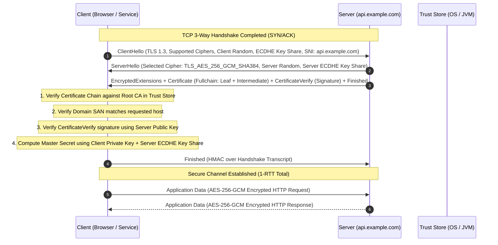

# Transport Layer Security (TLS)

## 1. One-minute explanation

Transport Layer Security (TLS) is a cryptographic protocol operating at the transport layer to secure communication across computer networks. It establishes a secure channel between client and server using a hybrid cryptographic model: **asymmetric cryptography** (such as ECDHE and RSA/ECDSA) authenticates the server's identity via X.509 digital certificates and securely negotiates a shared secret, while **symmetric cryptography** (such as AES-256-GCM or ChaCha20-Poly1305) encrypts all subsequent application data at wire speed. TLS 1.3 is the modern gold standard, reducing handshake latency to 1-RTT, mandating Perfect Forward Secrecy (PFS), and deprecating legacy insecure cipher suites.

---

## 2. What is it?

TLS is the direct, secure successor to the deprecated Secure Sockets Layer (SSL) protocol. When engineers say "SSL certificate" today, they are technically referring to an X.509 certificate used by TLS.

```
Protocol Evolution:
SSL 2.0 (1995 - Deprecated)
  └── SSL 3.0 (1996 - Deprecated / Vulnerable to POODLE)
        └── TLS 1.0 (1999 - Deprecated)
              └── TLS 1.1 (2006 - Deprecated)
                    └── TLS 1.2 (2008 - Mainstream / 2-RTT Handshake)
                          └── TLS 1.3 (2018 - Modern Standard / 1-RTT Handshake, PFS Mandatory)
```

### Core Cryptographic Building Blocks
1. **Public Key Infrastructure (PKI) & X.509 Certificates:** Verifies server identity via a trusted hierarchical Chain of Trust.
2. **Key Exchange (ECDHE - Elliptic Curve Diffie-Hellman Ephemeral):** Derives a shared symmetric key over an insecure channel without transmitting the key itself.
3. **Authenticated Encryption with Associated Data (AEAD):** High-performance symmetric cipher modes (e.g., AES-GCM) that provide both confidentiality and tamper-proof authentication tags.

---

## 3. Why do we need it?

Without TLS, network communication over public infrastructure is completely open to:
- **Eavesdropping:** Passive sniffers capture cleartext payloads (API tokens, passwords, credit card numbers).
- **Man-in-the-Middle (MitM) Attacks:** Active attackers intercept and modify requests/responses in flight.
- **Impersonation / Spoofing:** Clients cannot prove that the IP address responding to `bank.com` is legitimately owned by the bank.
- **Session Hijacking:** Attackers capture session identifiers and impersonate legitimate users.

---

## 4. How does it work internally?

### 1. The X.509 Certificate & Chain of Trust
An X.509 certificate contains:
- **Subject / SAN (Subject Alternative Name):** The domain(s) protected (e.g., `*.api.example.com`).
- **Public Key:** The public key belonging to the server.
- **Issuer:** The Certificate Authority that signed this certificate.
- **Validity Period:** `Not Before` and `Not After` timestamps.
- **Digital Signature:** Cryptographic hash of the certificate signed by the Issuer's private key.

```
[ Root CA (Pre-installed in OS / Browser Trust Store) ]
       │  (Signs Intermediate Certificate)
       ▼
[ Intermediate CA (e.g., Let's Encrypt R3 / DigiCert) ]
       │  (Signs Leaf / End-Entity Certificate)
       ▼
[ Leaf Certificate (api.example.com) ]
```

### 2. SNI (Server Name Indication)
In virtual hosting, multiple domains share a single server IP address. Because TLS handshake occurs before the HTTP `Host` header is transmitted, SNI allows the client to include the target hostname inside the unencrypted `ClientHello` message so the server can present the correct digital certificate.

### 3. Perfect Forward Secrecy (PFS)
In legacy static RSA key exchange, if an attacker recorded encrypted traffic today and stole the server's private key 5 years later, they could decrypt all historical traffic. PFS ensures that every session negotiates a unique, ephemeral key pair (ECDHE). Compromising the server's long-term private key does *not* compromise past recorded sessions.

---

## 5. Architecture / Flow



---

## 6. Simple Example: Inspecting TLS Handshake with OpenSSL

You can inspect the complete TLS negotiation and certificate chain using the OpenSSL CLI:

```bash
# Connect and print SSL certificate chain and negotiated cipher
openssl s_client -connect api.github.com:443 -servername api.github.com -tls1_3
```

**Key Output Fields:**
```text
CONNECTED(00000003)
---
Certificate chain
 0 s:CN = github.com
   i:C = US, O = DigiCert Inc, CN = DigiCert Global G2 TLS RSA SHA256 2020 CA1
 1 s:C = US, O = DigiCert Inc, CN = DigiCert Global G2 TLS RSA SHA256 2020 CA1
   i:C = US, O = DigiCert Inc, OU = www.digicert.com, CN = DigiCert Global Root G2
---
New, TLSv1.3, Cipher is TLS_AES_128_GCM_SHA256
Server public key is 256 bit EC
Protocol : TLSv1.3
Key Exchange : ECDH, P-256
---
```

---

## 7. Production Example: Production TLS Tuning (Go Server)

In production backend microservices, default TLS configurations should restrict insecure legacy protocols, enforce modern ciphers, and enable session tickets with automatic rotation.

```go
package main

import (
	"crypto/tls"
	"log"
	"net/http"
	"time"
)

func main() {
	mux := http.NewServeMux()
	mux.HandleFunc("/healthz", func(w http.ResponseWriter, r *http.Request) {
		w.WriteHeader(http.StatusOK)
		w.Write([]byte(`{"status":"healthy"}`))
	})

	tlsConfig := &tls.Config{
		// Enforce TLS 1.2 minimum; TLS 1.3 preferred
		MinVersion: tls.VersionTLS12,
		MaxVersion: tls.VersionTLS13,
		
		// Secure Cipher Suites for TLS 1.2 (TLS 1.3 ciphers are automatically negotiated)
		CipherSuites: []uint16{
			tls.TLS_ECDHE_ECDSA_WITH_AES_256_GCM_SHA384,
			tls.TLS_ECDHE_RSA_WITH_AES_256_GCM_SHA384,
			tls.TLS_ECDHE_ECDSA_WITH_CHACHA20_POLY1305,
			tls.TLS_ECDHE_RSA_WITH_CHACHA20_POLY1305,
		},
		PreferServerCipherSuites: true,
		CurvePreferences: []tls.CurveID{
			tls.X25519,
			tls.CurveP256,
		},
	}

	server := &http.Server{
		Addr:         ":8443",
		Handler:      mux,
		TLSConfig:    tlsConfig,
		ReadTimeout:  5 * time.Second,
		WriteTimeout: 10 * time.Second,
		IdleTimeout:  120 * time.Second,
	}

	log.Println("Starting Secure HTTPS Server on :8443...")
	log.Fatal(server.ListenAndServeTLS("/etc/certs/cert.pem", "/etc/certs/key.pem"))
}
```

---

## 8. When should we use it?

- **All Public Web and API Ingress:** Without exception.
- **Service-to-Service Ingress:** Securing inter-service calls across Availability Zones or Kubernetes clusters.
- **Database Client Connections:** Connecting to RDS, Cloud SQL, and Redis clusters over public or peering networks.

---

## 9. When should we avoid it?

- **Local in-memory loops:** Internal UNIX domain socket communication (`/var/run/app.sock`) on the same physical host machine.
- **High-throughput local sidecar proxies:** Envoy sidecars communicating via loopback (`127.0.0.1`) where the network namespace is strictly kernel-isolated and crypto overhead would be redundant.

---

## 10. Tradeoffs

| Factor | Detail |
| :--- | :--- |
| **Latency Overhead** | Adds 1 RTT (TLS 1.3) to 2 RTT (TLS 1.2) to the initial TCP handshake connection setup. |
| **Compute / Memory** | Memory footprint per concurrent open socket is slightly higher due to TLS buffer allocations (~16KB per buffer). Modern CPUs eliminate CPU bottlenecks via AES-NI. |
| **Operational Overhead** | Certificate rotation pipelines, monitoring expiration alerts, and revocation checking (OCSP Stapling). |

---

## 11. Common Mistakes

1. **Incomplete Certificate Chain:** Serving only the leaf certificate without the intermediate CA certificate. Browsers with cached intermediates may work, but mobile apps or backend API clients will fail with `unknown certificate authority`.
2. **Missing SNI Support:** Failing to pass the SNI header when calling multi-tenant backend services via curl or SDKs.
3. **Hardcoding Certificates in Client Code (Brittle Pinning):** Certificate pinning without a backup pin causes massive production outages when certificates are rotated or re-issued.
4. **Ignoring OCSP Stapling:** Forcing clients to synchronously query external CA OCSP servers slows down handshake latency and exposes client browsing metadata to the CA.

---

## 12. Related Concepts

- [HTTP vs HTTPS Overview](file:///home/sameer/backendguide/01-networking/http-vs-https.md)
- [mTLS: Mutual TLS Authentication](file:///home/sameer/backendguide/01-networking/mtls.md)
- [Authentication vs Authorization](file:///home/sameer/backendguide/04-security/authentication-vs-authorization.md)
- [Load Balancing & TLS Offloading](file:///home/sameer/backendguide/09-scalability/load-balancing.md)

---

## 13. Interview Questions

### Q1. Walk me through the TLS 1.3 handshake step by step.
**Answer:** 
1. **ClientHello:** Client sends supported TLS versions, cipher suites, a random nonce, SNI (requested domain), and an **ECDHE Key Share** (its public Diffie-Hellman parameter).
2. **ServerHello:** Server selects the cipher suite, responds with its own random nonce and its own **ECDHE Key Share**. At this exact point, both client and server can independently compute the shared master secret!
3. **Encrypted Extensions & Certificate:** Server sends encrypted metadata, its X.509 certificate chain, a cryptographic signature proving ownership of the private key (`CertificateVerify`), and a `Finished` message.
4. **Client Finished:** Client verifies the certificate chain, computes the master secret, verifies the server signature, sends a `Finished` message, and immediately transmits encrypted application data (1-RTT).  
**Example:** Client sends Key Share for Curve X25519; server agrees; handshake finishes in 1 round trip.  
**Why this matters:** Demonstrates deep understanding of core network protocol internals and latency drivers.  
**Possible follow-up:** How does this differ from TLS 1.2?

### Q2. What is Server Name Indication (SNI) and why is it necessary?
**Answer:** SNI is an extension to the TLS protocol that includes the desired hostname in the initial `ClientHello` message. Because TLS negotiation occurs before the HTTP `Host` header is sent, a server hosting multiple HTTPS websites on a single IP address needs SNI to know which SSL certificate to present to the client.  
**Example:** An NGINX server hosts `api.store.com` and `admin.portal.com` on the same IP `198.51.100.1`. SNI tells NGINX which cert to serve.  
**Why this matters:** Enables modern virtual hosting and multi-tenant cloud load balancers.  
**Possible follow-up:** What is Encrypted Client Hello (ECH)?

### Q3. What is Perfect Forward Secrecy (PFS) and how does it protect historical traffic?
**Answer:** Perfect Forward Secrecy ensures that compromise of a server's long-term private key does not compromise past session keys. With PFS (using Ephemeral Diffie-Hellman, ECDHE), a unique temporary key pair is generated for every session and discarded immediately after. An adversary who records encrypted network traffic today cannot decrypt it in the future, even if they obtain the server's private key.  
**Example:** TLS 1.3 completely removed static RSA key exchange to mandate PFS across all connections.  
**Why this matters:** Critical for regulatory compliance and defense against long-term data capture.  
**Possible follow-up:** How does static RSA key exchange work and why is it vulnerable?

### Q4. How does Certificate Authority (CA) chain verification work on a client?
**Answer:** The client's operating system or runtime contains a pre-installed **Trust Store** of Root CA certificates. When the server presents its Leaf certificate and Intermediate certificate, the client:
1. Verifies the Leaf certificate was signed by the Intermediate CA's public key.
2. Verifies the Intermediate certificate was signed by a Root CA present in its local Trust Store.
3. Checks dates (`Not Before` / `Not After`).
4. Checks the Subject Alternative Name (SAN) matches the hostname being accessed.
5. Checks revocation status via CRL or OCSP.  
**Example:** Leaf (`example.com`) -> Intermediate (`Let's Encrypt R3`) -> Root (`ISRG Root X1` in local trust store).  
**Why this matters:** Core understanding of internet trust architecture.  
**Possible follow-up:** What happens if a Root CA itself expires or gets compromised?

### Q5. What is OCSP Stapling and what problem does it solve?
**Answer:** Online Certificate Status Protocol (OCSP) allows clients to check if a certificate has been revoked. In traditional OCSP, every client connects directly to the CA's OCSP server during the TLS handshake, causing latency and leaking client IP browsing history to the CA. With **OCSP Stapling**, the *web server* periodically queries the CA, obtains a cryptographically signed time-stamped OCSP response, and "staples" it directly into the TLS handshake payload sent to the client.  
**Example:** NGINX fetches the OCSP response every hour and attaches it to `ServerHello`.  
**Why this matters:** Eliminates external network round-trips for clients and improves privacy.  
**Possible follow-up:** What is the `Must-Staple` certificate extension?

---

## 14. Advanced Interview Questions

### Q6. How does TLS Session Resumption work with Session Tickets (RFC 5077) vs Pre-Shared Key (PSK) in TLS 1.3?
**Answer:** In TLS 1.2 Session Tickets, the server encrypts the session state with a secret ticket encryption key (STEK) and sends it to the client as an opaque blob. On reconnection, the client sends this ticket back, allowing 1-RTT resumption without server-side memory storage. In TLS 1.3, this is standardized as Pre-Shared Key (PSK) resumption, which also enables 0-RTT "Early Data" transmissions.

### Q7. How do you manage Session Ticket Encryption Keys (STEK) across a fleet of horizontally scaled load balancers?
**Answer:** If 10 load balancers sit behind Anycast or DNS round-robin, a client might reconnect to a different server instance. All load balancer nodes must share and regularly rotate identical STEK keys (e.g., via HashiCorp Vault or a synchronized key ring) so any node can decrypt tickets issued by another node.

---

## 15. Production Scenarios

### Scenario: Service-to-Service API Outage Caused by Missing Intermediate Certificate
**Incident:** Internal backend workers calling an external vendor API start throwing `PKIX path building failed: unable to find valid certification path`.
**Root Cause:** The vendor renewed their certificate and updated their server with only the leaf cert `cert.pem` instead of `fullchain.pem`. Web browsers worked because they cached the intermediate CA, but the backend Java/Go client trust store failed validation.
**Remediation:** Vendor must bundle the intermediate cert into the web server certificate bundle.

---

## 16. Debugging Scenarios

### Scenario: Debugging TLS Cipher Mismatch / Incompatible Versions
**Command:**
```bash
# Test specific TLS version and cipher suite
openssl s_client -connect api.example.com:443 -tls1_2 -cipher ECDHE-RSA-AES128-GCM-SHA256
```
If the server does not support that cipher, OpenSSL returns `handshake failure (no shared cipher)`.

---

## 17. Common Misconceptions

- *Misconception:* "Public Key / Asymmetric encryption is used to encrypt all HTTP payload data."
  - *Reality:* Asymmetric crypto is used *only* during the handshake to authenticate identity and derive keys. Symmetric crypto (AES-GCM) encrypts the actual data.
- *Misconception:* "TLS guarantees that the backend application code is secure."
  - *Reality:* TLS secures the transport wire between endpoints. It does not protect against SQL injection, XSS, compromised databases, or malicious server code.

---

## 18. Quick Revision

- TLS provides **Authentication**, **Confidentiality**, and **Integrity**.
- TLS 1.3 achieves 1-RTT handshakes and mandates Perfect Forward Secrecy.
- X.509 chain: Leaf -> Intermediate -> Root CA.
- SNI allows multiple SSL domains on a single IP address.
- OCSP Stapling speeds up revocation checks without leaking client metadata.

---

## 19. Interview-Ready Answer

> "TLS is the cryptographic foundation of internet communication. It uses asymmetric cryptography and X.509 certificate chains to authenticate the server and negotiate ephemeral session keys via ECDHE. Once established, high-performance symmetric AEAD ciphers like AES-GCM encrypt the application data. TLS 1.3 streamlines this into a single round-trip handshake while enforcing Perfect Forward Secrecy, protecting past communication from future key compromises."
