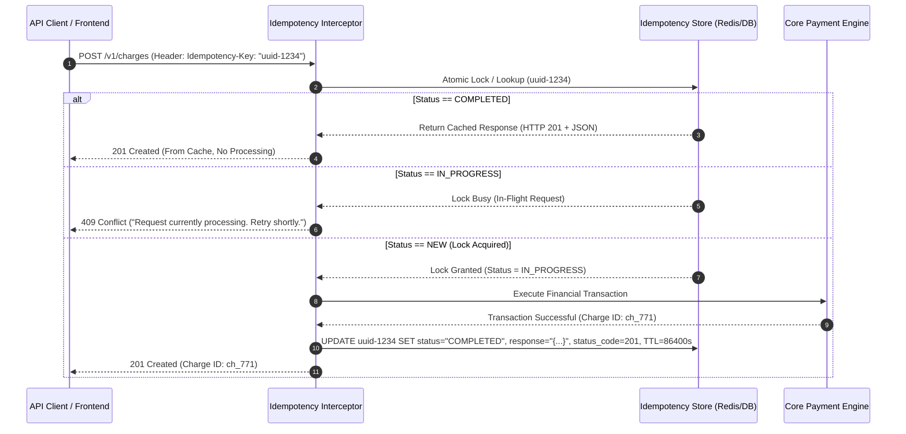

# Idempotency & Safe Retries

## 1. One-minute explanation

In backend engineering, an operation is **idempotent** if executing it multiple times produces the exact same side effects and resulting system state as executing it once ($f(f(x)) = f(x)$). In distributed systems, network timeouts are inevitable: when a client times out waiting for an HTTP `POST /payments` response, it is impossible to know whether the request failed before processing, failed during processing, or succeeded but the response packet was dropped. Without idempotency, automatic retries cause catastrophic double charges or duplicate database records. We implement idempotency using **Idempotency Keys** (client-generated UUIDs), distributed atomic locks (Redis `SET NX` or DB unique constraints), state machines (`IN_PROGRESS`, `COMPLETED`), and cached response payloads.

---

## 2. What is it?

Idempotency guarantees that duplicate requests can be safely processed or re-transmitted without unintended side effects.

### Mathematical & Distributed Definition
- If a client sends an identical request $N$ times with the same idempotency key, the backend executes the underlying state transition exactly once, and returns the identical response payload for all subsequent invocations.

```
Request 1: POST /payments ($100) -> Charge Created ($100 deducted) -> 201 Created
Request 2: POST /payments ($100) -> Duplicate detected -> Return Cached 201 Created (Balance unchanged)
Request 3: POST /payments ($100) -> Duplicate detected -> Return Cached 201 Created (Balance unchanged)
```

---

## 3. Why do we need it? The Network Timeout Problem

In computer networking, communication between two nodes has **three points of failure**:

```
Client                        Network                         Server
  │                              │                               │
  ├─────── 1. Request Sent ─────►│ (Packet lost in flight)       │ [Server never received]
  │                              ├─────── 1b. Delivered ────────►│ [Server processing...]
  │                              │                               │
  │                              │◄────── 2a. Processing Crash ──┤ [Server crashed mid-work]
  │                              │                               │
  │◄────── 2b. Drop in flight ───┴─────── 2. Response Sent ──────┤ [Server finished, response lost]
```

When a client experiences a `HTTP 504 Gateway Timeout` or socket read timeout:
- The client cannot distinguish between Case 1 (nothing happened), Case 2a (half-finished), or Case 2b (payment succeeded, but response was dropped).
- If the client retries without idempotency:
  - Case 1: Safe.
  - Case 2b: **Duplicate charge! Double billing! Data corruption!**

---

## 4. How does it work internally?

### The Idempotency Layer Architecture
1. **Client Generation:** Client generates a unique v4 UUID (`Idempotency-Key: 9b1deb4d-3b7d-4bad-9bdd-2b0d7b3dcb6d`) before the first request attempt and attaches it to request headers.
2. **Atomic Lock Acquisition:** 
   - Gateway/Backend checks the idempotency store (Redis or DB Table).
   - Atomic insert/lock: `SET key:uuid "IN_PROGRESS" NX EX 120` or SQL `INSERT INTO idempotency_keys (key, user_id, status) VALUES (...)`.
3. **State Evaluation:**
   - **Scenario A (First time):** Key successfully acquired. Application proceeds with business logic.
   - **Scenario B (Completed):** Key exists with status `COMPLETED`. Gateway returns the cached response body and HTTP status code immediately without re-executing business logic.
   - **Scenario C (In Progress):** Key exists with status `IN_PROGRESS`. Another concurrent thread or fast retry is active. Server returns `409 Conflict` or `425 Too Early` with header `Retry-After: 2`.
4. **Execution & Finalization:** Once business logic completes within a database transaction, update key status to `COMPLETED`, cache the response payload, and commit. Set a TTL (e.g., 24 hours to 7 days).

---

## 5. Architecture / Flow



---

## 6. Simple Example: Python + Redis Implementation

```python
import redis
import json
import uuid

r = redis.Redis(host='localhost', port=6379, db=0)

def process_payment_with_idempotency(user_id: str, idempotency_key: str, amount: float):
    cache_key = f"idempotency:{user_id}:{idempotency_key}"
    
    # 1. Try to atomically acquire lock with 120s timeout
    is_new = r.set(cache_key, json.dumps({"status": "IN_PROGRESS"}), nx=True, ex=120)
    
    if not is_new:
        cached_val = json.loads(r.get(cache_key))
        if cached_val["status"] == "COMPLETED":
            # Return cached response
            return cached_val["status_code"], cached_val["response"]
        elif cached_val["status"] == "IN_PROGRESS":
            return 409, {"error": "Concurrent request in progress with same idempotency key"}

    try:
        # 2. Execute actual payment logic
        charge_id = f"ch_{uuid.uuid4().hex[:12]}"
        response_payload = {"charge_id": charge_id, "amount": amount, "status": "succeeded"}
        
        # 3. Store completed state for 24 hours (86400 seconds)
        completed_record = {
            "status": "COMPLETED",
            "status_code": 201,
            "response": response_payload
        }
        r.setex(cache_key, 86400, json.dumps(completed_record))
        
        return 201, response_payload

    except Exception as e:
        # If business logic failed before charging, release lock so client can retry
        r.delete(cache_key)
        raise e
```

---

## 7. Production Example: Relational DB Transactional Idempotency

In payment systems, using the primary relational database ensures atomic consistency between business state changes and idempotency records.

### Database Schema
```sql
CREATE TABLE idempotency_records (
    id BIGSERIAL PRIMARY KEY,
    user_id VARCHAR(64) NOT NULL,
    idempotency_key VARCHAR(128) NOT NULL,
    request_hash VARCHAR(64) NOT NULL, -- SHA256 of request payload
    status VARCHAR(32) NOT NULL, -- 'IN_PROGRESS', 'COMPLETED', 'FAILED'
    response_code INT,
    response_body JSONB,
    created_at TIMESTAMP WITH TIME ZONE DEFAULT NOW(),
    updated_at TIMESTAMP WITH TIME ZONE DEFAULT NOW(),
    CONSTRAINT uq_user_idempotency_key UNIQUE (user_id, idempotency_key)
);
```

### Execution within Single DB Transaction
```sql
-- Step 1: Client sends request. Application attempts to insert lock record
INSERT INTO idempotency_records (user_id, idempotency_key, request_hash, status)
VALUES ('usr_100', 'uuid-9876-abcd', 'e3b0c44298fc1c149afbf4c8996fb924', 'IN_PROGRESS')
ON CONFLICT (user_id, idempotency_key) DO NOTHING;

-- If rows affected == 0, record exists! Check status:
SELECT status, response_code, response_body, request_hash 
FROM idempotency_records 
WHERE user_id = 'usr_100' AND idempotency_key = 'uuid-9876-abcd';
```

---

## 8. When should we use it?

- **All Mutating Financial / Billing Endpoints:** Payments, refunds, wallet transfers, subscription billing.
- **Order Placement / Inventory Deductions:** E-commerce checkout operations.
- **Third-Party Webhooks & Event Consumers:** Kafka/RabbitMQ message handlers consuming at-least-once deliveries.
- **Critical Infrastructure Actions:** Provisioning cloud servers, launching batch jobs.

---

## 9. When should we avoid it?

- **Read-Only Endpoints (`GET`, `HEAD`):** These are inherently safe and idempotent by HTTP specification.
- **High-Throughput Ephemeral Telemetry Ingestion:** IoT sensor metrics or clickstream beacons where occasional dropped or duplicated pings are preferable to database locking overhead.

---

## 10. Tradeoffs

| Pros | Cons |
| :--- | :--- |
| **Complete Protection Against Double Actions:** Eliminates duplicate charges and corrupted balances. | **Storage Overhead:** Requires maintaining idempotency tables or Redis keys with high write volume. |
| **Enables Aggressive Client Retries:** Clients can safely retry with exponential backoff on network blips. | **Concurrency Edge Cases:** Requires careful handling of concurrent identical requests. |
| **Auditability:** Exact historical log of client requests and returned responses. | **Payload Mismatch Complexity:** Requires detecting if a client reuses an old key with a *different* payload. |

---

## 11. Common Mistakes

1. **Reusing Idempotency Key with Modified Payload:** Client sends `{"amount": 100}` with Key A, and later sends `{"amount": 500}` with the same Key A. Server must validate `request_hash` (SHA256 of payload) and reject payload tampering with `422 Unprocessable Entity` or `400 Bad Request`.
2. **Missing Key Expiration (Unbounded Table Growth):** Failing to delete or partition idempotency records after 24h–7 days, causing billions of zombie rows in Postgres.
3. **Releasing Lock on Business Failures incorrectly:** If the bank card was declined, the state should be recorded as `COMPLETED` with status `402 Payment Required`, not deleted, to prevent retrying the same invalid card repeatedly.

---

## 12. Related Concepts

- [REST API Design & HTTP Verbs](file:///home/sameer/backendguide/02-api-design/rest-apis.md)
- [Database Transactions & ACID](file:///home/sameer/backendguide/05-databases/transactions-acid.md)
- [Race Conditions & Concurrency](file:///home/sameer/backendguide/08-concurrency/race-conditions.md)
- [Message Queues & At-Least-Once Delivery](file:///home/sameer/backendguide/07-messaging/message-queues-kafka.md)

---

## 13. Interview Questions

### Q1. Why is HTTP `POST` considered non-idempotent by default while `PUT` and `DELETE` are idempotent?
**Answer:** According to RFC 7231:
- `POST` is designed for subordinate resource creation or arbitrary command execution. Calling `POST /orders` 5 times creates 5 separate order records.
- `PUT` represents full replacement of a specific resource URI (`PUT /users/42`). Calling it 5 times with the same state results in the exact same resource state on the server.
- `DELETE /users/42` removes the resource. The first call deletes it; subsequent calls find it already deleted. The end state of the system is identical.  
**Example:** `POST /messages` sends 5 chat messages. `PUT /users/42/status` sets status to "active" once or 10 times with the same final database state.  
**Why this matters:** Core understanding of HTTP protocol contracts and REST semantics.  
**Possible follow-up:** If `DELETE` returns 200 on first call and 404 on second call, is it still idempotent?

### Q2. If `DELETE /items/10` returns `204 No Content` on the first call and `404 Not Found` on subsequent calls, is it still idempotent?
**Answer:** **Yes.** Idempotency applies to **server side-effects and resource state**, not necessarily identical HTTP response status codes. In both cases, after invocation 1, 2, or 100, item 10 does not exist in the database. The system state is identical.  
**Why this matters:** Eliminates a widespread misunderstanding during system design interviews.  
**Possible follow-up:** How should API clients handle 404s when retrying DELETE operations?

### Q3. How do you prevent a client from maliciously changing the request payload while keeping the same idempotency key?
**Answer:** When the server receives an idempotency key, it computes a cryptographic hash (e.g., SHA-256) of the HTTP method, URL path, and normalized request body payload, and saves this `request_hash` alongside the idempotency record. When a duplicate key arrives, the server hashes the new payload and compares it to the saved hash. If they do not match, the server rejects the request with `422 Unprocessable Entity` or `400 Bad Request: Idempotency key reused with different request payload`.  
**Example:** Stripe API enforces this payload hash verification across all endpoints.  
**Why this matters:** Security, fraud prevention, and system correctness.  
**Possible follow-up:** How do you normalize JSON payloads to avoid false hash mismatches due to whitespace/key ordering?

### Q4. What happens when two concurrent requests arrive at the exact same millisecond with the same Idempotency Key?
**Answer:** This is a classic race condition. The backend must rely on an **atomic locking primitive**:
1. **Redis:** `SET key:uuid "IN_PROGRESS" NX EX 120` (returns 1 to the winning thread, nil to the losing thread).
2. **Relational Database:** Unique index on `(user_id, idempotency_key)`. The first transaction succeeds; the second receives a unique constraint violation error (`SQLSTATE 23505`).
The losing thread returns `409 Conflict` or waits on a polling lock with exponential backoff until the winning thread finishes.  
**Why this matters:** Demonstrates concurrency management under high-load production scenarios.  
**Possible follow-up:** How do you handle distributed deadlocks if the winning thread crashes mid-execution?

### Q5. What is the recommended TTL (Time to Live) for Idempotency Keys in production?
**Answer:** Typically **24 hours to 7 days**, depending on the business domain. For payment APIs (like Stripe/Adyen), 24 hours is the industry standard because network retries and automated reconciliation occur within hours. Storing keys indefinitely wastes memory/storage and risks key collision years later.  
**Why this matters:** Capacity planning and database maintenance strategies.  
**Possible follow-up:** How do you purge expired idempotency records from a PostgreSQL table without locking the table?

---

## 14. Advanced Interview Questions

### Q6. How do you implement End-to-End Idempotency across a multi-hop microservice architecture?
**Answer:** When an edge gateway receives an idempotency key from a client:
1. The gateway registers the key.
2. The gateway propagates the *same* Idempotency Key (or derived sub-keys, e.g., `${parent_key}:payment`, `${parent_key}:ledger`) downstream across internal gRPC / Kafka headers to Order Service, Payment Service, and Warehouse Service.
3. Every downstream microservice uses its local transactional outbox or database table to ensure its own state mutation is idempotent against that key.

---

## 15. Production Scenarios

### Scenario: Payment Gateway Webhook Retry Flood
**Problem:** A payment provider (e.g., PayPal/Stripe) sends a webhook `payment.succeeded`. Your backend encounters a slow database query, taking 6 seconds to reply. The provider times out at 5 seconds and retries the webhook every 10 seconds, spawning 50 duplicate worker processes trying to fulfill the same order.
**Resolution:**
1. Ingest webhook immediately into a Kafka topic or Redis queue and respond `200 OK` in <50ms.
2. The asynchronous consumer uses a database unique constraint on `webhook_event_id` to ensure order fulfillment logic executes exactly once.

---

## 16. Debugging Scenarios

### Scenario: Stuck "IN_PROGRESS" Locks Caused by Unhandled Worker Panics
**Incident:** A backend worker crashes with Out-Of-Memory (OOM) while processing an order. The Redis key remains stuck in `IN_PROGRESS` state without a response body, causing all subsequent client retries to fail with `409 Conflict`.
**Fix:**
- Always enforce a strict TTL (e.g., `EX 120`) on `IN_PROGRESS` locks so locks auto-expire if a process dies abruptly.
- Implement an explicit `status_code: 500` fallback in a `finally` or panic recovery handler.

---

## 17. Common Misconceptions

- *Misconception:* "Idempotency means the server returns the exact same HTTP response code every time."
  - *Reality:* Idempotency guarantees identical *system side-effects and resource state*, even if status codes differ (e.g., 200 vs 204 or 404).
- *Misconception:* "Using UUIDs in the database primary key makes POST idempotent."
  - *Reality:* If a client retries and generates a *new* UUID each time, the server will insert duplicate rows. The client must supply the *same* idempotency key across all retry attempts.

---

## 18. Quick Revision

- Idempotency: $f(f(x)) = f(x)$.
- Protects against network timeouts, dropped responses, and duplicate charges.
- Implement via: Client UUID -> Atomic Lock (Redis `SET NX` or DB unique constraint) -> State Check -> Execution -> Cache Response.
- Verify request payload hash to prevent key reuse with altered arguments.
- Set reasonable TTLs (24h - 7d) and automatic lock timeouts.

---

## 19. Interview-Ready Answer

> "Idempotency ensures that performing an operation multiple times produces the exact same side effects and system state as performing it once. In production, when client requests encounter network timeouts, safe retries are enabled by attaching an Idempotency-Key header containing a client-generated UUID. The backend uses atomic locks in Redis or database unique constraints to ensure single execution, stores the status and cached response payload, and handles concurrent retries cleanly with 409 Conflict or cached replay."
