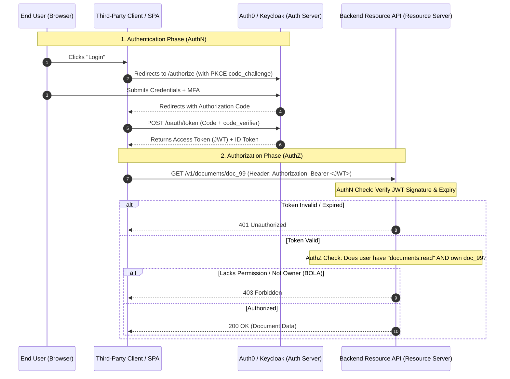

# Authentication vs Authorization

## 1. One-minute explanation

**Authentication (AuthN)** is the process of verifying *who* a user or service is (identity verification), whereas **Authorization (AuthZ)** is the process of determining *what* permissions or actions an authenticated identity is allowed to perform (access control). In HTTP terms, failing authentication yields a **401 Unauthorized** (unauthenticated), while failing authorization yields a **403 Forbidden** (authenticated but lacking permissions). Modern production backend systems implement authentication using OpenID Connect (OIDC), OAuth 2.0, Passkeys, or mTLS, and authorization using Role-Based Access Control (RBAC), Attribute-Based Access Control (ABAC), or dedicated policy engines like Open Policy Agent (OPA).

---

## 2. What is it?

| Aspect | Authentication (AuthN) | Authorization (AuthZ) |
| :--- | :--- | :--- |
| **Fundamental Question** | *"Who are you?"* | *"What are you permitted to do?"* |
| **Inputs** | Credentials (Passwords, MFA tokens, Biometrics, Private Keys) | Identity Context, Roles, Permissions, Resource Attributes |
| **Timing** | First step in the request lifecycle | Second step, evaluated after identity is established |
| **HTTP Status Code** | `401 Unauthorized` (Misnamed: means Unauthenticated) | `403 Forbidden` |
| **Standard Protocols** | OpenID Connect (OIDC), SAML, WebAuthn, mTLS | OAuth 2.0 Scopes, RBAC, ABAC, XACML, Zanzibar |
| **Failure Resolution** | Client must provide valid credentials (login) | Client cannot self-resolve unless granted higher privilege |

---

## 3. Why do we need it?

Without robust AuthN and AuthZ mechanisms:
1. **Broken Object Level Authorization (BOLA / IDOR):** An authenticated user changes `/api/v1/invoices/100` to `/api/v1/invoices/101` and reads another customer's financial records (the #1 vulnerability on OWASP API Top 10).
2. **Privilege Escalation:** A regular user modifies their role payload to `"role": "admin"` to gain root access.
3. **Data Breaches & Regulatory Violations:** Non-compliance with GDPR, HIPAA, and SOC2 requiring strict least-privilege access controls.

---

## 4. How does it work internally?

### 1. Access Control Models

#### Role-Based Access Control (RBAC)
Permissions are assigned to **Roles**, and Roles are assigned to **Users**.
```
[ User: Alice ] ──► [ Role: Editor ] ──► [ Permissions: posts:create, posts:edit ]
[ User: Bob ]   ──► [ Role: Viewer ] ──► [ Permissions: posts:read ]
```
- *Limitation:* Does not handle fine-grained context (e.g., "Alice can only edit posts *that she created*, and only *during business hours*").

#### Attribute-Based Access Control (ABAC)
Evaluates boolean logic over dynamic attributes:
- **Subject Attributes:** User role, department, clearance level.
- **Resource Attributes:** Document owner, classification, creation date.
- **Action Attributes:** `read`, `write`, `delete`, `approve`.
- **Environment Attributes:** Current time, client IP subnet, device security posture.

```
ALLOW IF:
  subject.role == "Doctor" AND
  resource.department == subject.department AND
  environment.is_hospital_network == TRUE
```

### 2. OAuth 2.0 Core Roles & Flows
OAuth 2.0 is an **authorization framework** allowing third-party applications to obtain limited access to an HTTP service on behalf of a resource owner.

```
Roles:
1. Resource Owner: The end user who owns the data.
2. Client: The third-party application requesting access.
3. Authorization Server: Issues access tokens after authenticating the Resource Owner.
4. Resource Server: The API hosting protected resources (validates tokens).
```

#### Modern Grant Types
- **Authorization Code Grant with PKCE (Proof Key for Code Exchange):** Standard for SPAs, mobile apps, and web applications.
- **Client Credentials Grant:** Machine-to-machine / Service-to-service backend authorization without user involvement.
- **Refresh Token Grant:** Exchanging a long-lived refresh token for a new short-lived access token.

---

## 5. Architecture / Flow



---

## 6. Simple Example: Python API Authorization Middleware

```python
from functools import wraps
from flask import request, jsonify, g
import jwt

SECRET_KEY = "production-jwt-secret-key"

# 1. Authentication Middleware (AuthN)
def authenticate_user(f):
    @wraps(f)
    def decorated(*args, **kwargs):
        auth_header = request.headers.get("Authorization")
        if not auth_header or not auth_header.startswith("Bearer "):
            return jsonify({"error": "Missing or malformed Authorization header"}), 401
        
        token = auth_header.split(" ")[1]
        try:
            payload = jwt.decode(token, SECRET_KEY, algorithms=["HS256"])
            g.current_user = payload  # e.g., {"user_id": 42, "role": "editor"}
        except jwt.ExpiredSignatureError:
            return jsonify({"error": "Token has expired"}), 401
        except jwt.InvalidTokenError:
            return jsonify({"error": "Invalid token"}), 401
            
        return f(*args, **kwargs)
    return decorated

# 2. Authorization Middleware (AuthZ)
def require_roles(*allowed_roles):
    def decorator(f):
        @wraps(f)
        def decorated_function(*args, **kwargs):
            user_role = g.current_user.get("role")
            if user_role not in allowed_roles:
                return jsonify({"error": "Forbidden: Insufficient role permissions"}), 403
            return f(*args, **kwargs)
        return decorated_function
    return decorator
```

---

## 7. Production Example: Storing & Validating High-Performance API Keys

For public developer APIs (like Stripe or GitHub), API keys must never be stored in plaintext.

### Secure API Key Architecture
1. **Key Generation:** Prefix + High-Entropy Secret: `sk_live_1234567890abcdef...`
2. **Storage:** Hash the key with SHA-256 before saving to the database.
3. **Lookup:** Server computes SHA-256 of incoming key header and performs constant-time lookup.

```sql
CREATE TABLE api_keys (
    id BIGSERIAL PRIMARY KEY,
    organization_id UUID NOT NULL,
    key_prefix VARCHAR(16) NOT NULL, -- e.g. "sk_live_" for fast indexing
    key_hash VARCHAR(64) NOT NULL UNIQUE, -- SHA-256 hash of full token
    scopes TEXT[] NOT NULL, -- e.g. ARRAY['read:orders', 'write:charges']
    rate_limit_rpm INT DEFAULT 1000,
    is_active BOOLEAN DEFAULT TRUE,
    expires_at TIMESTAMP WITH TIME ZONE,
    created_at TIMESTAMP WITH TIME ZONE DEFAULT NOW()
);

CREATE INDEX idx_api_keys_hash ON api_keys (key_hash) WHERE is_active = TRUE;
```

---

## 8. When should we use it?

- **RBAC:** Suitable for coarse-grained administrative tools (Admin, Editor, Viewer).
- **ABAC / Policy Engines (OPA/Zanzibar):** Multi-tenant SaaS, enterprise healthcare, document management systems with complex ownership and sharing permissions.
- **OAuth 2.0:** Whenever third-party applications or decoupled frontends/mobile apps access your APIs.
- **API Keys:** Machine-to-machine developer API integrations.

---

## 9. When should we avoid it?

- **Avoid heavy ABAC/Zanzibar systems for simple microservices:** Introduces unnecessary latency and operational complexity when simple RBAC or database ownership checks suffice.
- **Never use API Keys for end-user browser authentication:** Exposed to XSS and client-side extraction.

---

## 10. Tradeoffs: RBAC vs ABAC

| Attribute | RBAC | ABAC |
| :--- | :--- | :--- |
| **Complexity** | Low — easy to model and query | High — requires policy engine logic |
| **Granularity** | Coarse-grained | Extremely fine-grained |
| **Performance** | Very Fast ($O(1)$ set lookup) | Moderate (Evaluates complex attribute trees) |
| **Maintainability**| Suffers from "Role Explosion" as rules grow | Scales cleanly by defining dynamic rules |

---

## 11. Common Mistakes

1. **Confusing 401 and 403:** Returning 401 when a valid user tries to access an unauthorized resource confuses clients and triggers infinite re-login loops.
2. **Broken Object-Level Authorization (BOLA):** Checking that the user has the role `CUSTOMER`, but failing to check that `order.user_id == current_user.id`.
3. **Hardcoding Permissions in Application Code:** Scattering `if user.role == 'admin'` across 50 microservice files instead of centralized permission sets (`orders:delete`).

---

## 12. Related Concepts

- [JWT vs Sessions](./jwt-vs-sessions.md)
- [Mutual TLS (mTLS)](../01-networking/mtls.md)
- [REST API Status Codes](../02-api-design/rest-apis.md)

---

## 13. Interview Questions

### Q1. What is the fundamental difference between Authentication and Authorization? Give a concrete real-world analogy.
**Answer:** Authentication is proving *identity* ("Who you are"); Authorization is determining *access rights* ("What you are allowed to do").  
*Analogy:* When you board an airplane, your passport authenticates who you are. Your boarding pass authorizes you to sit in Seat 14B and enter the flight lounge, but does not authorize you to enter the cockpit.  
**Example:** Logging in with a username/password is Authentication (yields 401 if failed). Trying to delete another user's account is Authorization (yields 403 if denied).  
**Why this matters:** Foundational concept for designing secure backend architectures.  
**Possible follow-up:** What is the difference between 401 and 403 HTTP status codes?

### Q2. What is Broken Object Level Authorization (BOLA) and how do you prevent it?
**Answer:** BOLA (also known as Insecure Direct Object Reference, or IDOR) occurs when an API endpoint accepts an object identifier (e.g., `/api/v1/invoices/999`) and retrieves the record without verifying that the authenticated user actually owns or is permitted to access object `999`.  
**Prevention:**
1. Always scope database queries by the tenant/user context: `SELECT * FROM invoices WHERE id = :invoice_id AND organization_id = :current_user_org_id;`
2. Use non-enumerable, non-sequential IDs (e.g., UUIDv7 or prefixed NanoIDs: `inv_9b1deb4d...`) to prevent attackers from scraping adjacent IDs.  
**Why this matters:** Consistently ranked #1 in the OWASP API Top 10 vulnerabilities.  
**Possible follow-up:** Is using UUIDs alone sufficient to stop BOLA?

### Q3. Why is using UUIDs alone NOT a complete fix for BOLA?
**Answer:** UUIDs prevent attackers from guessing sequential integers (like ID 101, 102, 103), but if an attacker obtains a victim's UUID (via shared links, referer headers, or network leaks), an endpoint lacking server-side ownership checks will still serve the victim's data. Security through obscurity is not access control.  
**Why this matters:** Tests whether candidates understand defense in depth vs superficial fixes.  
**Possible follow-up:** How do you enforce authorization at the database layer directly?

### Q4. What is the difference between OAuth 2.0 and OpenID Connect (OIDC)?
**Answer:**
- **OAuth 2.0** is strictly an **Authorization framework**. It issues **Access Tokens** designed for APIs (Resource Servers) to authorize actions. It does not provide standard user identity information.
- **OpenID Connect (OIDC)** is an **Authentication layer** built directly on top of OAuth 2.0. It introduces the **ID Token** (a signed JWT containing user profile claims like `sub`, `email`, `name`, `auth_time`) and the standard `/userinfo` endpoint.  
**Example:** "Sign in with Google" uses OIDC to prove who you are (ID Token) and OAuth 2.0 to grant the app access to your Google Drive files (Access Token).  
**Why this matters:** Eliminates widespread confusion between identity federation and access delegation.  
**Possible follow-up:** Can you use an OAuth 2.0 Access Token for authentication?

### Q5. How should high-throughput API Keys be stored and verified securely?
**Answer:**
1. Never store API keys in plaintext in the database.
2. Upon generation, display the raw key to the developer once.
3. Store the SHA-256 or SHA-512 hash of the API key in the database with a unique index.
4. When a request arrives with `Authorization: Bearer <api_key>`, compute the cryptographic hash and query the database/cache by `key_hash`.
5. Use constant-time comparison to prevent timing attacks.  
**Why this matters:** Prevents massive credential leaks if database read replicas or backup snapshots are compromised.  
**Possible follow-up:** Why use SHA-256 for API keys instead of slow hashing like bcrypt used for passwords?

---

## 14. Advanced Interview Questions

### Q6. Why is SHA-256 suitable for API keys while bcrypt/Argon2 is mandatory for passwords?
**Answer:** Passwords chosen by humans have low entropy (e.g., 8–12 characters, dictionary words) and require slow, memory-hard hashing algorithms (bcrypt/Argon2 with work factors) to protect against offline GPU brute-force attacks. API keys are machine-generated strings with 128+ bits of cryptographic entropy (e.g., `crypto/rand` generating 32 random bytes). With $2^{128}$ possible combinations, brute-forcing a raw SHA-256 hash is mathematically impossible, allowing fast hashing to handle thousands of requests per second.

---

## 15. Production Scenarios

### Scenario: High-Frequency Permission Checks in Microservices Causing Database Saturation
**Problem:** In an enterprise SaaS app with ABAC, every microservice queries the centralized Auth DB to evaluate permissions on every incoming HTTP request, generating 50,000 DB queries/sec and causing connection pool exhaustion.
**Solution:**
1. **Decentralized Policy Evaluation (Open Policy Agent - OPA / Envoy):** Run an OPA sidecar or in-memory policy cache locally inside each microservice.
2. **Self-Contained Token Claims:** Encode coarse permissions/roles directly into the signed JWT access token.
3. **Local Cache with Invalidation Webhooks:** Cache fine-grained permissions in local Redis with a 60-second TTL and invalidate via Redis Pub/Sub when permissions change.

---

## 16. Debugging Scenarios

### Scenario: Intermittent 403 Errors Across Distributed Services
**Diagnostic Steps:**
1. Inspect JWT payload claims: `jwt.io` or `jwt-cli` to check if `scope` or `roles` array is missing expected claims.
2. Check token expiration (`exp`) and clock skew between microservice system clocks using NTP.
3. Check if the upstream API gateway stripped the authorization header before routing to the downstream service.

---

## 17. Common Misconceptions

- *Misconception:* "An ID Token can be used to call backend APIs as an Access Token."
  - *Reality:* ID Tokens are meant for the *client frontend* to display user profile info. Access Tokens are meant for *APIs* to authorize requests.
- *Misconception:* "Role-Based Access Control (RBAC) is sufficient for all enterprise applications."
  - *Reality:* RBAC fails when authorization depends on resource ownership, relationship hierarchies, or dynamic context (time, location), necessitating ABAC or graph-based access control (Zanzibar).

---

## 18. Quick Revision

- AuthN = Who are you? (401). AuthZ = What can you do? (403).
- Always prevent BOLA/IDOR by scoping database queries to the authenticated tenant/owner.
- OAuth 2.0 = Authorization; OIDC = Authentication (ID Token).
- Store API keys as SHA-256 hashes; store passwords using bcrypt/Argon2id.

---

## 19. Interview-Ready Answer

> "Authentication verifies the identity of a client using credentials like passwords, MFA, or certificates, returning 401 Unauthorized if invalid. Authorization determines whether an authenticated identity has permission to perform a specific action on a specific resource, returning 403 Forbidden if denied. In scalable backend systems, we combine OIDC for user authentication, OAuth 2.0 scopes with RBAC/ABAC for authorization, and strictly enforce tenant and resource ownership checks at the database query level to prevent BOLA vulnerabilities."
