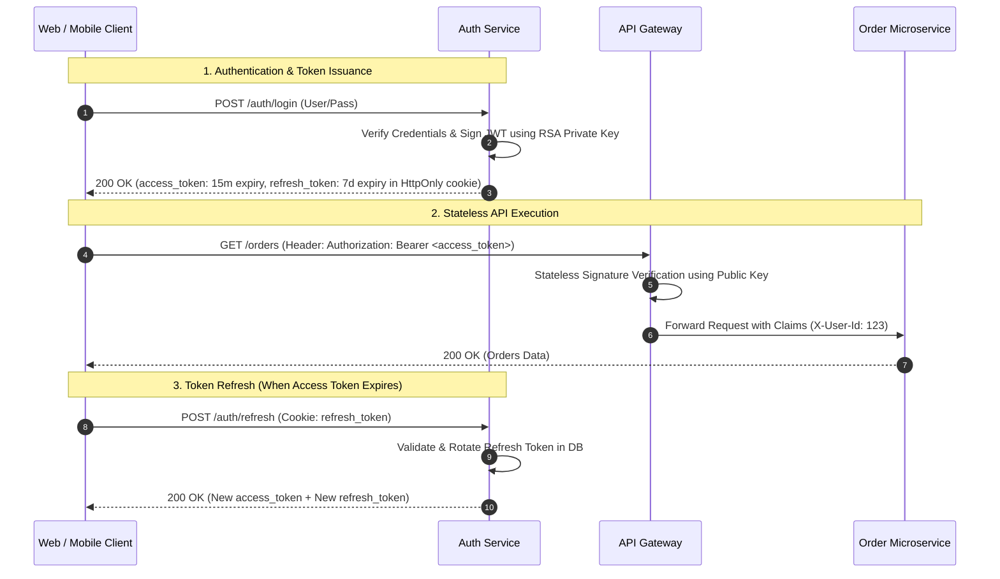

# JWT vs Sessions

## 1. One-minute explanation

Session-based authentication is **stateful**: the server creates a session record in a centralized store (Redis or DB) and returns an opaque, cryptographically random `session_id` stored inside a secure `HttpOnly` cookie. On every request, the backend performs a lookup to validate the session. In contrast, JSON Web Token (JWT) authentication is **stateless**: the server signs a structured JSON payload containing user identity and claims using a secret key (HMAC) or private key (RSA/ECDSA). The client sends this token in the `Authorization: Bearer` header, allowing any backend service to verify identity cryptographically without querying a central database. Sessions make instant revocation trivial but require stateful storage; JWTs scale effortlessly across microservices but make instant token revocation complex.

---

## 2. What is it?

### Session-Based Authentication (Stateful)
- **Token Type:** Opaque reference token (e.g., `sess_a7b8c9d0...`).
- **Data Location:** All user attributes, roles, and expiration dates reside on the **server-side** (Redis, Postgres, Memcached).
- **Client Storage:** Secure Cookie (`HttpOnly; Secure; SameSite=Lax`).

### JWT-Based Authentication (Stateless / Value Token)
- **Token Type:** Self-contained value token containing header, payload, and digital signature.
- **Data Location:** Claims reside inside the token itself, carried on the **client-side**.
- **Client Storage:** Memory / Secure Cookie.

```
JWT Structure:
[ Base64URL(Header) ] . [ Base64URL(Payload) ] . [ Base64URL(Signature) ]

Example:
eyJhbGciOiJIUzI1NiIsInR5cCI6IkpXVCJ9.
eyJzdWIiOiIxMjM0NTYiLCJyb2xlIjoiYWRtaW4iLCJleHAiOjE3MjQ3NjgwMDB9.
SflKxwRJSMeKKF2QT4fwpMeJf36POk6yJV_adQssw5c
```

---

## 3. Why do we need it? Comparison & Engineering Tradeoffs

| Architectural Dimension | Stateful Sessions | Stateless JWTs |
| :--- | :--- | :--- |
| **Server State** | High (Store millions of active sessions in Redis/DB) | Zero (State is held in signed token) |
| **Scalability** | Bound to Redis/DB throughput and replication | Horizontally infinite (Any node verifies via public key) |
| **Instant Revocation** | **Trivial** (Delete session key in Redis in <1ms) | **Hard** (Token valid until `exp` unless using a blacklist) |
| **Payload Size** | Tiny (~32-byte opaque string) | Large (~500 bytes to 2KB per request) |
| **Microservice Decoupling** | Every service must call Session Store / Auth Service | Services verify signature locally with zero network I/O |
| **Data Freshness** | 100% real-time (Role changes take effect instantly) | Stale claims until token expiration / refresh |

---

## 4. How does it work internally?

### 1. The 3 Parts of a JWT
1. **Header:** Algorithm and token type (`{"alg": "RS256", "typ": "JWT"}`).
2. **Payload (Claims):**
   - *Registered Claims:* `sub` (Subject ID), `iss` (Issuer), `exp` (Expiration timestamp), `iat` (Issued at), `jti` (Unique token ID).
   - *Custom Claims:* `{"role": "admin", "org_id": "org_99"}`.
3. **Signature:** 
   $$\text{Signature} = \text{Sign}_{\text{private\_key}}(\text{Base64URL}(\text{Header}) + "." + \text{Base64URL}(\text{Payload}))$$

> **Signing vs Encryption:** Standard JWTs (JWS) are **signed, not encrypted**. The payload is merely Base64URL encoded; anyone on the network can decode and read the claims. To encrypt sensitive payloads, JSON Web Encryption (JWE) must be used.

### 2. Cookie Security Flags
When storing tokens or session IDs in browser cookies, three security flags are mandatory:
- **`HttpOnly`:** Prevents JavaScript (`document.cookie`) from accessing the cookie, blocking **Cross-Site Scripting (XSS)** token theft.
- **`Secure`:** Instructs browser to transmit cookie exclusively over encrypted **HTTPS (Port 443)** connections.
- **`SameSite=Lax` / `SameSite=Strict`:** Prevents browser from sending cookies on cross-origin requests, blocking **Cross-Site Request Forgery (CSRF)**.

---

## 5. Architecture / Flow



---

## 6. Simple Example: Node.js / Express JWT Verification

```javascript
const jwt = require('jsonwebtoken');

const PUBLIC_KEY = process.env.JWT_RSA_PUBLIC_KEY; // RSA Public Key

function verifyTokenMiddleware(req, res, next) {
  const authHeader = req.headers['authorization'];
  if (!authHeader || !authHeader.startsWith('Bearer ')) {
    return res.status(401).json({ error: 'Missing Bearer token' });
  }

  const token = authHeader.split(' ')[1];

  jwt.verify(token, PUBLIC_KEY, { algorithms: ['RS256'] }, (err, decodedClaims) => {
    if (err) {
      if (err.name === 'TokenExpiredError') {
        return res.status(401).json({ error: 'Token expired', code: 'TOKEN_EXPIRED' });
      }
      return res.status(401).json({ error: 'Invalid token signature' });
    }

    // Attach decoded identity to request object
    req.user = decodedClaims; // { sub: 'usr_100', role: 'admin', org_id: 'org_50' }
    next();
  });
}
```

---

## 7. Production Example: Refresh Token Rotation (RTR) Pattern

To mitigate the risk of refresh token theft, production systems enforce **Refresh Token Rotation (RTR)**. Every time a refresh token is used, it is invalidated and replaced with a newly issued refresh token.

### Database Schema
```sql
CREATE TABLE refresh_tokens (
    id BIGSERIAL PRIMARY KEY,
    user_id VARCHAR(64) NOT NULL,
    token_family_id UUID NOT NULL, -- Groups token lineage
    token_hash VARCHAR(64) NOT NULL UNIQUE,
    is_revoked BOOLEAN DEFAULT FALSE,
    expires_at TIMESTAMP WITH TIME ZONE NOT NULL,
    created_at TIMESTAMP WITH TIME ZONE DEFAULT NOW()
);
```

### Detection of Token Theft / Replay
If an attacker and a legitimate user both attempt to use the same old refresh token:
1. The backend detects that an *already consumed* refresh token was presented.
2. **Immediate Breach Action:** The backend invalidates the entire `token_family_id`, revoking all active sessions for that user across all devices.

---

## 8. When should we use it?

- **Use Sessions:**
  - Traditional server-rendered web applications (Next.js, Django, Rails, Laravel).
  - High-security applications requiring instant, zero-latency session revocation (banking portals, payment consoles).
- **Use JWTs:**
  - Microservice architectures where dozens of decoupled services need to verify identity independently without hammering a central database.
  - Mobile applications and single-page applications (SPAs) calling cross-domain APIs.
  - Single Sign-On (SSO) and federated identity protocols (OIDC / OAuth 2.0).

---

## 9. When should we avoid it?

- **Never store sensitive secrets (passwords, PII, SSNs) inside standard JWT payloads.**
- **Avoid JWTs with 30-day expiration periods without a refresh mechanism:** An exposed token allows an attacker full access for a month with no revocation ability.

---

## 10. Tradeoffs

| Strategy | Security | Scalability | Complexity |
| :--- | :--- | :--- | :--- |
| **Short-Lived JWT + Refresh Token Rotation** | High | High | Moderate |
| **Long-Lived JWT Only** | Critical Risk | High | Very Low |
| **Redis Session Store** | High | Moderate (Redis scale limit) | Low |

---

## 11. Common Mistakes

1. **Accepting `alg: "none"` in JWT Verification:** A classic security bug where attackers modify the header to `{"alg": "none"}` and strip the signature, causing vulnerable libraries to accept forged tokens.
2. **Storing JWTs in `localStorage`:** JavaScript running on the page (or injected via XSS) can read `localStorage` and exfiltrate tokens.
3. **Huge JWT Payloads:** Storing excessive claims (user permissions arrays with 500 items), ballooning HTTP headers to 10KB+ on every API call.
4. **Symmetric Secret Key Sharing Across All Microservices:** If 20 microservices share the same HMAC secret key, any compromised microservice can forge valid tokens for any user! (Best practice: Use asymmetric **RS256 / ES256** — Auth Service signs with Private Key; microservices verify with Public Key).

---

## 12. Related Concepts

- [Authentication vs Authorization](./authentication-vs-authorization.md)
- [REST APIs & Error Codes](../02-api-design/rest-apis.md)
- [Redis Caching & Invalidation](../06-caching/redis-caching.md)

---

## 13. Interview Questions

### Q1. Why is instant token revocation difficult with JWTs, and how do production systems solve it?
**Answer:** Because JWT verification is stateless (validated using only mathematical signature checks and the `exp` claim), the server does not consult a database on incoming requests. If a user logs out, changes their password, or gets banned, their active JWT remains valid until its expiration timestamp.  
**Production Solutions:**
1. **Short Expiration Windows:** Set access token TTL to 5–15 minutes and use refresh tokens for longevity.
2. **Token Blacklisting / Revocation List in Redis:** Store revoked token IDs (`jti`) in Redis with a TTL equal to the remaining token lifetime. Gateway checks Redis for revoked IDs. (Tradeoff: re-introduces stateful lookups).
3. **User Version / Epoch Counters:** Include a `token_version` claim in the JWT. If the user changes password or is banned, increment `user.token_version` in DB/cache. Microservices reject tokens whose version does not match.  
**Why this matters:** The core architectural tradeoff of stateless authentication.  
**Possible follow-up:** If you check Redis on every request for blacklisting, why not just use sessions?

### Q2. If you maintain a Redis blacklist for JWTs, why not simply use Sessions instead?
**Answer:** 
1. **Asymmetric Verification in Microservices:** With JWTs, 95% of microservices verify tokens locally via public keys with zero network I/O. Only edge API gateways or high-security mutations need to check the blacklist.
2. **Blacklist Size is Tiny:** A session store must hold entries for *every active user in the system* (e.g., 10 million users). A JWT blacklist holds entries *only for prematurely revoked tokens* (e.g., a few thousand users who logged out in the last 10 minutes).  
**Why this matters:** Demonstrates deep systems reasoning about memory footprint and network overhead.  
**Possible follow-up:** How do you structure the Redis key for token blacklists?

### Q3. Why should you use Asymmetric signing (RS256/ES256) instead of Symmetric signing (HS256) in microservice architectures?
**Answer:** 
- **HS256 (HMAC with SHA-256):** Uses a single shared secret key for both signing and verifying tokens. Every downstream microservice that needs to verify the token must possess the secret. If one microservice is compromised, an attacker gains the ability to forge valid tokens for any user in the entire company.
- **RS256 / ES256 (Asymmetric):** The Auth Service signs tokens using a strictly guarded **Private Key**. All downstream microservices only need the **Public Key** (distributed via a JWKS endpoint) to verify signatures. They cannot forge new tokens.  
**Why this matters:** Critical for least-privilege security boundaries in distributed systems.  
**Possible follow-up:** What is a JWKS (JSON Web Key Set) endpoint?

### Q4. Where should a frontend store a JWT to maximize security against XSS and CSRF?
**Answer:** The most secure location is in an **`HttpOnly`, `Secure`, `SameSite=Lax` or `Strict` cookie**.
- `HttpOnly` blocks JavaScript access, making token theft via Cross-Site Scripting (XSS) impossible.
- `Secure` forces transmission over HTTPS only.
- `SameSite` mitigates Cross-Site Request Forgery (CSRF).
Storing JWTs in `localStorage` or `sessionStorage` exposes tokens to any malicious third-party script, npm package vulnerability, or XSS vector.  
**Why this matters:** Web application security fundamentals.  
**Possible follow-up:** If tokens are stored in cookies, does the frontend still need CSRF tokens?

### Q5. What is Refresh Token Rotation (RTR) and why is it necessary?
**Answer:** Refresh Token Rotation issues a brand new refresh token every time the client exchanges an old refresh token for a new access token, simultaneously invalidating the old refresh token. If an attacker steals a refresh token and uses it, the next time the legitimate user attempts to refresh, the server detects that an already-used token was presented. The server treats this as an active breach, invalidates the entire token family, and forces all sessions to re-authenticate.  
**Why this matters:** Standard security recommendation for Single Page Applications (SPAs) and mobile apps (OAuth 2.0 Security Best Current Practice).  
**Possible follow-up:** How is token family lineage tracked in the database?

---

## 14. Advanced Interview Questions

### Q6. What is the difference between JWS (JSON Web Signature) and JWE (JSON Web Encryption)?
**Answer:**
- **JWS (Signed JWT):** Encodes the payload as plaintext Base64URL and adds a signature. Anyone can decode and read the contents; the signature only guarantees that the payload was not tampered with (Integrity & Authenticity).
- **JWE (Encrypted JWT):** Cryptographically encrypts the payload using symmetric/asymmetric algorithms (e.g., RSA-OAEP + AES-GCM). The payload cannot be read by anyone who does not possess the decryption key (Confidentiality + Integrity).

---

## 15. Production Scenarios

### Scenario: Sudden Token Validation Latency Spike Across Fleet
**Problem:** Downstream microservices experience a 50ms latency spike verifying JWT tokens because each service was fetching the Auth Server's JWKS (public keys) on *every single incoming request*.
**Solution:**
- Cache the JWKS public keys in-memory inside each microservice for 24 hours.
- Refresh public keys in the background or only on cache-miss when encountering an unknown key ID (`kid` header claim).

---

## 16. Debugging Scenarios

### Scenario: "jwt signature is invalid" After Rotating Keys
**Diagnostic Steps:**
1. Check the `kid` (Key ID) header in the decoded JWT.
2. Confirm the public key store holds both the new active signing key and the old key for the duration of the longest token lifespan.
3. Check for clock drift (NTP) between the server issuing the token and the server validating it.

---

## 17. Common Misconceptions

- *Misconception:* "JWTs are encrypted by default."
  - *Reality:* Standard JWTs are signed, not encrypted. Anyone can read claims by decoding the Base64 string at `jwt.io`.
- *Misconception:* "JWTs eliminate the need for databases entirely."
  - *Reality:* User registration, password verification, refresh token lineage, and permission updates still require a persistent database.

---

## 18. Quick Revision

- Sessions = Stateful (Redis/DB store, opaque ID in cookie, instant revocation).
- JWTs = Stateless (Self-contained, signed claims, horizontally scalable).
- Use **RS256/ES256** asymmetric keys for microservices.
- Enforce `HttpOnly; Secure; SameSite=Lax` cookies for browser storage.
- Combine short-lived Access Tokens (15 min) with Refresh Token Rotation (7 days).

---

## 19. Interview-Ready Answer

> "Session authentication stores user state on the server in Redis or a database, giving clients an opaque session ID cookie. This makes instant revocation and data freshness trivial, but creates centralized state and scaling bottlenecks. JWT authentication is stateless: the server cryptographically signs user claims into a self-contained token using asymmetric keys like RS256. Microservices can verify JWTs independently without hitting a database. In production, we balance this tradeoff by using short-lived 15-minute access JWTs alongside refresh token rotation stored in HttpOnly cookies, backed by a lightweight Redis blacklist for emergency revocations."
