# Database Indexes & Query Optimization

## 1. One-minute explanation

A database index is an auxiliary, self-balancing search data structure (predominantly a **B+ Tree**) that maps indexed column values to their underlying table row locations. Without an index, the database must execute a **Full Table Scan** (Sequential Scan), reading every 8KB disk page in $O(N)$ time. With an index, the database performs an **Index Seek** in $O(\log N)$ time, traversing root-to-leaf nodes in 3–4 I/O operations. While indexes drastically accelerate `SELECT` queries with high selectivity, they incur trade-offs: every `INSERT`, `UPDATE`, and `DELETE` must synchronously update all associated index trees (causing disk writes and page splits), and consume substantial RAM and storage.

---

## 2. What is it?

An index is to a database table what a book index is to an encyclopedia. Instead of reading all 1,000 pages to find mentions of "Distributed Systems", you jump directly to the index at the back, find the term, and read the exact page numbers.

```
Without Index (Sequential Scan - O(N)):
Query: SELECT * FROM users WHERE email = 'alice@example.com';
[Row 1: bob@...] -> [Row 2: charlie@...] -> ... -> [Row 10,000,000: alice@...] 
(Scanned 10,000,000 rows across gigabytes of disk I/O)

With B+ Tree Index (Index Seek - O(log N)):
Query: SELECT * FROM users WHERE email = 'alice@example.com';
[Root Node] ──► [Branch Node 'A'-'M'] ──► [Leaf Page 'ali'] ──► Pointer to Row Tuple
(Found in 3 page reads in < 1 millisecond)
```

---

## 3. Why do we need it?

As database tables grow from thousands to tens of millions of rows:
1. **I/O Bottleneck:** A table scan on 50GB of data requires reading 50GB from disk/buffer cache into memory, saturating disk throughput and evicting cached pages.
2. **CPU Saturation:** Decompressing and evaluating query predicates across millions of rows pins CPU cores at 100%.
3. **Lock Contention:** Long-running table scans hold shared buffer locks, starving concurrent transactions and blocking writes.

---

## 4. How does it work internally?

### 1. B+ Tree Structure (The Universal Relational Index)
Unlike binary search trees (BST), a B+ Tree has a very high **fan-out** (typically 100 to 500 children per node), keeping tree depth shallow (3 to 4 levels for hundreds of millions of records).

```
                      [ Root Node: 50 | 100 ]
                     /           |           \
         [ Branch: 20 | 35 ]  [ Branch: 65 | 80 ]  [ Branch: 120 | 150 ]
        /       |       \
[ Leaf 1 ] <-> [ Leaf 2 ] <-> [ Leaf 3 ] <-> [ Leaf 4 ]  <--- Doubly Linked List for Range Scans
(10, 15, 20)   (25, 30, 35)   (55, 60, 65)   (70, 75, 80)
```

- **Non-Leaf Nodes:** Store only key values and child pointers to direct search traffic.
- **Leaf Nodes:** Store indexed keys along with pointers to actual row data.
- **Doubly Linked Leaf Chain:** Leaf pages are linked sequentially, allowing lightning-fast range queries (`WHERE age BETWEEN 20 AND 35`) without re-traversing the tree from the root.

### 2. Clustered vs Secondary (Non-Clustered) Indexes: Engine Differences

> [!IMPORTANT]
> How indexes map to row data depends heavily on the specific database storage engine!

| Database Engine | Table Organization | Clustered Index | Secondary Index Leaf Contains |
| :--- | :--- | :--- | :--- |
| **MySQL (InnoDB)** | **Index-Organized Table (IOT)** | The Primary Key is the Clustered Index; the leaf nodes *are* the actual full table rows. | The **Primary Key value** (requires a secondary lookup / "bookmark lookup" to the clustered index to fetch non-indexed columns). |
| **PostgreSQL** | **Heap-Organized Table** | No native clustered index (tables are un-ordered heaps). `CLUSTER` command is a one-time rewrite. | Direct **Tuple ID (`ctid`)** pointing to page offset in the heap table file. |
| **SQL Server / Oracle**| Supports both Heap tables and Clustered tables. | Leaf pages contain the actual data rows. | Row ID (RID for heap) or Clustered Key value. |

### 3. Specialized Index Types

- **Unique Index:** Guarantees uniqueness across column values while providing index lookup.
- **Covering Index (Index-Only Scan):** An index that contains *all* columns requested by a query (e.g., using PostgreSQL `INCLUDE (col2)` or compound keys). The database retrieves data entirely from the index without touching table heap pages.
- **Partial / Filtered Index:** Indexes only a subset of rows matching a constant condition:
  `CREATE INDEX idx_active_orders ON orders (customer_id) WHERE status = 'PENDING';` (Saves 90% space if completed orders dominate).
- **Hash Index:** $O(1)$ equality lookups (`=`), but does not support range scans (`<`, `>`, `BETWEEN`) or sorting (`ORDER BY`).
- **GIN / GiST (PostgreSQL):** Generalized Inverted Index (GIN) for arrays, JSONB keys, and Full-Text Search. GiST for PostGIS geometric coordinates.

---

## 5. Architecture / Flow

```mermaid
graph TD
    subgraph SeqScan ["Sequential Table Scan (O(N) - Costly)"]
        Q1["SELECT * FROM users WHERE email = 'bob@test.com'"] --> Engine1[DB Engine]
        Engine1 --> Page1["Disk Page 1 (100 rows evaluated)"]
        Page1 --> Page2["Disk Page 2 (100 rows evaluated)"]
        Page2 --> PageN["... 100,000 Pages Read from Disk ..."]
        PageN --> Match1["Found 1 Matching Row (High I/O Latency)"]
    end

    subgraph IndexSeek ["B+ Tree Index Seek (O(log N) - Ultra Fast)"]
        Q2["SELECT * FROM users WHERE email = 'bob@test.com'"] --> Engine2[DB Engine]
        Engine2 --> Root["B+ Tree Root Page"]
        Root --> Branch["Branch Page (B)"]
        Branch --> Leaf["Leaf Page ('bob@test.com')"]
        Leaf --> HeapPtr["Direct Pointer to Row"]
        HeapPtr --> Match2["Row Fetched in 3 Disk I/O Reads (<1ms)"]
    end
```



---

## 6. Simple Example: Creating & Analyzing Indexes in SQL

```sql
-- Create table
CREATE TABLE customers (
    id BIGSERIAL PRIMARY KEY,
    email VARCHAR(255) NOT NULL,
    status VARCHAR(32) NOT NULL,
    created_at TIMESTAMP WITH TIME ZONE DEFAULT NOW()
);

-- Query without index (Triggers Sequential Scan)
EXPLAIN ANALYZE SELECT * FROM customers WHERE email = 'user@example.com';
-- Output: Seq Scan on customers  (cost=0.00..18450.00 rows=1 width=38) (actual time=142.312..142.315 ms)

-- Create B-Tree index
CREATE UNIQUE INDEX idx_customers_email ON customers (email);

-- Query with index (Triggers Index Seek)
EXPLAIN ANALYZE SELECT * FROM customers WHERE email = 'user@example.com';
-- Output: Index Scan using idx_customers_email on customers  (cost=0.42..8.44 rows=1 width=38) (actual time=0.042..0.045 ms)
```

---

## 7. Production Example: Covering Index to Eliminate Heap Fetches

In high-throughput APIs, fetching the profile picture and username for user authentication is queried millions of times per hour.

```sql
-- PostgreSQL Covering Index using INCLUDE
CREATE INDEX idx_users_email_covering 
ON users (email) 
INCLUDE (username, status, password_hash);

-- Query executed by Login API
SELECT username, status, password_hash 
FROM users 
WHERE email = 'alex@company.com';
```

**Query Execution Plan Result:**
`Index Only Scan using idx_users_email_covering on users`
The database resolves the query directly from the cached B-Tree leaf pages without performing random I/O reads against the main table heap.

---

## 8. When should we use it?

- Columns frequently used in `WHERE`, `JOIN` (`ON a.id = b.user_id`), `ORDER BY`, and `GROUP BY` clauses.
- Foreign key columns to avoid full table scans during cascading operations.
- Columns with **High Selectivity / Cardinality** (e.g., UUIDs, email addresses, phone numbers).

---

## 9. When should we avoid it?

- **Low Selectivity Columns:** Columns with very few distinct values (e.g., `gender`, `is_active` where 95% are true). The query planner will ignore the index and use a table scan.
- **Write-Heavy Tables with Few Reads:** High-volume event logs, clickstreams, or telemetry metrics where index maintenance degrades insert throughput.
- **Tiny Tables:** Tables with fewer than a few hundred rows (a sequential scan of 2 disk pages is faster than traversing index pages).

---

## 10. Tradeoffs

| Benefit | Cost |
| :--- | :--- |
| Query lookup time reduced from $O(N)$ to $O(\log N)$. | **Write Amplification:** Slower `INSERT`, `UPDATE`, and `DELETE` (must update every index). |
| Drastically reduces CPU and disk I/O for filtered queries. | **Memory & Storage:** Indexes can consume 50% to 200% as much disk and RAM as the table itself. |
| Enables index-only scans and fast sorting. | **Page Splits:** Inserting out-of-order keys splits B-Tree leaf pages, causing disk fragmentation. |

---

## 11. Common Mistakes

1. **Applying Functions on Indexed Columns in `WHERE`:** 
   `WHERE DATE(created_at) = '2026-08-27'` or `WHERE LOWER(email) = '...'`. The database cannot use a standard index on `created_at` because the function wraps the column. (Fix: Use Expression / Functional Indexes: `CREATE INDEX idx_users_lower_email ON users (LOWER(email))`).
2. **Over-Indexing:** Adding 15 indexes on a single table, destroying insert performance and bloating the buffer pool.
3. **Ignoring Index Fragmentation & Bloat:** Failing to run `VACUUM` / `REINDEX` (Postgres) or `OPTIMIZE TABLE` (MySQL) after massive delete operations.

---

## 12. Related Concepts

- [Composite Indexes & Column Ordering](./composite-indexes.md)
- [Database Transactions & ACID](./transactions-acid.md)
- [N+1 Query Problem](./n-plus-one.md)

---

## 13. Interview Questions

### Q1. How does a B+ Tree index work internally, and why is it preferred over a Binary Search Tree (BST) or Hash Table for databases?
**Answer:** A B+ Tree is a self-balancing $M$-way search tree with high fan-out (hundreds of keys per node) stored on disk pages (typically 8KB or 16KB).
- **Why not BST?** A binary tree has a fan-out of only 2. For 100 million rows, a BST has depth $\approx 27$, requiring 27 separate random disk I/O seeks per query. A B+ Tree with fan-out 500 has depth 3–4, requiring only 3–4 page reads.
- **Why not Hash Index?** Hash tables provide $O(1)$ lookups for exact matches (`=`), but cannot perform range scans (`BETWEEN`, `<`, `>`), prefix searches (`LIKE 'abc%'`), or ordered retrieval (`ORDER BY`). B+ Trees excel at both point lookups and range scans via doubly linked leaf pages.  
**Why this matters:** Core understanding of storage engine mechanics.  
**Possible follow-up:** What happens during a B+ tree page split?

### Q2. What is the difference between a Clustered Index and a Secondary (Non-Clustered) Index in MySQL InnoDB vs PostgreSQL?
**Answer:**
- **MySQL (InnoDB):** The table is physically structured around the **Clustered Index** (the Primary Key). Leaf pages contain the actual table row data. Any secondary index stores the indexed column values and the **Primary Key value**. A query on a secondary index that needs non-indexed columns must do a second lookup (Clustered Index seek) by PK.
- **PostgreSQL:** Uses a **Heap table** model. Table rows are stored in unordered heap pages. **All indexes in Postgres are secondary indexes**. The leaf nodes of every index contain the indexed column values and direct **Tuple IDs (`ctid`)** pointing to the heap file page and line pointer.  
**Why this matters:** Vital for predicting query execution costs across database engines.  
**Possible follow-up:** Why does InnoDB use the PK in secondary indexes instead of physical disk pointers?

### Q3. What is Index Cardinality and Index Selectivity, and how do they influence the query planner?
**Answer:**
- **Cardinality:** The number of unique values in a column (e.g., `user_id` has high cardinality; `gender` has low cardinality).
- **Selectivity:** The ratio of distinct values to total rows ($\frac{\text{Cardinality}}{\text{Total Rows}}$).
The query cost optimizer compares the estimated cost of an Index Scan vs a Table Scan. If selectivity is low (e.g., a query returns 40% of the entire table), random disk seeks to the heap table will be slower than a single sequential disk scan. The query planner will purposefully ignore the index.  
**Why this matters:** Explains why the database sometimes "refuses" to use your index.  
**Possible follow-up:** How do you update table statistics when query plans become suboptimal?

### Q4. What is a Covering Index and why is it powerful?
**Answer:** A Covering Index is an index that contains all columns requested by a `SELECT` query. When an index covers the query, the database performs an **Index-Only Scan**, satisfying the query entirely from the index pages in the buffer pool without touching table data blocks.  
**Example:** Query: `SELECT status, created_at FROM orders WHERE customer_id = 42;`  
Index: `CREATE INDEX idx_orders_cust_covering ON orders (customer_id, status, created_at);`  
**Why this matters:** Drastically reduces disk I/O and cache thrashing on high-frequency read endpoints.  
**Possible follow-up:** What is the difference between including a column in a compound index vs using the `INCLUDE` clause in Postgres?

### Q5. What is the difference between `EXPLAIN` and `EXPLAIN ANALYZE`?
**Answer:**
- **`EXPLAIN`:** Shows the execution plan chosen by the optimizer along with **estimated costs** and estimated row counts based on planner statistics, without actually executing the query.
- **`EXPLAIN ANALYZE`:** **Executes the query**, measuring actual runtime in milliseconds, actual row counts, buffer cache hits/misses, and memory usage alongside planner estimates.  
**Why this matters:** Essential tool for production slow-query diagnosis.  
**Possible follow-up:** What should you be cautious about when running `EXPLAIN ANALYZE` on a `DELETE` or `UPDATE` statement?

---

## 14. Advanced Interview Questions

### Q6. What is a PostgreSQL Bitmap Index Scan and when is it chosen over a regular Index Scan?
**Answer:** When a query matches thousands of rows across an index, a standard Index Scan performs random I/O jumping back and forth between index pages and heap pages. A **Bitmap Index Scan** creates an in-memory bitmap of physical heap page offsets where matching rows reside, sorts the page references sequentially, and reads table blocks in physical disk order, converting random I/O into sequential I/O. It can also perform bitwise AND/OR operations combining multiple indexes.

---

## 15. Production Scenarios

### Scenario: High CPU and 100% Disk Utilization After Deploying a Date Filter
**Problem:** An endpoint filtering orders created today (`WHERE created_at >= NOW() - INTERVAL '1 DAY'`) is timing out under load.
**Analysis:** `created_at` is indexed, but the query uses `WHERE DATE(created_at) = CURRENT_DATE`. Wrapping `created_at` inside the `DATE()` function prevents index usage, causing a full table scan of 80 million rows.
**Resolution:** Rewrite query to range predicates: `WHERE created_at >= CURRENT_DATE AND created_at < CURRENT_DATE + INTERVAL '1 day'`.

---

## 16. Debugging Scenarios

### Scenario: Diagnosing Why Postgres Query Planner Ignores an Index
**Diagnostic Query:**
```sql
EXPLAIN (ANALYZE, BUFFERS) 
SELECT * FROM payments WHERE status = 'PENDING';
```
Look for:
1. `Filter: (status = 'PENDING')` under `Seq Scan`.
2. Check table row count vs pending row count: If 60% of rows are 'PENDING', sequential scan is mathematically faster.
3. Check table statistics freshness: `ANALYZE payments;` to update planner distribution stats.

---

## 17. Common Misconceptions

- *Misconception:* "Adding an index will always speed up queries on that column."
  - *Reality:* If column selectivity is low or the query returns a large fraction of the table, the optimizer will skip the index.
- *Misconception:* "Primary Keys and Unique Constraints don't need indexes."
  - *Reality:* RDBMS engines automatically create an underlying B-Tree index to enforce Primary Key and Unique constraints.

---

## 18. Quick Revision

- Indexes replace $O(N)$ table scans with $O(\log N)$ B+ Tree seeks.
- B+ Tree leaf nodes are doubly linked for fast range queries.
- MySQL InnoDB secondary indexes store PK values; PostgreSQL indexes store heap `ctid` pointers.
- Covering indexes eliminate heap lookups via Index-Only scans.
- Use `EXPLAIN (ANALYZE, BUFFERS)` to inspect query plans.

---

## 19. Interview-Ready Answer

> "A database index is an auxiliary B+ tree data structure that enables logarithmic O(log N) point and range lookups by mapping indexed values to physical row locations. MySQL InnoDB organizes tables around the clustered primary key, while PostgreSQL uses heap-organized tables where all indexes are secondary. We use indexes on high-cardinality columns in WHERE and JOIN predicates, leverage covering indexes to enable index-only scans, and avoid over-indexing to protect write throughput and buffer pool memory."
