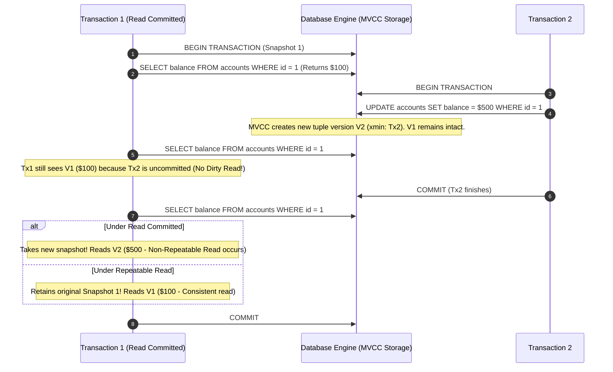

# Transaction Isolation Levels & Concurrency Anomalies

## 1. One-minute explanation

Transaction Isolation Levels define the degree to which concurrent transactions are insulated from each other's intermediate state mutations. The ANSI SQL standard defines four isolation levels: **Read Uncommitted**, **Read Committed**, **Repeatable Read**, and **Serializable**. Lower isolation levels maximize concurrency throughput but expose applications to data anomalies like **Dirty Reads**, **Non-Repeatable Reads**, and **Phantom Reads**. Modern database engines implement isolation using **Multi-Version Concurrency Control (MVCC)**, ensuring readers never block writers and writers never block readers by maintaining snapshot versions of rows.

---

## 2. What is it?

When thousands of users interact with a database simultaneously, total isolation (running transactions one after another sequentially) would eliminate concurrency and cripple throughput. Isolation levels allow engineers to choose the exact trade-off between **Data Consistency** and **Concurrent Throughput**.

### The 4 ANSI SQL Isolation Levels & Anomalies Matrix

| Isolation Level | Dirty Read | Non-Repeatable Read | Phantom Read | Serialization Anomaly / Write Skew | Default Engine |
| :--- | :--- | :--- | :--- | :--- | :--- |
| **Read Uncommitted** | **Allowed** | **Allowed** | **Allowed** | **Allowed** | Rarely used |
| **Read Committed** | *Prevented* | **Allowed** | **Allowed** | **Allowed** | **PostgreSQL**, Oracle, SQL Server |
| **Repeatable Read** | *Prevented* | *Prevented* | *Engine Specific* | **Allowed** | **MySQL (InnoDB)** |
| **Serializable** | *Prevented* | *Prevented* | *Prevented* | *Prevented* | High consistency systems |

---

## 3. Why do we need it? Understanding Concurrency Anomalies

### 1. Dirty Read ($G_1$)
A transaction reads data written by a concurrent uncommitted transaction. If that transaction rolls back, the first transaction acted on phantom data that never existed.

```
Tx 1: UPDATE account SET balance = 500 WHERE id = 1; (Uncommitted)
Tx 2: SELECT balance FROM account WHERE id = 1; (Reads 500! - DIRTY READ)
Tx 1: ROLLBACK; (Balance reverts to 100)
Result: Tx 2 acted on a phantom balance of 500.
```

### 2. Non-Repeatable Read / Fuzzy Read ($G_{2a}$)
A transaction re-reads a row it previously read and discovers that the row was modified or deleted by another committed transaction.

```
Tx 1: SELECT status FROM users WHERE id = 42; (Returns 'ACTIVE')
Tx 2: UPDATE users SET status = 'BANNED' WHERE id = 42; COMMIT;
Tx 1: SELECT status FROM users WHERE id = 42; (Returns 'BANNED' - Inconsistent within same Tx!)
```

### 3. Phantom Read ($A3$)
A transaction queries a range of rows matching a predicate, and upon re-querying finds new "phantom" rows inserted and committed by another transaction.

```
Tx 1: SELECT COUNT(*) FROM employees WHERE dept = 'Sales'; (Returns 5)
Tx 2: INSERT INTO employees (name, dept) VALUES ('Dave', 'Sales'); COMMIT;
Tx 1: SELECT COUNT(*) FROM employees WHERE dept = 'Sales'; (Returns 6 - PHANTOM ROW!)
```

### 4. Write Skew / Serialization Anomaly
Two concurrent transactions read overlapping datasets, verify a business constraint independently, and write non-overlapping changes that together violate the global business constraint.

*The On-Call Doctor Problem:*
- Rule: At least 1 doctor must remain on call at all times.
- Both Dr. Alice and Dr. Bob are currently on call.
- Alice and Bob simultaneously click "Go off call".
- Both transactions read: `COUNT(on_call) == 2` (Constraint satisfied: $2 - 1 \ge 1$).
- Alice's Tx updates Alice to inactive. Bob's Tx updates Bob to inactive. Both commit!
- **Result:** Zero doctors on call! (Write Skew).

---

## 4. How does it work internally? Multi-Version Concurrency Control (MVCC)

Modern databases avoid heavy shared read-locks by using **MVCC (Multi-Version Concurrency Control)**.

### The Core MVCC Rule:
> *"Readers do not block Writers, and Writers do not block Readers."*

### How MVCC Works Internally:
1. When a row is updated, the database does not overwrite the old data in-place.
2. It creates a **new version of the tuple/row** tagged with the creating Transaction ID ($T_{\text{create}}$).
3. The old row version is tagged with an expiration/deletion Transaction ID ($T_{\text{expire}}$).
4. Each transaction is given a **Snapshot / Read View** of active transactions at its start time. When reading, it only sees row versions that were committed prior to its snapshot.

```
PostgreSQL Tuple Headers:
[ Tuple V1 | xmin: 100 | xmax: 105 | Name: "Alice" ]  <-- Expired at Tx 105
[ Tuple V2 | xmin: 105 | xmax: 0   | Name: "Alicia" ] <-- Active from Tx 105
```

### Engine Specific Nuances:

> [!IMPORTANT]
> PostgreSQL vs MySQL InnoDB Implementations:
- **PostgreSQL:**
  - `Read Uncommitted` is internally mapped to `Read Committed` (PG never allows Dirty Reads).
  - `Repeatable Read` uses **Snapshot Isolation**: it prevents Dirty Reads, Non-Repeatable Reads, *and* Phantom Reads! However, it does *not* prevent Write Skew.
  - `Serializable` uses **Serializable Snapshot Isolation (SSI)**, tracking read-write dependency graphs (SIREAD locks) in memory and aborting transactions with `40001 (serialization_failure)` if a cycle occurs.
- **MySQL (InnoDB):**
  - Default is `Repeatable Read`.
  - For consistent reads (`SELECT`), InnoDB uses MVCC snapshots (preventing Dirty and Non-Repeatable reads).
  - For locking reads (`SELECT FOR UPDATE`, `UPDATE`), InnoDB prevents Phantom Reads using **Next-Key Locking** (combining Record Locks with Gap Locks over the index range).

---

## 5. Architecture / Flow



---

## 6. Simple Example: Demonstrating Isolation Levels in PostgreSQL

```sql
-- Terminal Session 1
SET TRANSACTION ISOLATION LEVEL READ COMMITTED;
BEGIN;
SELECT balance FROM accounts WHERE id = 1; -- Returns 100

-- Terminal Session 2 (Concurrent)
BEGIN;
UPDATE accounts SET balance = 200 WHERE id = 1;
COMMIT;

-- Terminal Session 1
SELECT balance FROM accounts WHERE id = 1; 
-- Under READ COMMITTED: Returns 200 (Non-repeatable read)
-- Under REPEATABLE READ: Returns 100 (Consistent snapshot)
COMMIT;
```

---

## 7. Production Example: Preventing Write Skew

To prevent the "On-Call Doctor" Write Skew anomaly without upgrading the entire database to `SERIALIZABLE`:

```sql
-- Solution 1: Explicit Pessimistic Locking (SELECT FOR UPDATE)
BEGIN;
-- Lock all rows matching the shift to serialize concurrent checks
SELECT COUNT(*) FROM doctor_shifts 
WHERE shift_date = CURRENT_DATE AND is_on_call = TRUE 
FOR UPDATE;

-- Evaluate condition in application: if count > 1:
UPDATE doctor_shifts 
SET is_on_call = FALSE 
WHERE doctor_id = 'dr_alice' AND shift_date = CURRENT_DATE;

COMMIT;
```

---

## 8. When should we use which level?

- **Read Committed (Default in most RDBMS):** Standard CRUD web applications where each read query should reflect the latest committed data.
- **Repeatable Read:** Financial reports, month-end billing runs, data analytics queries executing multiple related queries that require point-in-time consistency.
- **Serializable:** Financial transfers, auction bidding, inventory booking with complex multi-row invariant constraints where race conditions cause monetary loss.

---

## 9. When should we avoid Serializable?

- High-concurrency write workloads. Under Serializable (SSI), high contention causes frequent transaction aborts (`40001 serialization_failure`), requiring application retry loops.

---

## 10. Tradeoffs

| Level | Consistency | Throughput | Abort Rate / Latency |
| :--- | :--- | :--- | :--- |
| **Read Committed** | Moderate (Susceptible to Non-Repeatable & Phantom reads) | **Maximum** | Lowest abort rate |
| **Repeatable Read** | High (Consistent Snapshot) | High | Low abort rate |
| **Serializable** | **Absolute** (Mathematical serial equivalence) | Moderate / Low | High abort rate under contention (Requires application retry loops) |

---

## 11. Common Mistakes

1. **Assuming Repeatable Read Prevents All Concurrency Bugs:** Developers assume `REPEATABLE READ` prevents Write Skew or Lost Updates. (It does not).
2. **Missing Retry Logic with Serializable Isolation:** When using `SERIALIZABLE`, the application *must* wrap database operations in a retry block to handle serialization failure aborts (`SQLSTATE 40001`).
3. **Using Read Uncommitted for Performance:** The performance gain over MVCC Read Committed is negligible in modern engines, while data corruption risks are immense.

---

## 12. Related Concepts

- [Transactions & ACID](file:///home/sameer/backendguide/05-databases/transactions-acid.md)
- [Locks & Deadlocks](file:///home/sameer/backendguide/05-databases/locks-deadlocks.md)
- [Race Conditions](file:///home/sameer/backendguide/08-concurrency/race-conditions.md)

---

## 13. Interview Questions

### Q1. Explain Dirty Read, Non-Repeatable Read, and Phantom Read with distinct real-world scenarios.
**Answer:**
- **Dirty Read:** Transaction A updates a hotel room price to $50. Transaction B reads $50. Transaction A aborts/rolls back. Transaction B booked the room based on a price that was never committed.
- **Non-Repeatable Read:** Transaction A reads customer discount as 10%. Concurrently, Transaction B updates the discount to 20% and commits. Transaction A re-reads the discount for billing and sees 20%, resulting in inconsistent pricing calculations within the same transaction.
- **Phantom Read:** Transaction A queries `SELECT COUNT(*) FROM bookings WHERE hotel_id = 5` and gets 10. Concurrently, Transaction B inserts a new booking for hotel 5 and commits. Transaction A runs the count again and gets 11.  
**Why this matters:** Universal litmus test for relational database concurrency.  
**Possible follow-up:** How does Multi-Version Concurrency Control (MVCC) prevent dirty reads without using read locks?

### Q2. How does MVCC allow concurrent reads and writes without blocking?
**Answer:** MVCC maintains multiple chronological versions of every row tuple. When a row is modified, the database creates a new tuple version with an incremented transaction ID. When a read query executes, the engine creates a **Snapshot / Read View** and selects the most recent tuple version that was committed *before* the snapshot was taken. Because readers look at historical immutable snapshots in the buffer pool, they never block concurrent transactions writing newer versions to the table.  
**Why this matters:** Core architecture of modern high-performance databases (PostgreSQL, MySQL InnoDB, Oracle).  
**Possible follow-up:** What is the overhead of MVCC (Tuple bloat / VACUUM)?

### Q3. What is Write Skew and why does Repeatable Read fail to prevent it?
**Answer:** Write Skew occurs when two concurrent transactions read disjoint or overlapping datasets, check a shared invariant, and then make non-conflicting updates to *different* rows that collectively violate the invariant. Because neither transaction modifies the *exact same row*, standard row-level locks and snapshot isolation under `REPEATABLE READ` do not detect a conflict. Both transactions commit successfully, violating the business rule.  
**Example:** The "On-Call Doctor" problem or "White/Black Marble" problem.  
**Solution:** Explicit locking (`SELECT FOR UPDATE`), Unique Constraints, or `SERIALIZABLE` isolation level.  
**Why this matters:** Differentiates senior backend engineers from junior developers.  
**Possible follow-up:** How does PostgreSQL Serializable Snapshot Isolation (SSI) detect write skew?

### Q4. How does MySQL InnoDB prevent Phantom Reads in Repeatable Read?
**Answer:** While ANSI SQL states that `REPEATABLE READ` permits Phantom Reads, MySQL InnoDB prevents them via two mechanisms:
1. **For Consistent Reads (`SELECT`):** Uses MVCC snapshot isolation; queries always see the snapshot established at the start of the transaction.
2. **For Locking Reads (`SELECT ... FOR UPDATE`, `UPDATE`, `DELETE`):** Uses **Next-Key Locks** (a combination of a Record Lock on the index record and a **Gap Lock** on the gap before the index record). This prevents other transactions from inserting new rows into the gap.  
**Why this matters:** Demonstrates vendor-specific optimization knowledge.  
**Possible follow-up:** What is a Gap Lock?

### Q5. When a database transaction aborts with `SQLSTATE 40001 (serialization_failure)`, whose responsibility is it to resolve it?
**Answer:** It is the **Application Code's responsibility**. Under `SERIALIZABLE` or optimistic concurrency control, serialization failures are an expected outcome of high concurrency. The application must catch the serialization exception and retry the entire transaction from the beginning with exponential backoff and jitter.  
**Why this matters:** Essential for building resilient distributed microservices.  
**Possible follow-up:** How many retries should you configure before failing the user request?

---

## 14. Advanced Interview Questions

### Q6. How does PostgreSQL handle tuple garbage collection from MVCC bloat?
**Answer:** In PostgreSQL, updating a row leaves the old tuple in the table heap marked with `xmax`. As transactions commit, older tuples are no longer visible to any active snapshot and become "dead tuples". The **VACUUM** process (and background `autovacuum` daemon) scans heap pages, reclaims dead tuple storage, updates the Free Space Map (FSM), and freezes old transaction IDs to prevent 32-bit transaction ID wraparound.

---

## 15. Production Scenarios

### Scenario: Sudden Burst of `40001 serialization_failure` During High Traffic
**Problem:** An e-commerce service running under `SERIALIZABLE` isolation begins throwing thousands of transaction abort errors per minute during a product launch.
**Resolution:**
1. Downgrade non-critical read-heavy endpoints to `READ COMMITTED`.
2. For critical inventory updates, switch from `SERIALIZABLE` to `READ COMMITTED` with targeted pessimistic row locks (`SELECT * FROM inventory WHERE id = ? FOR UPDATE`).
3. Add application-level retry decorators with jitter.

---

## 16. Debugging Scenarios

### Scenario: Diagnosing MVCC Table Bloat in PostgreSQL
```sql
SELECT schemaname, relname, n_live_tup, n_dead_tup, 
       round(n_dead_tup * 100.0 / NULLIF(n_live_tup + n_dead_tup, 0),2) as dead_ratio
FROM pg_stat_user_tables 
ORDER BY n_dead_tup DESC;
```
If `dead_ratio` exceeds 20%, tune `autovacuum_vacuum_scale_factor` or trigger manual `VACUUM ANALYZE`.

---

## 17. Common Misconceptions

- *Misconception:* "Read Committed means reads lock the entire table."
  - *Reality:* Modern databases use MVCC snapshots; reads require zero locks and do not block writers.
- *Misconception:* "Repeatable Read is identical across all database engines."
  - *Reality:* PostgreSQL's Repeatable Read prevents Phantom Reads via snapshot isolation; MySQL InnoDB prevents them via Gap Locking; Oracle does not support Repeatable Read natively (maps to Serializable).

---

## 18. Quick Revision

- Read Committed prevents Dirty Reads (PostgreSQL default).
- Repeatable Read prevents Dirty & Non-Repeatable Reads (MySQL InnoDB default).
- Serializable prevents all anomalies including Write Skew.
- MVCC enables lock-free reads using historical row version snapshots.
- Always implement retry loops when operating under Serializable isolation.

---

## 19. Interview-Ready Answer

> "Transaction isolation levels balance data consistency against concurrent throughput. Read Committed prevents dirty reads using statement-level MVCC snapshots and is the standard default for PostgreSQL. Repeatable Read guarantees transaction-level snapshot consistency, preventing dirty and fuzzy reads. Serializable provides mathematical serial execution, eliminating phantom reads and write skew at the cost of higher abort rates. In production, we default to Read Committed for performance and apply explicit row-level locking or Serializable with retry loops for high-stakes financial operations."
