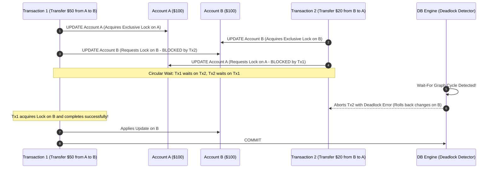

# Database Locks & Deadlocks

## 1. One-minute explanation

Database locks are concurrency control primitives used by database engines to serialize access to shared mutable data and enforce transaction isolation. Locks operate primarily as **Shared Locks (S-Locks)** for concurrent readers and **Exclusive Locks (X-Locks)** for writers. When multiple transactions attempt to acquire conflicting locks on overlapping resources in different orders, a **Deadlock** occurs—a circular wait state where no transaction can proceed. Database engines periodically run background **Wait-For Graph** cycle detection to automatically abort one "victim" transaction. In backend engineering, we prevent deadlocks by enforcing deterministic global lock ordering (e.g., sorting IDs before locking), minimizing transaction duration, and utilizing **Optimistic Locking** or `SKIP LOCKED`.

---

## 2. What is it?

### Lock Types & Compatibility Matrix

```
                 Requested Lock
                 Shared (S)   Exclusive (X)
Held  Shared (S)     ALLOW         BLOCK
Lock  Exclusive (X)  BLOCK         BLOCK
```

- **Shared Lock (S):** Multiple transactions can concurrently hold S-locks to read the same row. Prevents any transaction from acquiring an Exclusive lock.
- **Exclusive Lock (X):** Only a single transaction can hold an X-lock on a row. Blocks all other concurrent reads (`FOR UPDATE` / `FOR SHARE`) and writes.

### Lock Granularity
- **Database Level:** Restricts maintenance/migration tasks.
- **Table Level:** Acquired during `ALTER TABLE` or `LOCK TABLE`.
- **Page Level:** Blocks 8KB/16KB disk page.
- **Row Level:** Locks only the specific tuple/record modified (standard for high concurrency).

---

## 3. Why do we need it? Pessimistic vs Optimistic Locking

### 1. Pessimistic Locking (`SELECT FOR UPDATE`)
- **Philosophy:** *"Assume conflicts will happen; lock data upfront."*
- **Mechanism:** The transaction explicitly requests an Exclusive lock before inspecting or updating data.
- **When to use:** High contention environments (flash sales, high-frequency stock trading).

```sql
BEGIN;
SELECT stock FROM products WHERE id = 101 FOR UPDATE; -- Acquires Exclusive Row Lock
-- Business logic checks: if stock >= 1
UPDATE products SET stock = stock - 1 WHERE id = 101;
COMMIT; -- Releases Lock
```

### 2. Optimistic Locking (`version` column)
- **Philosophy:** *"Assume conflicts are rare; verify at commit time."*
- **Mechanism:** No locks are held during read. The table contains a `version INT` column. When updating, the query checks if the version has changed.
- **When to use:** Low-contention environments, long user think times, web forms.

```sql
-- Step 1: Read data and version without locks
SELECT id, price, version FROM items WHERE id = 101; -- Reads version = 4

-- Step 2: Update conditionally on version
UPDATE items 
SET price = 49.99, version = version + 1 
WHERE id = 101 AND version = 4;

-- Step 3: Application checks rows affected
-- If rows_affected == 0: Concurrent update detected! Abort or retry.
```

---

## 4. How does it work internally? Deadlocks & Detection

### The Deadlock Condition
A deadlock occurs when two or more transactions form a **Circular Dependency**:
- Transaction 1 holds Lock A and requests Lock B.
- Transaction 2 holds Lock B and requests Lock A.

```
[ Transaction 1 ] ──(Holds Lock A)──► [ Resource A ] ◄──(Requested by)── [ Transaction 2 ]
       │                                                                       ▲
       ▼                                                                       │
 (Requests Lock B) ──► [ Resource B ] ──(Held by Transaction 2)────────────────┘
```

### Internal Engine Detection: The Wait-For Graph (WFG)
1. The database maintains a directed graph of transactions waiting for resources:
   $$T_1 \to T_2 \to T_1$$
2. A background thread runs deadlock detection every $N$ milliseconds (e.g., PostgreSQL `deadlock_timeout` default 1000ms; MySQL `innodb_deadlock_detect`).
3. If a cycle is detected, the engine selects a **Victim Transaction** (typically the transaction with the fewest modified rows / least undo cost) and forcibly aborts it with an error:
   - PostgreSQL: `ERROR: deadlock detected (SQLSTATE 40001 / 40P01)`
   - MySQL InnoDB: `ERROR 1213 (40001): Deadlock found when trying to get lock; try restarting transaction`

---

## 5. Architecture / Flow



---

## 6. Simple Example: PostgreSQL Advisory Locks for Distributed Mutexes

PostgreSQL allows developers to acquire explicit application-level distributed locks without modifying table rows:

```sql
-- Session 1: Acquire application lock for User 99 (Key: 99)
SELECT pg_advisory_lock(99);
-- Critical section (e.g. Generate month-end PDF report)

-- Release the lock
SELECT pg_advisory_unlock(99);

-- Non-blocking attempt: Returns TRUE if acquired, FALSE if busy
SELECT pg_try_advisory_lock(99);
```

---

## 7. Production Example: High-Throughput Queue Processing with `SKIP LOCKED`

Building a reliable task queue in PostgreSQL without worker contention:

```sql
-- Worker queries the oldest 10 pending jobs, locking them and skipping already locked rows
BEGIN;

SELECT id, payload 
FROM background_jobs 
WHERE status = 'PENDING' 
ORDER BY id ASC 
LIMIT 10 
FOR UPDATE SKIP LOCKED;

-- Mark locked jobs as processing
UPDATE background_jobs 
SET status = 'PROCESSING', started_at = NOW() 
WHERE id IN (...locked_ids...);

COMMIT;
```

**Why `SKIP LOCKED` is revolutionary:**
Instead of worker threads waiting in line on row locks (causing deadlocks and latency), workers skip locked rows and grab the next available rows immediately.

---

## 8. When should we use it?

- **Pessimistic Locking (`FOR UPDATE`):** High-contention inventory booking, seat reservations, financial transactions.
- **Optimistic Locking (`version`):** Content management systems, SaaS configurations, profile updates, low-contention CRUD.
- **`SKIP LOCKED`:** Database-backed job queues, message dispatchers.

---

## 9. When should we avoid it?

- Never hold pessimistic locks during user interaction, long batch compute, or third-party HTTP calls.
- Avoid table-level locks (`LOCK TABLE`) in production OLTP systems.

---

## 10. Tradeoffs: Optimistic vs Pessimistic

| Dimension | Optimistic Locking | Pessimistic Locking |
| :--- | :--- | :--- |
| **Lock Overhead** | Zero database lock overhead | Holds physical row locks until commit |
| **Concurrency Under Low Load**| Extremely high throughput | Slightly slower due to lock acquisition |
| **Behavior Under High Load** | High retry rate and wasted CPU cycles | Queries queue cleanly; deterministic latency |
| **Deadlock Risk** | Zero database deadlocks | High deadlock risk if lock order is inconsistent |

---

## 11. Common Mistakes

1. **Inconsistent Lock Ordering:** Service A locks User 1 then User 2; Service B locks User 2 then User 1 $\to$ Instant Deadlock.
2. **Missing Index on Locked Column in MySQL InnoDB:** If you execute `SELECT * FROM items WHERE code = 'XYZ' FOR UPDATE` and `code` is **not indexed**, InnoDB escalates to a **Table-Level Lock**, blocking the entire table!
3. **Lock Escalation Ignorance:** Updating 100,000 individual rows in a single query causing the database to escalate row locks to page/table locks.

---

## 12. Related Concepts

- [Transactions & ACID](file:///home/sameer/backendguide/05-databases/transactions-acid.md)
- [Isolation Levels & Write Skew](file:///home/sameer/backendguide/05-databases/isolation-levels.md)
- [Race Conditions & Concurrency](file:///home/sameer/backendguide/08-concurrency/race-conditions.md)

---

## 13. Interview Questions

### Q1. What is the fundamental cause of a database Deadlock, and what are the 4 Coffman conditions required for it to occur?
**Answer:** A deadlock is a state where two or more transactions are blocked indefinitely because each holds a lock that the other needs. The 4 Coffman conditions are:
1. **Mutual Exclusion:** Resources cannot be shared simultaneously (Exclusive locks).
2. **Hold and Wait:** Transactions hold allocated locks while waiting for additional locks.
3. **No Preemption:** Locks cannot be forcibly confiscated from a transaction.
4. **Circular Wait:** A closed chain of transactions exists where each waits for a resource held by the next.  
**Why this matters:** Foundational computer science theory directly applicable to backend debugging.  
**Possible follow-up:** How do you break the Circular Wait condition in application code?

### Q2. How do you prevent deadlocks when transferring money between two accounts in code?
**Answer:** Enforce a **Deterministic Global Resource Ordering**. Regardless of which account is the sender and which is the receiver, always acquire locks in ascending order of their Primary Key ID:
```python
def transfer_money(from_id: int, to_id: int, amount: float):
    # Enforce deterministic order
    first_id, second_id = (from_id, to_id) if from_id < to_id else (to_id, from_id)
    
    with db.transaction():
        # Lock in strict numerical order
        db.execute("SELECT * FROM accounts WHERE id = :id FOR UPDATE", {"id": first_id})
        db.execute("SELECT * FROM accounts WHERE id = :id FOR UPDATE", {"id": second_id})
        
        # Deduct and credit
        db.execute("UPDATE accounts SET balance = balance - :a WHERE id = :from_id", ...)
        db.execute("UPDATE accounts SET balance = balance + :a WHERE id = :to_id", ...)
```
Because all threads lock smaller IDs before larger IDs, a circular wait is mathematically impossible.  
**Why this matters:** The standard production design pattern for multi-resource locking.  
**Possible follow-up:** How does this apply when locking 5 resources at once?

### Q3. What is the difference between `SELECT ... FOR UPDATE`, `FOR UPDATE NOWAIT`, and `FOR UPDATE SKIP LOCKED`?
**Answer:**
- **`FOR UPDATE`:** Acquires Exclusive lock on matching rows. If a row is already locked by another transaction, the query **blocks and waits** until the other transaction commits or aborts.
- **`FOR UPDATE NOWAIT`:** Attempts to acquire the lock immediately. If any row is locked, it fails instantly with an error (`ERROR: could not obtain lock on row`).
- **`FOR UPDATE SKIP LOCKED`:** Bypasses any rows that are currently locked by other transactions and returns only the unlocked rows immediately without blocking.  
**Why this matters:** Critical for building message queues, workers, and rate limiters in SQL.  
**Possible follow-up:** Why is `SKIP LOCKED` safe for task queue workers?

### Q4. What are MySQL InnoDB Gap Locks and Next-Key Locks?
**Answer:**
- **Record Lock:** A lock on a specific index record.
- **Gap Lock:** A lock on the open gap *between* index records (or before the first / after the last record). It prevents other transactions from inserting new rows into that gap.
- **Next-Key Lock:** A combination of a Record Lock on the index record plus a Gap Lock on the gap preceding the record. InnoDB uses Next-Key Locking in `REPEATABLE READ` isolation to prevent Phantom Reads during locking reads.  
**Why this matters:** InnoDB-specific locking behavior that frequently causes unexpected deadlocks on `INSERT`.  
**Possible follow-up:** When does InnoDB degrade Next-Key locks to simple Record locks?

### Q5. How do PostgreSQL Advisory Locks differ from standard row-level locks?
**Answer:** Advisory locks are explicitly controlled by application code using 64-bit integer keys (`pg_advisory_lock(int8)`). They do not correspond to physical table rows or disk tuples. They reside entirely in PostgreSQL shared memory and can be either transaction-scoped or session-scoped. They provide a high-performance distributed mutex mechanism without the overhead of row updates or table locks.  
**Why this matters:** Eliminates the need for external tools like Redis distributed locks in Postgres-centric architectures.  
**Possible follow-up:** What happens to session-scoped advisory locks if the backend connection pool reuses the connection?

---

## 14. Advanced Interview Questions

### Q6. What is the "Intent Lock" hierarchy (IS, IX) in relational storage engines?
**Answer:** Intent Locks are table-level locks indicating what type of lock a transaction intends to acquire on individual rows within that table:
- **Intent Shared (IS):** Transaction intends to set S-locks on rows.
- **Intent Exclusive (IX):** Transaction intends to set X-locks on rows.
*Why they exist:* When another transaction executes `ALTER TABLE` or requests a full `Table Exclusive Lock (X)`, instead of scanning 10 million rows to see if any row is locked, the database engine checks if an `IX` lock exists on the table header in $O(1)$ time.

---

## 15. Production Scenarios

### Scenario: Sudden Burst of Deadlocks in Order Processing Workers
**Problem:** In an e-commerce platform, concurrent transactions updating customer shopping carts and applying promo coupons start throwing `Deadlock found when trying to get lock`.
**Analysis:** Worker A updated `cart_items` then `coupons`. Worker B updated `coupons` then `cart_items`.
**Fix:** Standardized lock order across all services: always sort table mutations alphabetically and order row IDs numerically.

---

## 16. Debugging Scenarios

### Scenario: Inspecting Active Locks and Blocked Queries in PostgreSQL
```sql
SELECT 
    blocked_locks.pid AS blocked_pid,
    blocked_activity.usename AS blocked_user,
    blocking_locks.pid AS blocking_pid,
    blocking_activity.usename AS blocking_user,
    blocked_activity.query AS blocked_statement,
    blocking_activity.query AS current_statement_in_blocking_process
FROM pg_catalog.pg_locks blocked_locks
JOIN pg_catalog.pg_stat_activity blocked_activity ON blocked_activity.pid = blocked_locks.pid
JOIN pg_catalog.pg_locks blocking_locks 
    ON blocking_locks.locktype = blocked_locks.locktype
    AND blocking_locks.database IS NOT DISTINCT FROM blocked_locks.database
    AND blocking_locks.relation IS NOT DISTINCT FROM blocked_locks.relation
    AND blocking_locks.page IS NOT DISTINCT FROM blocked_locks.page
    AND blocking_locks.tuple IS NOT DISTINCT FROM blocked_locks.tuple
    AND blocking_locks.virtualxid IS NOT DISTINCT FROM blocked_locks.virtualxid
    AND blocking_locks.transactionid IS NOT DISTINCT FROM blocked_locks.transactionid
    AND blocking_locks.classid IS NOT DISTINCT FROM blocked_locks.classid
    AND blocking_locks.objid IS NOT DISTINCT FROM blocked_locks.objid
    AND blocking_locks.objsubid IS NOT DISTINCT FROM blocked_locks.objsubid
    AND blocking_locks.pid != blocked_locks.pid
JOIN pg_catalog.pg_stat_activity blocking_activity ON blocking_activity.pid = blocking_locks.pid
WHERE NOT blocked_locks.granted;
```

---

## 17. Common Misconceptions

- *Misconception:* "Optimistic locking physically locks the database table."
  - *Reality:* Optimistic locking uses zero database locks; it validates row versions at update time via SQL `WHERE version = ?`.
- *Misconception:* "A Deadlock is a bug in the database engine."
  - *Reality:* Deadlocks are a natural consequence of concurrent operations. The database's job is to detect and resolve them; the application's job is to handle retries and enforce deterministic lock ordering.

---

## 18. Quick Revision

- Shared (S) allows reads; Exclusive (X) allows single writer.
- Deadlocks occur when circular dependencies form in the Wait-For Graph.
- Prevent deadlocks via **Deterministic ID Ordering** (`sort(ids)`).
- Use **Optimistic Locking** for low contention; **Pessimistic Locking** for high contention.
- Use `SKIP LOCKED` for high-performance job queue consumption.

---

## 19. Interview-Ready Answer

> "Database locks enforce isolation on mutable resources, with Shared locks permitting concurrent reads and Exclusive locks granting sole write access. When concurrent transactions acquire conflicting locks in opposing orders, a deadlock occurs. Modern database engines detect cycles in the Wait-For Graph and abort a victim transaction. In production, we prevent deadlocks by enforcing strict deterministic resource ordering (such as locking IDs in ascending order), keeping transactions concise, utilizing optimistic locking with version columns for low contention, and leveraging SKIP LOCKED for task queues."
