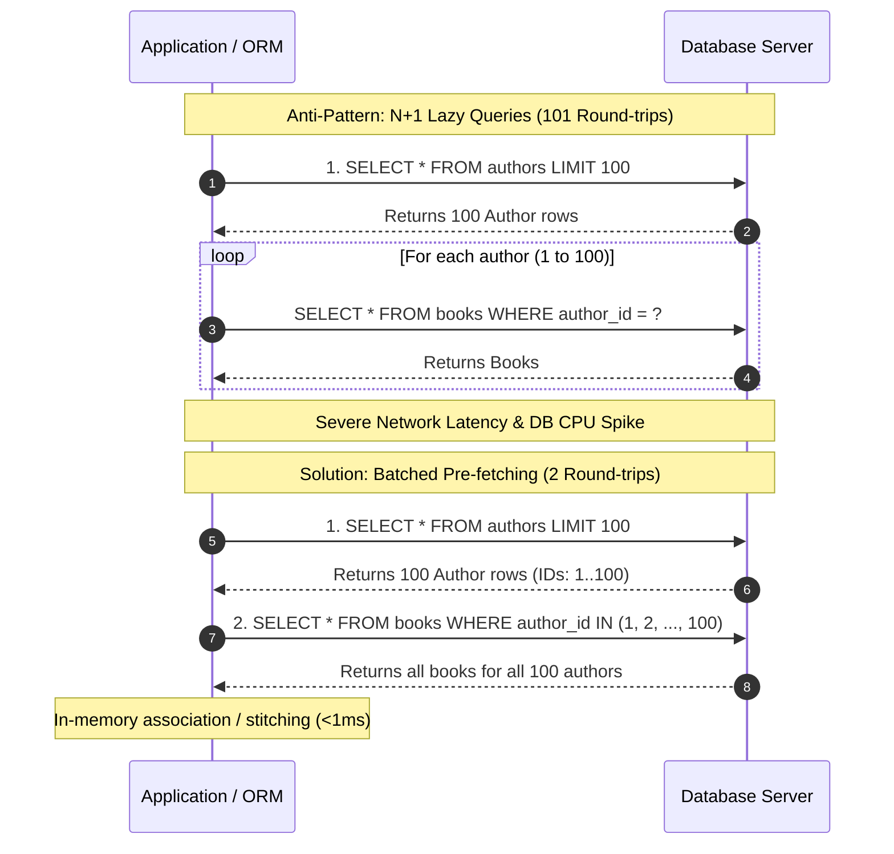

# The N+1 Query Problem & Batch Loading

## 1. One-minute explanation

The **N+1 Query Problem** is a prevalent database access anti-pattern where an application executes 1 initial SQL query to retrieve $N$ parent records, followed by $N$ separate subsequent queries to retrieve the associated child records for each individual parent. This results in $N + 1$ total database round-trips instead of 1 or 2 batched queries. In production, this causes severe latency degradation due to accumulated network Round-Trip Time (RTT), connection pool saturation, and high database CPU usage. We solve the N+1 problem through **Eager Loading** (using SQL `JOIN`s or `WHERE parent_id IN (...)` batch queries) and **DataLoader batching patterns** in GraphQL and microservices.

---

## 2. What is it?

The N+1 problem commonly occurs when Object-Relational Mappers (ORMs) use **Lazy Loading** by default.

```
Scenario: Display a list of 100 Users and their Companies.

Query 1 (Fetch Parents):
SELECT * FROM users LIMIT 100;  -- (Returns 100 user rows)

Queries 2 to 101 (Fetch Children lazily in a loop):
SELECT * FROM companies WHERE id = 1;
SELECT * FROM companies WHERE id = 2;
SELECT * FROM companies WHERE id = 3;
...
SELECT * FROM companies WHERE id = 100;

Total DB Queries = 1 + 100 = 101 Queries!
```

If network RTT to the database is 5ms:
$$\text{Total Latency} = 101 \times 5\text{ms} = 505\text{ms (Spent purely waiting on network round-trips!)}$$

---

## 3. Why do we need it? The Engineering Problem

| Metric | N+1 Lazy Loading (100 Parents) | Batched Eager Loading (`IN (...)`) |
| :--- | :--- | :--- |
| **Total DB Queries** | **101** | **2** |
| **Network Round Trips** | 101 | 2 |
| **Database Latency** | ~500ms | ~10ms |
| **Connection Pool Contention** | High (Holds connection across 101 operations) | Minimal (Checked out for 2 brief statements) |
| **Database CPU Usage** | High (Parses and plans 101 SQL strings) | Low (Single prepared statement execution) |

---

## 4. How does it work internally?

### The 3 Resolution Strategies

#### 1. SQL `JOIN` (Single Query Eager Loading)
Fetches parent and child records in a single database round-trip using an `INNER JOIN` or `LEFT JOIN`:

```sql
SELECT u.id AS user_id, u.name, c.id AS company_id, c.name AS company_name
FROM users u
LEFT JOIN companies c ON u.company_id = c.id
LIMIT 100;
```
- *Advantage:* Exactly 1 database round-trip.
- *Caveat (Cartesian Product Bloat):* If one parent has 50 children (One-to-Many), the parent columns are repeated 50 times across the wire.

#### 2. Batched `IN (...)` Loading (Two-Query Eager Loading)
Fetches all parents first, collects all unique parent IDs, and queries all children in a single batched query:

```sql
-- Query 1: Fetch Parents
SELECT * FROM users LIMIT 100;

-- Query 2: Fetch All Associated Children in 1 Round-trip
SELECT * FROM companies WHERE id IN (12, 15, 18, 22, 34, ...);
```
- *Advantage:* Exactly 2 queries. Avoids Cartesian product duplication over the network.

#### 3. The DataLoader Pattern (Batching & Memoization)
Used in GraphQL and decoupled microservice layers. Within a single tick of the event loop (e.g., Node.js `process.nextTick()`), the DataLoader collects individual IDs requested across multiple concurrent resolver functions, coalesces them into a single batched array call, and caches results in memory for the duration of that single request.

---

## 5. Architecture / Flow



---

## 6. Simple Example: Python ORM (Django / SQLAlchemy)

### Django ORM
```python
# ANTI-PATTERN (N+1 Queries):
authors = Author.objects.all()[:100]
for author in authors:
    print(author.profile.bio) # Fires 100 extra queries!

# SOLUTION 1: select_related (SQL JOIN for One-to-One / Foreign Key)
authors = Author.objects.select_related('profile').all()[:100] # 1 Query

# SOLUTION 2: prefetch_related (Batched IN Query for Many-to-Many / Reverse FK)
authors = Author.objects.prefetch_related('books').all()[:100] # 2 Queries
```

### SQLAlchemy
```python
# Joined Eager Loading
session.query(Author).options(joinedload(Author.books)).all()

# Select-IN Eager Loading (Batched)
session.query(Author).options(selectinload(Author.books)).all()
```

---

## 7. Production Example: GraphQL DataLoader Implementation

```javascript
const DataLoader = require('dataloader');

// Batch function: receives array of author IDs [1, 2, 3, ...]
const bookBatchLoader = new DataLoader(async (authorIds) => {
  // Single SQL query with WHERE author_id IN (...)
  const books = await db('books').whereIn('author_id', authorIds);
  
  // Map books back to their corresponding author ID
  return authorIds.map(id => books.filter(book => book.author_id === id));
});

// GraphQL Resolver
const resolvers = {
  Author: {
    books: (author, args, context) => {
      // Instead of querying DB directly, delegate to DataLoader
      return bookBatchLoader.load(author.id);
    }
  }
};
```

---

## 8. When should we use which solution?

- **Use `JOIN` (Single Query):** For **One-to-One** and **Many-to-One** relationships where row duplication is zero or minimal (e.g., User $\to$ Profile, Order $\to$ Customer).
- **Use Batched `IN (...)`:** For **One-to-Many** and **Many-to-Many** relationships where returning wide joined rows would cause severe network payload explosion (e.g., User $\to$ 1,000 Order Items).
- **Use DataLoader:** In GraphQL resolvers, nested tree traversals, and microservice RPC composition layers.

---

## 9. When should we avoid premature optimization?

- Simple queries fetching a single record by primary key (`SELECT * FROM users WHERE id = 1`) do not suffer from N+1.

---

## 10. Tradeoffs

| Approach | DB Round Trips | Memory Usage | Network Payload | Complexity |
| :--- | :--- | :--- | :--- | :--- |
| **Lazy Loading (N+1)** | $N+1$ | Very Low | Low | Zero |
| **SQL JOIN (Eager)** | **1** | Moderate | High (Cartesian Duplication) | Low |
| **Batched IN (Prefetch)**| **2** | Moderate | Optimal (Zero Duplication) | Low |
| **DataLoader** | **2** | Moderate (Per-request cache) | Optimal | Moderate |

---

## 11. Common Mistakes

1. **Looping Over Relational Properties in Serialization:** E.g., serializing a list of orders to JSON and calling `item.product.name` inside the serializer without eager preloading.
2. **Exceeding SQL `IN (...)` Parameter Limits:** Passing 50,000 IDs into a single `WHERE id IN (...)` query can exceed database parameter limits (e.g., Postgres 65,535 parameters, SQLite 999). (Fix: Chunk batches into sets of 1,000).
3. **Reusing DataLoader Instances Across Requests:** DataLoader instances must be scoped **per request**; sharing across requests causes memory leaks and cross-tenant data leaks.

---

## 12. Related Concepts

- [Database Indexes & Performance](file:///home/sameer/backendguide/05-databases/indexes.md)
- [Connection Pooling](file:///home/sameer/backendguide/05-databases/connection-pooling.md)
- [REST API Design](file:///home/sameer/backendguide/02-api-design/rest-apis.md)

---

## 13. Interview Questions

### Q1. What is the N+1 Query Problem and why is it particularly dangerous in distributed cloud architectures?
**Answer:** The N+1 problem occurs when an application executes 1 initial query to fetch $N$ parent records, and subsequently runs $N$ individual queries to fetch child data for each parent. In modern cloud architectures where applications run in container clusters and databases run on managed services (RDS/Cloud SQL), every query incurs cross-network latency ($1-5\text{ms}$ RTT). Executing 500 sequential queries translates to 2.5 seconds of pure network idle time, starving connection pools and degrading user response times.  
**Why this matters:** Universal performance question in backend interviews.  
**Possible follow-up:** How do you detect N+1 queries automatically in continuous integration (CI) tests?

### Q2. How do you distinguish between `select_related` and `prefetch_related` in Django (or Joined vs Select-IN loading in SQLAlchemy)?
**Answer:**
- **`select_related` / Joined Loading:** Performs a single SQL query using an **SQL `JOIN`**. Best suited for single-valued relationships (Foreign Key, One-to-One).
- **`prefetch_related` / Select-IN Loading:** Performs **two separate SQL queries**: the first fetches parents, and the second fetches all related children in batch using `WHERE foreign_key IN (id1, id2, ...)`. The ORM joins the objects in application memory. Best suited for multi-valued relationships (One-to-Many, Many-to-Many) to avoid Cartesian product payload explosion.  
**Why this matters:** Tests deep framework knowledge and SQL query planning intuition.  
**Possible follow-up:** What happens if the `IN` list contains 100,000 IDs?

### Q3. How does the GraphQL DataLoader pattern work?
**Answer:** DataLoader solves the N+1 problem in GraphQL resolvers by combining **Batching** and **Per-Request Caching**:
1. When GraphQL resolves individual fields across different nodes concurrently, calls to `loader.load(id)` do not immediately query the database.
2. DataLoader queues the requested IDs within the current JavaScript event loop tick.
3. On the next tick, it calls a user-defined batch function with the combined array of unique IDs `[1, 2, 3, ...]`, firing a single `WHERE id IN (...)` query.
4. It memoizes the results in memory so identical IDs within the same request return instantly from cache.  
**Why this matters:** Essential for designing high-performance GraphQL APIs.  
**Possible follow-up:** Why must DataLoader instances be recreated for every incoming HTTP request?

### Q4. Why is a single massive SQL `LEFT JOIN` not always better than two separate batched queries?
**Answer:** When joining across multiple One-to-Many relationships (e.g., `Users` $\to$ `Orders` $\to$ `OrderItems`), a Cartesian product occurs. If 100 users have 10 orders each, and each order has 5 items, the `JOIN` returns $100 \times 10 \times 5 = 5,000$ wide database rows. The user's name, email, and metadata are duplicated 50 times across the network. Two or three separate batched `IN` queries return $100 + 1,000 + 5,000$ compact rows, using far less network bandwidth and memory.  
**Why this matters:** Shows senior-level discernment between network payload size and query count.  
**Possible follow-up:** What is the overhead of in-memory object stitching?

### Q5. How do you automate N+1 query detection in production and automated test suites?
**Answer:**
1. **Automated Test Assertions:** In unit/integration tests, use test helpers like `assertNumQueries(2)` in Django or query counters in RSpec to fail CI builds if query counts scale with $N$.
2. **APM & Tracing Tools:** Tools like Datadog, New Relic, or OpenTelemetry automatically detect and flag N+1 query spans in distributed traces.
3. **ORM Strict Loading Flags:** Modern ORMs (e.g., Ruby on Rails `strict_loading`, Hibernate `hibernate.max_fetch_depth`) can be configured to throw exceptions in development if lazy loading is triggered without explicit preloading.  
**Why this matters:** Production observability and preventive software engineering.  
**Possible follow-up:** How do you set alerts for query volume anomalies?

---

## 14. Advanced Interview Questions

### Q6. How do you handle pagination on the child side of a One-to-Many relationship (e.g., Fetch 10 users and only the top 3 latest comments for each user)?
**Answer:** Standard SQL `LIMIT` applies to the entire result set, not per-parent group. Solutions:
1. **SQL Window Functions (`ROW_NUMBER()`):**
   ```sql
   WITH ranked_comments AS (
       SELECT *, ROW_NUMBER() OVER (PARTITION BY user_id ORDER BY created_at DESC) as rn
       FROM comments WHERE user_id IN (1, 2, 3)
   )
   SELECT * FROM ranked_comments WHERE rn <= 3;
   ```
2. **PostgreSQL `LATERAL JOIN`:**
   ```sql
   SELECT u.id, c.* 
   FROM users u 
   CROSS JOIN LATERAL (
       SELECT * FROM comments WHERE comments.user_id = u.id ORDER BY created_at DESC LIMIT 3
   ) c;
   ```

---

## 15. Production Scenarios

### Scenario: Dashboard Loading Time Jumps from 150ms to 4.2s After Adding User Avatars
**Problem:** The team added a user avatar component to the team member list.
**Analysis:** In the template serializer, `user.avatar.thumbnail_url` triggered a lazy database query for every user in the list (150 team members = 151 queries).
**Fix:** Added `.select_related('avatar')` to the underlying query queryset. Response time dropped back to 110ms.

---

## 16. Debugging Scenarios

### Scenario: Diagnosing N+1 via SQL Query Logging
In local development, enable SQL statement logging:
- PostgreSQL: `log_min_duration_statement = 0`
- Look for repeating identical query patterns with only the parameterized ID changing:
  ```text
  LOG: statement: SELECT * FROM profiles WHERE user_id = 1;
  LOG: statement: SELECT * FROM profiles WHERE user_id = 2;
  LOG: statement: SELECT * FROM profiles WHERE user_id = 3;
  ```

---

## 17. Common Misconceptions

- *Misconception:* "Using an ORM always leads to bad performance and N+1 queries."
  - *Reality:* ORMs provide comprehensive eager loading utilities (`includes`, `prefetch_related`, `select_related`). The problem is lack of developer awareness regarding lazy loading defaults.
- *Misconception:* "Every JOIN is always faster than two separate queries."
  - *Reality:* For wide tables with large One-to-Many relationships, batched `IN` queries transfer significantly less redundant data over the network than Cartesian `JOIN` products.

---

## 18. Quick Revision

- N+1 = 1 initial query + $N$ subsequent lazy queries.
- Caused by ORM lazy-loading in loops/serializers.
- Solved by Eager Loading: `JOIN` (One-to-One) or Batched `IN (...)` (One-to-Many).
- GraphQL uses DataLoader for batching and memoization.
- Guard against N+1 using test query assertions (`assertNumQueries`) and strict loading.

---

## 19. Interview-Ready Answer

> "The N+1 query problem occurs when an application executes 1 parent query followed by N subsequent queries to fetch child relations in a loop, causing severe latency degradation from accumulated network round trips and connection pool contention. We resolve this by enforcing Eager Loading: utilizing SQL JOINs for singular relationships and batched IN subqueries for collection relationships to reduce the database interaction to 1 or 2 round trips. In GraphQL and microservices, we implement the DataLoader pattern to coalesce and batch IDs within the event loop."
