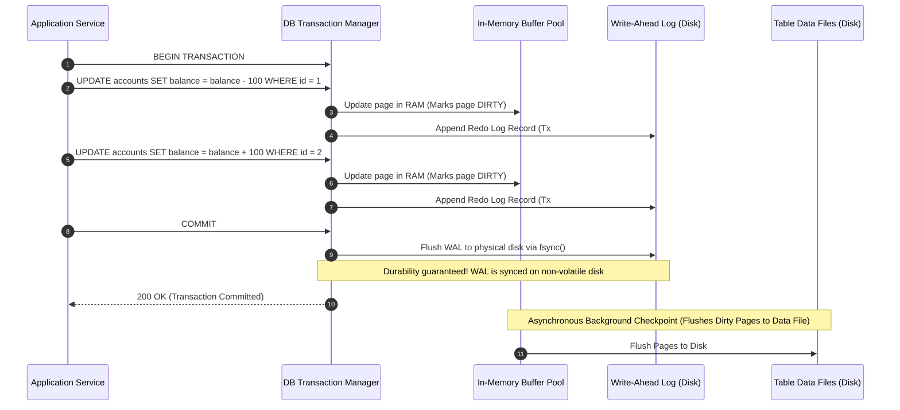

# Database Transactions & ACID Guarantees

## 1. One-minute explanation

A database transaction is a sequence of one or more SQL operations executed as a single, atomic **Logical Unit of Work**. Transactions guarantee four fundamental properties known as **ACID**:
- **Atomicity (All-or-Nothing):** Either all operations succeed, or the entire transaction is rolled back with zero partial mutations.
- **Consistency (Valid State):** The database moves from one valid state to another, satisfying all schema constraints, foreign keys, and invariants.
- **Isolation (Concurrency Control):** Concurrent transactions execute without observing uncommitted intermediate states of other transactions (managed via MVCC and locks).
- **Durability (Persistence):** Once committed, changes are permanent and survive crashes or power failures, guaranteed by writing sequentially to a **Write-Ahead Log (WAL)** with `fsync()`.

---

## 2. What is it?

A transaction wraps multiple database statements between `BEGIN` and `COMMIT` (or `ROLLBACK`):

```sql
BEGIN;
  UPDATE accounts SET balance = balance - 100 WHERE id = 'Alice';
  UPDATE accounts SET balance = balance + 100 WHERE id = 'Bob';
COMMIT;
```

If the database server loses power, crashes, or encounters an error between statement 1 and statement 2, the entire transaction is rolled back upon reboot. Alice never loses $100 without Bob receiving it.

---

## 3. Why do we need it?

In concurrent, distributed production environments, three failure modes are constant:
1. **Application & Infrastructure Crashes:** A network timeout, out-of-memory error, or server crash during a multi-step operation leaves data corrupted in half-written states.
2. **Concurrent Interferences:** Multiple threads modifying the same account balance simultaneously overwrite each other's changes (lost updates).
3. **Hardware & Power Failures:** Data held only in volatile server RAM is lost when power is interrupted.

---

## 4. How does it work internally?

### 1. The ACID Mechanics

```
┌─────────────────┬───────────────────────────────┬───────────────────────────────────────────────┐
│ Property        │ Core Promise                  │ Database Internal Implementation Mechanism    │
├─────────────────┼───────────────────────────────┼───────────────────────────────────────────────┤
│ **Atomicity**   │ All operations succeed or none│ **Undo Log** (InnoDB) / **MVCC Tuples** (PG)  │
│ **Consistency** │ Invariants & constraints hold │ Schema validation, FKs, Unique Constraints, Tx│
│ **Isolation**   │ Concurrent safety             │ **MVCC** (Multi-Version Concurrency) & Locks  │
│ **Durability**  │ Committed data survives crash │ **Write-Ahead Log (WAL)** / Redo Log + fsync  │
└─────────────────┴───────────────────────────────┴───────────────────────────────────────────────┘
```

### 2. Write-Ahead Logging (WAL) & Crash Recovery
Writing random 8KB/16KB data pages directly to disk for every transaction would bottleneck disk I/O. Databases solve this using **WAL (Write-Ahead Logging)**:

1. When a transaction mutates data, the engine applies the change to in-memory pages in the **Buffer Pool** (marking them "dirty").
2. The engine writes a sequential log record describing the delta to the **WAL / Redo Log**.
3. Upon `COMMIT`, the database flushes the WAL record to disk using the synchronous OS system call **`fsync()`**.
4. Durability is guaranteed because sequential disk writes are extremely fast ($<1$ms).
5. In the background, **Checkpointer processes** flush dirty memory pages to the main table files on disk.

```
Application Commit ──► Append to WAL ──► fsync() to Disk ──► Return Success to Client
                                                                    │
                                       (Asynchronously in background)
                                                                    ▼
                                       Dirty In-Memory Pages ──► Table Data Files
```

### 3. ARIES Crash Recovery (Analysis, Redo, Undo)
If a crash occurs, upon reboot the database runs:
- **Phase 1 (Analysis):** Scans WAL from the last checkpoint to identify active transactions and dirty pages at the time of crash.
- **Phase 2 (Redo):** Replays all WAL records forward to bring the database buffer pool to the exact state right before the crash.
- **Phase 3 (Undo):** Scans backward and rolls back all transactions that were still active (uncommitted) when the crash occurred using the Undo Log.

---

## 5. Architecture / Flow



---

## 6. Simple Example: Bank Balance Transfer with Savepoint

```sql
BEGIN;

-- Deduct from Account A
UPDATE accounts 
SET balance = balance - 250.00 
WHERE id = 'acc_alice' AND balance >= 250.00;

-- Ensure deduction succeeded
-- (If rows affected == 0, application triggers ROLLBACK)

-- Optional Savepoint for partial rollback
SAVEPOINT transfer_initiated;

-- Credit to Account B
UPDATE accounts 
SET balance = balance + 250.00 
WHERE id = 'acc_bob';

-- Commit all changes atomically
COMMIT;
```

---

## 7. Production Example: Distributed Transactions vs The Saga Pattern

When business workflows span multiple microservices (e.g., Order Service, Payment Service, Inventory Service), a single relational database ACID transaction cannot span across network boundaries.

```
Distributed Transaction Problem:
Order Svc (DB 1) ──► Payment Svc (DB 2) ──► Inventory Svc (DB 3)
```

### The Saga Pattern (Compensating Transactions)
Instead of blocking distributed Two-Phase Commit (2PC) locks, use an **Orchestrated Saga**:
1. **Order Service:** Creates Order (State: `PENDING`).
2. **Payment Service:** Charges Card ($100).
3. **Inventory Service:** Fails (Out of stock!).
4. **Compensation Triggered:** Payment Service executes a **Compensating Transaction** (Refund $100), and Order Service sets status to `FAILED`.

---

## 8. When should we use it?

- Financial ledgers, payment processing, and billing systems.
- Inventory booking and seat reservations.
- Multi-row data mutations requiring strict referential integrity.

---

## 9. When should we avoid it?

- **High-throughput append-only logs:** Server logs, telemetry, metrics where occasional dropped writes are acceptable.
- **Long-Running Batch Jobs within a single transaction:** Holding a transaction open for 10 minutes locks database tables, causes massive WAL growth, and starves connections.

---

## 10. Tradeoffs

| Advantage | Cost / Overhead |
| :--- | :--- |
| **Data Correctness:** Eliminates partial writes and data corruption. | **Latency:** Synchronous `fsync()` disk writes add I/O latency. |
| **Simplified Business Logic:** Applications rely on DB rollback. | **Lock Contention:** Concurrent writes on shared rows must wait for locks. |
| **Crash Resilience:** Automatic recovery after system restarts. | **Throughput Bottleneck:** Centralized single-node write constraints. |

---

## 11. Common Mistakes

1. **Performing Third-Party Network Calls Inside a DB Transaction:** 
   ```python
   # ANTI-PATTERN:
   with db.transaction():
       db.execute("UPDATE orders SET status='PAID' WHERE id=1")
       stripe.charge(...) # 5-second network call holds DB locks open!
   ```
2. **Huge Batch Transactions:** Wrapping 500,000 row inserts in a single transaction, holding millions of row locks and overflowing memory undo buffers.
3. **Ignoring Unhandled Exceptions:** Failing to issue an explicit `ROLLBACK` in error handlers, leaving transactions dangling and holding connection locks.

---

## 12. Related Concepts

- [Isolation Levels & Concurrency Anomalies](file:///home/sameer/backendguide/05-databases/isolation-levels.md)
- [Locks & Deadlocks](file:///home/sameer/backendguide/05-databases/locks-deadlocks.md)
- [Race Conditions & Concurrency](file:///home/sameer/backendguide/08-concurrency/race-conditions.md)

---

## 13. Interview Questions

### Q1. Explain each of the four ACID properties with a concrete engineering example.
**Answer:**
1. **Atomicity:** All-or-nothing. In a $100 bank transfer, debiting Account A and crediting Account B must either both complete or both fail.
2. **Consistency:** Data validity. An invariant stating `balance >= 0` is strictly enforced. If a debit results in negative balance, the transaction aborts.
3. **Isolation:** Concurrent isolation. If two users buy the last ticket simultaneously, isolation guarantees that one succeeds and one fails, without seeing partial states.
4. **Durability:** Crash permanence. Once `COMMIT` returns success, even if the datacenter loses power a millisecond later, the transaction is safely recorded in the WAL.  
**Why this matters:** Core prerequisite for every backend systems interview.  
**Possible follow-up:** How does the database guarantee Durability without writing full table pages immediately?

### Q2. How does Write-Ahead Logging (WAL) enable high-performance Durability?
**Answer:** Random disk I/O (updating 8KB data pages scattered across a 500GB database file) is slow. WAL transforms disk writes into **fast sequential append-only operations**. When a transaction commits, only the compact diff/log record is written to the WAL file and synced via `fsync()`. The main data pages are modified in RAM (Buffer Pool) and lazily flushed to disk in the background by checkpoint threads. If a crash occurs, the database replays the sequential WAL to reconstruct lost in-memory state.  
**Why this matters:** Explains how modern relational databases achieve thousands of transactions per second.  
**Possible follow-up:** What is the performance cost of calling `fsync()` on every commit?

### Q3. Why should you NEVER make an external HTTP API call inside a database transaction?
**Answer:** External HTTP calls (e.g., Stripe API, Twilio SMS) have unpredictable network latency (200ms to 10+ seconds) or can hang completely. While an application thread waits for the HTTP response:
1. The database transaction remains open.
2. All row locks acquired during the transaction remain active, blocking other concurrent transactions.
3. The database connection from the connection pool remains checked out, causing **connection pool exhaustion** and fleet-wide cascading outages.  
**Rule:** Perform external API calls *outside* the database transaction.  
**Why this matters:** One of the most common production outage causes in web backend services.  
**Possible follow-up:** How do you guarantee consistency if the external API succeeds but the subsequent DB commit fails?

### Q4. What is the difference between an Undo Log and a Redo Log?
**Answer:**
- **Redo Log (WAL):** Used for **Durability**. Records new values of committed modifications. Used during crash recovery to "replay" changes that were in memory but not yet written to table files.
- **Undo Log (Rollback Segment):** Used for **Atomicity** and **MVCC**. Records original values before modification. Used to roll back active transactions when an error occurs, or to provide older snapshot versions of rows for concurrent read queries.  
**Why this matters:** Demonstrates deep RDBMS engine literacy (MySQL InnoDB / PostgreSQL internals).  
**Possible follow-up:** How does PostgreSQL implement undo without a dedicated undo log?

### Q5. What is the Two-Phase Commit (2PC) protocol and why is it rarely used in modern microservices?
**Answer:** 2PC is a distributed consensus algorithm guaranteeing ACID across multiple distributed databases:
- **Phase 1 (Prepare):** Coordinator asks all nodes if they are ready to commit. Nodes acquire locks and write to local log.
- **Phase 2 (Commit):** If all agree, coordinator sends Commit command. If any vote no, coordinator sends Abort.
**Why avoided in modern microservices:** 2PC is a **blocking protocol**. If the coordinator fails during Phase 2, all participating databases hold row locks indefinitely, stalling the entire system. It also incurs severe network latency overhead across microservices. Sagas with eventual consistency are preferred.  
**Why this matters:** Key architectural transition from monolithic ACID to distributed microservices.  
**Possible follow-up:** What is the difference between an Orchestrated Saga and a Choreographed Saga?

---

## 14. Advanced Interview Questions

### Q6. What is Group Commit in database engines?
**Answer:** Calling `fsync()` for every individual transaction commit saturates disk I/O (HDDs/SSDs can only perform so many sync operations per second). **Group Commit** batches the `fsync()` operations of multiple concurrent transactions into a single physical disk write. While Transaction 1 waits for its WAL buffer flush, Transactions 2, 3, and 4 join the same flush batch, boosting transaction throughput by an order of magnitude.

---

## 15. Production Scenarios

### Scenario: Database Connection Pool Starvation Caused by Long Transaction
**Problem:** The backend API server experiences 100% connection pool exhaustion during peak hours.
**Root Cause:** A developer wrapped a user signup process in a single transaction:
`BEGIN` -> `INSERT user` -> `Send Welcome Email via SMTP` -> `COMMIT`.
When the SMTP server slowed down, DB connections stayed checked out for 8 seconds each.
**Fix:** Removed email delivery from the transaction. Enqueue email jobs to a message queue after the transaction commits.

---

## 16. Debugging Scenarios

### Scenario: Investigating Long-Running Transactions in PostgreSQL
```sql
SELECT pid, now() - xact_start AS duration, query, state 
FROM pg_stat_activity 
WHERE state != 'idle' AND xact_start IS NOT NULL 
ORDER BY duration DESC;
```
Kill a hung transaction: `SELECT pg_terminate_backend(<pid>);`

---

## 17. Common Misconceptions

- *Misconception:* "ACID means that all database transactions are completely serialized and run one at a time."
  - *Reality:* Serializability is the strictest isolation level; by default, databases use weaker isolation levels (Read Committed / Repeatable Read) for concurrency.
- *Misconception:* "NoSQL databases cannot support ACID transactions."
  - *Reality:* Modern document stores like MongoDB and distributed databases like FoundationDB/CockroachDB support multi-document ACID transactions.

---

## 18. Quick Revision

- Atomicity = All-or-nothing (Undo Log / MVCC).
- Consistency = Invariants and integrity constraints respected.
- Isolation = Concurrency control (Locks & MVCC).
- Durability = Crash resilience via Write-Ahead Logging (WAL) + `fsync()`.
- Never make external network/HTTP calls inside a database transaction.

---

## 19. Interview-Ready Answer

> "A database transaction is a logical unit of work governed by ACID guarantees. Atomicity ensures all operations succeed or roll back via undo logs; Consistency enforces schema rules and invariants; Isolation prevents concurrent transactions from interfering using MVCC and locks; and Durability guarantees committed data survives crashes by appending changes to a Write-Ahead Log (WAL) with synchronous fsync calls before dirty buffer pages are lazily flushed to disk."
