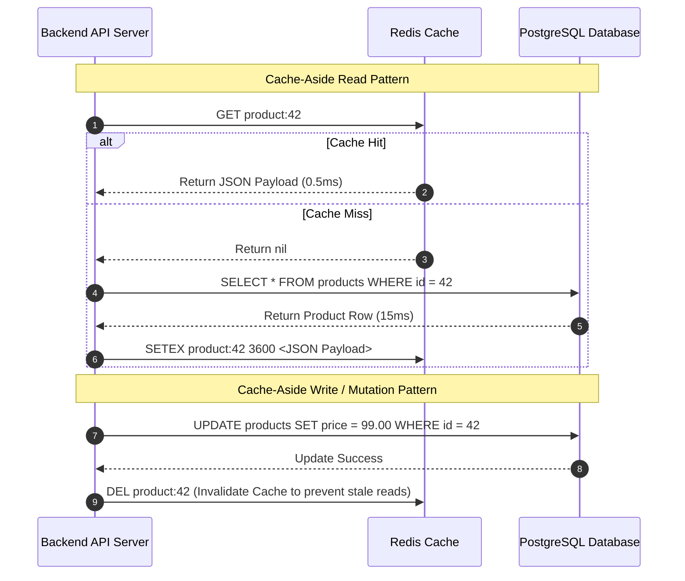

# Redis & Caching Strategies

## 1. One-minute explanation

Redis (Remote Dictionary Server) is an open-source, in-memory key-value data structure store utilized primarily as a low-latency cache, message broker, and distributed lock coordinator. Redis achieves sub-millisecond throughput by executing commands in-memory over an **event-driven, single-threaded reactor core** with I/O multiplexing (`epoll`), eliminating lock contention and thread context-switching. In production backend architectures, caching shields relational databases from high read throughput. To engineer resilient caching systems, developers implement patterns like **Cache-Aside**, establish precise **TTL and eviction policies** (LRU/LFU), and actively guard against the three classic caching failures: **Cache Stampede**, **Cache Penetration**, and **Cache Avalanche**.

---

## 2. What is it?

Caching is the technique of storing copies of frequently accessed data in a fast, temporary storage layer (RAM) so future requests are served with minimal latency without repeatedly querying slower storage tiers (SSD/Hard Disk databases).

```
Latency Comparison (Why Memory Caching Wins):
┌───────────────────────────────┬──────────────────────────┐
│ Storage Tier                  │ Typical Access Latency   │
├───────────────────────────────┼──────────────────────────┤
│ CPU L1/L2 Cache               │ 0.5 - 7 ns               │
│ System RAM (Redis In-Memory)  │ 100 ns (< 1 ms network)  │
│ NVMe SSD (Local Database)     │ 10 - 100 µs              │
│ Network Round Trip to DB Disk │ 5 - 50 ms                │
└───────────────────────────────┴──────────────────────────┘
```

---

## 3. Why do we need it?

1. **Database Offloading:** Relational databases hit write and connection saturation under heavy read load. Caching absorbs 80–95% of read traffic.
2. **Sub-Millisecond Response Times:** Complex aggregate queries taking 250ms in PostgreSQL return in 0.8ms from Redis.
3. **Cost Reduction:** Scaling Redis in-memory nodes is significantly cheaper than vertically scaling enterprise database clusters.

---

## 4. How does it work internally?

### 1. Caching Design Patterns

#### A. Cache-Aside (Lazy Loading - Industry Standard for Web Backends)
- **Read:** App queries Redis. If Hit $\to$ return data. If Miss $\to$ read DB, write to Redis with TTL, return data.
- **Write:** App writes update to DB, then **deletes (invalidates)** the key in Redis.
- *Why Delete instead of Update?* Updating the cache introduces race conditions where concurrent writes overwrite cache in the wrong order. Deleting is safe and lazy.

#### B. Read-Through
The application treats the cache as the primary data store. The cache provider library automatically reads from the database on a cache miss.

#### C. Write-Through
The application writes data to the cache. The cache synchronously writes to the primary database before acknowledging success.

#### D. Write-Behind (Write-Back)
The application writes to the cache immediately ($<1$ms). The cache asynchronously batches and persists writes to the database in the background.
- *Advantage:* Extreme write throughput.
- *Risk:* Risk of data loss if the cache node crashes before flushing dirty writes to the database.

---

### 2. The 3 Classic Production Caching Pitfalls & Mitigations

```
+────────────────────┬───────────────────────────────────────────┬───────────────────────────────────────────+
│ Failure Mode       │ Root Cause                                │ Production Mitigation Strategy            │
+────────────────────┼───────────────────────────────────────────┼───────────────────────────────────────────+
│ **Cache Stampede** │ Hot key expires; thousands of concurrent  │ 1. Distributed Mutex (only 1 thread hits  │
│ (Thundering Herd)  │ requests miss simultaneously & hammer DB. │    DB; others wait)                       │
│                    │                                           │ 2. Probabilistic Early Expiration (XFetch)│
│                    │                                           │ 3. Background Cron Worker refreshes key   │
+────────────────────┼───────────────────────────────────────────┼───────────────────────────────────────────+
│ **Cache            │ Requests query non-existent keys (e.g.    │ 1. **Bloom Filter** at API Gateway        │
│  Penetration**     │ ID: -999); misses cache every time and    │ 2. Cache Null/Empty values with short TTL │
│                    │ hits DB on every request (DDoS risk).     │    (e.g., 60 seconds)                     │
+────────────────────┼───────────────────────────────────────────┼───────────────────────────────────────────+
│ **Cache            │ Thousands of keys expire at the exact     │ 1. **TTL Jitter / Randomization**:        │
│  Avalanche**       │ same second, or Redis cluster restarts;   │    `TTL = 3600 + random(0, 300)`          │
│                    │ massive traffic tsunami floods the DB.    │ 2. Multi-AZ Redis Cluster with failover   │
│                    │                                           │ 3. Circuit Breakers on DB queries         │
+────────────────────┴───────────────────────────────────────────┴───────────────────────────────────────────+
```

---

### 3. Redis Eviction Policies (`maxmemory-policy`)
When Redis memory reaches its configured limit:
- **`volatile-lru` / `allkeys-lru`:** Evicts Least Recently Used keys.
- **`volatile-lfu` / `allkeys-lfu`:** Evicts Least Frequently Used keys (tracks hit frequency).
- **`volatile-ttl`:** Evicts keys with the shortest remaining TTL.
- **`noeviction`:** Returns errors on write operations when memory is full (safe for financial data).

---

## 5. Architecture / Flow



---

## 6. Simple Example: Python Cache-Aside Implementation with Jitter

```python
import redis
import json
import random

r = redis.Redis(host='localhost', port=6379, db=0)

def get_product_details(product_id: int):
    cache_key = f"product:{product_id}"
    
    # 1. Check Redis
    cached_data = r.get(cache_key)
    if cached_data:
        return json.loads(cached_data)
        
    # 2. Cache Miss: Query Primary Database
    product = query_database_for_product(product_id)
    if product is None:
        # Cache Null to prevent Cache Penetration (short 60s TTL)
        r.setex(cache_key, 60, json.dumps({"_null": True}))
        return None
        
    # 3. Cache Result with TTL Jitter to prevent Cache Avalanche
    ttl = 3600 + random.randint(0, 300) # 1 hour + 0..5 min random jitter
    r.setex(cache_key, ttl, json.dumps(product))
    
    return product
```

---

## 7. Production Example: Distributed Locking with Redis (Redlock / Lua Script)

Acquiring and safely releasing a distributed mutex lock in Redis:

```python
import uuid

def acquire_lock(lock_key: str, ttl_ms: int = 10000) -> str:
    """Acquires lock with unique token and TTL."""
    token = str(uuid.uuid4())
    # SET lock_key token NX PX ttl_ms (Atomic operation)
    acquired = r.set(lock_key, token, nx=True, px=ttl_ms)
    return token if acquired else None

def release_lock(lock_key: str, token: str) -> bool:
    """Releases lock atomically ONLY if the caller owns the token."""
    # Lua script guarantees atomic compare-and-delete
    lua_release = """
    if redis.call("get", KEYS[1]) == ARGV[1] then
        return redis.call("del", KEYS[1])
    else
        return 0
    end
    """
    result = r.eval(lua_release, 1, lock_key, token)
    return result == 1
```

---

## 8. When should we use it?

- High read-to-write ratio workloads ($>80\%$ reads).
- Computationally expensive database queries or aggregations.
- Ephemeral session storage and token blacklists.
- Distributed rate limiting counters and leaderboards (Sorted Sets).

---

## 9. When should we avoid it?

- Rapidly mutating data where every read requires strict, real-time consistency.
- Workloads with low query repetition (random single-access reads).
- Storing large binary files/blobs (use S3 / Object Storage instead).

---

## 10. Tradeoffs

| Factor | Detail |
| :--- | :--- |
| **Consistency vs Speed** | Inherent eventual consistency; cache may serve stale data for brief windows. |
| **Operational Overhead** | Cluster management, memory capacity monitoring, and replication topologies. |
| **Cost** | RAM is significantly more expensive per gigabyte than disk storage. |

---

## 11. Common Mistakes

1. **Updating Cache Instead of Invalidation on DB Write:** Leads to write race conditions where stale background jobs overwrite newer writes.
2. **Forgetting TTL on Cached Keys:** Keys remain in memory forever, eventually triggering out-of-memory (OOM) evictions.
3. **Releasing Distributed Locks with Raw `DEL`:** Thread A takes 12s, lock expires; Thread B acquires lock; Thread A finishes and runs `DEL`, deleting Thread B's lock! (Always release via atomic Lua token check).

---

## 12. Related Concepts

- [Database Connection Pooling](file:///home/sameer/backendguide/05-databases/connection-pooling.md)
- [Rate Limiting with Redis](file:///home/sameer/backendguide/09-scalability/rate-limiting.md)
- [Race Conditions & Distributed Locks](file:///home/sameer/backendguide/08-concurrency/race-conditions.md)

---

## 13. Interview Questions

### Q1. Why is Redis single-threaded for command execution, and why is it still blazingly fast?
**Answer:** Redis executes commands using a single-threaded event loop built on top of OS **I/O Multiplexing primitives (`epoll`, `kqueue`, `select`)**.
It is blazingly fast because:
1. **In-Memory Storage:** All data structures reside in RAM; operations execute in nanoseconds without disk I/O.
2. **Zero Context Switching:** No CPU time is wasted switching thread register contexts or kernel threads.
3. **Zero Lock Overhead:** Single-threaded execution eliminates mutexes, semaphores, and thread synchronization overhead.  
*(Note: Redis 6.0+ uses multi-threading for network I/O socket reading/writing, but core command execution remains strictly single-threaded).*  
**Why this matters:** Fundamental architectural understanding of high-throughput caching systems.  
**Possible follow-up:** When can a Redis single-threaded architecture become blocked?

### Q2. What are the dangers of running `KEYS *` or large `O(N)` commands in production Redis?
**Answer:** Because Redis executes commands on a single thread, calling `KEYS *` (which scans the entire database in $O(N)$ time) or deleting a set with 5 million elements (`DEL huge_set`) blocks all other incoming client operations for seconds or minutes. Every other application query stalls, triggering gateway timeouts and cascading microservice failures.  
**Production Alternative:** Use `SCAN`, `SSCAN`, `HSCAN` (cursor-based incremental scanning) and asynchronous deletion (`UNLINK`).  
**Why this matters:** Classic cause of production outages caused by naive debugging.  
**Possible follow-up:** What is the difference between `DEL` and `UNLINK`?

### Q3. Explain the difference between Cache Stampede, Cache Penetration, and Cache Avalanche.
**Answer:**
- **Cache Stampede (Thundering Herd):** A single high-traffic hot key expires; 10,000 concurrent requests miss the cache at once and overwhelm the database simultaneously.
- **Cache Penetration:** Requests query keys that *do not exist* in either cache or database (e.g., hacker queries `user_id = -100`). Every request bypasses the cache and queries the DB directly.
- **Cache Avalanche:** A large percentage of all cached keys expire at the exact same moment (e.g., all set with a fixed 1-hour TTL), or the Redis node restarts, sending a massive wave of traffic directly to the database.  
**Why this matters:** Essential knowledge for systems resilience design.  
**Possible follow-up:** How does a Bloom Filter prevent Cache Penetration?

### Q4. How does a Bloom Filter work and how does it protect the database from Cache Penetration?
**Answer:** A Bloom Filter is a space-efficient, probabilistic data structure used to test whether an element is a member of a set.
- **Guarantees:** It can return **False Positives** (might say "Key exists" when it doesn't), but **Never False Negatives** (if it says "Key does not exist", it is 100% guaranteed not to exist).
- **Architecture:** The application checks the Bloom Filter before querying Redis/DB. If the Bloom Filter returns False, the API rejects the request immediately without touching Redis or PostgreSQL.  
**Why this matters:** Used extensively at edge API gateways (e.g., Akamai, Cloudflare, Bigtable).  
**Possible follow-up:** How do you handle element deletions in a Bloom Filter?

### Q5. In Cache-Aside, why is it safer to Invalidate (Delete) the cache on DB write rather than Updating the cache?
**Answer:** If you update the cache on writes, concurrent write transactions create race conditions:
1. Thread 1 updates DB with Value A.
2. Thread 2 updates DB with Value B.
3. Due to network jitter, Thread 2 updates Redis with Value B first.
4. Thread 1 updates Redis with Value A second.
**Result:** DB contains Value B, but Redis contains stale Value A indefinitely!  
Invalidating (`DEL`) ensures the next read lazily fetches the latest committed data from the database.  
**Why this matters:** Core cache consistency design pattern.  
**Possible follow-up:** What is the Dual-Write problem in caching?

---

## 14. Advanced Interview Questions

### Q6. How do you safely release a distributed lock in Redis to avoid deleting another process's lock?
**Answer:** When acquiring a lock (`SET lock_key uuid NX PX 10000`), generate a unique random UUID as the value. To release the lock, execute a **Lua script** that checks if `GET(lock_key) == uuid` before calling `DEL`. Because Lua scripts execute atomically in Redis, this ensures a process never accidentally deletes a lock acquired by another process after its own lock timed out.

---

## 15. Production Scenarios

### Scenario: Database CPU Spikes to 100% Every Hour on the Hour
**Problem:** At :00 past every hour, database CPU spikes and API requests time out.
**Analysis:** A batch job cached 500,000 product categories with a fixed TTL of `3600` seconds at midnight. Every hour, all 500,000 keys expire simultaneously (Cache Avalanche).
**Fix:** Added random jitter to TTL: `TTL = 3600 + rand(0, 600)`. Expirations smoothed out across a 10-minute window, eliminating CPU spikes.

---

## 16. Debugging Scenarios

### Scenario: High Redis Memory Consumption & Evictions
**Command:**
```bash
redis-cli info memory
redis-cli --bigkeys
```
Use `--bigkeys` to detect massive Hash or Set structures holding millions of entries.

---

## 17. Common Misconceptions

- *Misconception:* "Redis is purely volatile and loses all data on restart."
  - *Reality:* Redis supports persistence via **RDB snapshots** (point-in-time binary dumps) and **AOF (Append-Only File)** for durability.
- *Misconception:* "Redis is always consistent with the database."
  - *Reality:* Caching inherently introduces eventual consistency; application design must account for brief windows of stale reads.

---

## 18. Quick Revision

- Redis uses single-threaded event loop with `epoll` for nano-second memory access.
- Use **Cache-Aside** (Write to DB $\to$ Delete Cache).
- Prevent Stampede with Mutex/XFetch; Penetration with Bloom Filters/Null cache; Avalanche with TTL Jitter.
- Safely release distributed locks using unique UUIDs and Lua scripts.

---

## 19. Interview-Ready Answer

> "Redis is an in-memory data structure store executing commands on a single-threaded event loop with I/O multiplexing, delivering sub-millisecond latency. In backend architectures, we implement the Cache-Aside pattern, invalidating cache keys upon database updates to prevent write race conditions. To ensure production resilience, we mitigate Cache Stampede using distributed mutex locks or early expiration, Cache Penetration using Bloom filters and null caching, and Cache Avalanche by adding randomized TTL jitter."
