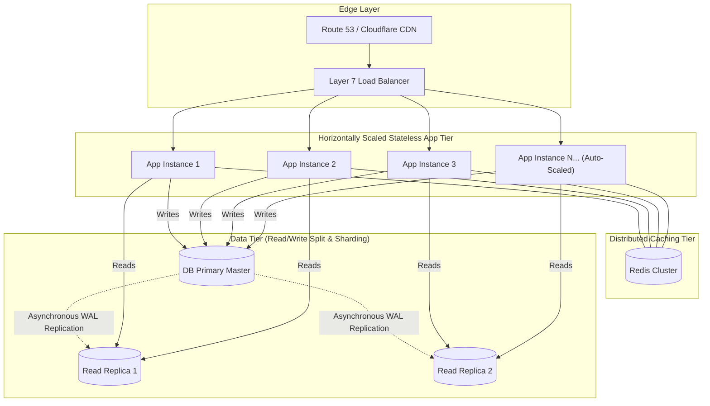

# Horizontal vs Vertical Scaling

## 1. One-minute explanation

**Vertical Scaling (Scale-Up)** increases the capacity of a single machine by adding more CPU cores, RAM, or faster NVMe storage. While conceptually simple and incurring zero distributed complexity, it hits hard physical hardware limits, requires downtime for upgrades, creates a Single Point of Failure (SPOF), and scales with an exponential cost curve. **Horizontal Scaling (Scale-Out)** increases system capacity by adding more commodity machines or container instances in parallel behind a load balancer. Horizontal scaling offers virtually unlimited elasticity and fault tolerance, but requires applications to be strictly **stateless** and shifts architectural complexity to the data tier via **Read Replicas**, **Caching**, and **Database Sharding**.

---

## 2. What is it?

```
Vertical Scaling (Scale Up):
[ 4 vCPU, 16GB RAM ] ──(Upgrade Hardware)──► [ 128 vCPU, 1TB RAM ]
- Maximum simplicity
- Hard physical ceiling & Single Point of Failure

Horizontal Scaling (Scale Out):
                           ┌──► [ App Pod 1 ] ──┐
[ Load Balancer ] ─────────┼──► [ App Pod 2 ] ──┼──► [ Shared Data Tier ]
                           └──► [ App Pod N ] ──┘    (Redis / Sharded DB)
- Elastic, fault-tolerant
- Requires stateless app design & distributed coordination
```

---

## 3. Comparison & Architectural Tradeoffs

| Attribute | Vertical Scaling (Scale-Up) | Horizontal Scaling (Scale-Out) |
| :--- | :--- | :--- |
| **Hardware Boundary** | Hard physical limit (e.g., max AWS instance size) | **Practically unlimited** (Add 1,000s of instances) |
| **Cost Curve** | Exponential (Supercomputers cost exponentially more) | Linear (Commodity cloud VMs/containers) |
| **Fault Tolerance** | Zero (If the machine dies, the entire system is down) | **High** (If 2 of 20 pods crash, 18 continue serving) |
| **Application Architecture**| Monolithic / Stateful allowed | **Must be strictly Stateless** |
| **Data Consistency** | Simple local ACID transactions | Complex distributed consistency (CAP / PACELC) |
| **Downtime on Scaling** | Requires server reboot / downtime | **Zero downtime** (Elastic dynamic auto-scaling) |

---

## 4. How does it work internally? Scaling the Multi-Tier Stack

### 1. The Application Tier: The Stateless Mandate
To scale backend web servers horizontally behind a load balancer:
- **No Local Session Memory:** Sessions are stored in a distributed Redis cluster or encoded in JWTs.
- **No Local File Storage:** Uploaded media and assets are stored in Object Storage (AWS S3, Google Cloud Storage) behind a CDN.
- **No Local Background Schedulers:** Cron jobs are orchestrated via external schedulers (Kubernetes CronJobs, Temporal, Celery) to prevent duplicate runs across instances.

---

### 2. The Data Tier: Scaling Bottlenecks & Solutions

When 100 stateless application servers hammer a single relational database, the database becomes the bottleneck.

```
Data Layer Scaling Progression:
1. Index Optimization & Connection Pooling (PgBouncer)
2. In-Memory Caching Tier (Redis / Memcached)
3. Read Replicas (Master-Replica Replication)
4. Database Sharding (Horizontal Partitioning across nodes)
```

#### A. Read Replicas (Master-Replica Architecture)
- **Master Node:** Handles all write operations (`INSERT`, `UPDATE`, `DELETE`) and streams Write-Ahead Logs to replicas.
- **Read Replicas:** Handle all read queries (`SELECT`).
- *Challenge:* **Replication Lag** (Replicas are asynchronously updated, creating eventual consistency where a user writes a comment and immediately refreshes the page but doesn't see it).
  - *Fix:* **Read-Your-Own-Writes Consistency**: Route reads for 5 seconds after a write to the Master database.

#### B. Database Sharding (Horizontal Partitioning)
Splits a massive table across independent database servers based on a **Shard Key** (e.g., `hash(user_id) % num_shards`).

```
Shard 1 (Users 1 - 1,000,000)     ──► DB Node A
Shard 2 (Users 1,000,001 - 2,000,000) ──► DB Node B
Shard 3 (Users 2,000,001 - 3,000,000) ──► DB Node C
```
- *Tradeoffs:* Cross-shard `JOIN`s and cross-shard distributed transactions become prohibitively slow and complex.

---

## 5. Architecture / Flow



---

## 6. Simple Example: Routing Reads to Replicas in Code

```python
import random

class DatabaseRouter:
    def __init__(self, master_db, replica_dbs):
        self.master = master_db
        self.replicas = replica_dbs

    def get_read_connection(self, user_recently_wrote: bool = False):
        # Read-Your-Own-Writes Consistency Guard
        if user_recently_wrote:
            return self.master
        # Distribute read load randomly across healthy replicas
        return random.choice(self.replicas)

    def get_write_connection(self):
        return self.master
```

---

## 7. Production Example: Hash-Based Database Sharding

```python
import hashlib

NUM_SHARDS = 4
SHARD_NODES = [
    "postgresql://shard0.db.internal:5432/db",
    "postgresql://shard1.db.internal:5432/db",
    "postgresql://shard2.db.internal:5432/db",
    "postgresql://shard3.db.internal:5432/db"
]

def get_shard_connection(user_id: str):
    """Deterministically routes user data to a specific database shard."""
    # Compute consistent MD5 hash integer
    hash_val = int(hashlib.md5(user_id.encode('utf-8')).hexdigest(), 16)
    shard_index = hash_val % NUM_SHARDS
    return SHARD_NODES[shard_index]
```

---

## 8. When should we use Vertical vs Horizontal Scaling?

- **Start with Vertical Scaling:**
  - Early-stage MVPs and startups (saves immense engineering complexity).
  - Fast-growing single relational databases before hitting the $100\text{GB}-1\text{TB}$ threshold.
- **Switch to Horizontal Scaling:**
  - When reaching cloud hardware limits or cost inflection points.
  - When high availability and zero-downtime rolling deployments are mandatory.
  - For stateless web and API application tiers from Day 1.

---

## 9. When should we avoid Database Sharding?

- Avoid sharding until all other optimization strategies have been exhausted: indexing, caching, query optimization, connection pooling, read replicas, and vertical hardware upgrades. Sharding permanently fractures relational semantics.

---

## 10. Tradeoffs

| Dimension | Vertical Scaling | Horizontal Scaling |
| :--- | :--- | :--- |
| **Architectural Complexity** | **Zero** | High (Service discovery, distributed logs, monitoring) |
| **Max Capacity Ceiling** | Low | **Infinite** |
| **Resilience & Availability**| Low (SPOF) | **Extremely High** |
| **Network Latency** | In-memory / Inter-process | Microservice network hops |

---

## 11. Common Mistakes

1. **Premature Sharding:** Sharding a 20GB database that could run flawlessly on a $50/month vertical instance.
2. **Ignoring Replication Lag in Read-Heavy Architectures:** Serving user profile update forms from an asynchronous read replica that is 500ms behind the master, showing users outdated data.
3. **Stateful In-Memory Caching on Horizontally Scaled Nodes:** Storing user shopping carts in local process memory (`Map<UserId, Cart>`), causing users to lose their cart on the next HTTP request when the load balancer hits a different pod.

---

## 12. Related Concepts

- [Load Balancing](./load-balancing.md)
- [Rate Limiting](./rate-limiting.md)
- [Database Indexes & Optimization](../05-databases/indexes.md)

---

## 13. Interview Questions

### Q1. Why is making application services "stateless" the core prerequisite for horizontal scaling?
**Answer:** In a horizontally scaled architecture, incoming client requests are dynamically routed across any of $N$ interchangeable server instances by a load balancer. If an application stores state (like user login sessions, shopping carts, or in-flight wizard steps) in local process memory:
1. Subsequent requests from that user routed to a different instance will fail to find the state.
2. An instance crash destroys all active user sessions on that machine.
3. Auto-scaling cannot terminate instances without dropping user data.  
By externalizing all state to dedicated persistence tiers (Redis for sessions, S3 for files, PostgreSQL for business data), any server instance can handle any incoming request interchangeably.  
**Why this matters:** Foundational concept of cloud-native systems design.  
**Possible follow-up:** How do you handle file uploads in a stateless architecture?

### Q2. What is Replication Lag in Read Replicas, and how do you guarantee "Read-Your-Own-Writes" consistency?
**Answer:** Master-replica replication in relational databases is typically **asynchronous** to avoid slowing down write transactions on the primary node. Replication lag is the time delay (from a few milliseconds to several seconds) before a committed WAL record on the primary is applied to the read replica.
- **The Problem:** A user updates their profile picture, submits the form, and the page reloads. If the read query hits a replica experiencing 200ms lag, the user sees their old profile picture.
- **Solutions (Read-Your-Own-Writes):**
  1. **Time-Based Master Routing:** If a user performed a write operation within the last $X$ seconds (e.g., 5 seconds), route all of that specific user's read queries directly to the **Primary Master**.
  2. **WAL Location / GTID Checking:** Client tracks the Global Transaction ID (GTID) of its write; queries only route to replicas that have caught up to that GTID.  
**Why this matters:** Solves one of the most common user-facing consistency bugs in scalable systems.  
**Possible follow-up:** What causes replication lag to spike in PostgreSQL?

### Q3. How do you choose an effective Database Shard Key?
**Answer:** A good Shard Key must satisfy three criteria:
1. **High Cardinality:** Generates hundreds of thousands of distinct values (e.g., `user_id` or `tenant_id`, NOT `country` or `gender`).
2. **Uniform Distribution (Anti-Hotspotting):** Avoids routing 80% of traffic to a single database node (e.g., using cryptographic hashes `MD5(user_id) % N`).
3. **Query Locality:** Ensures the majority of frequent application queries can be satisfied within a **single shard** without requiring slow cross-shard scatter-gather queries.  
**Why this matters:** A poor shard key permanently degrades database performance and is notoriously expensive to re-shard.  
**Possible follow-up:** What is Consistent Hashing and why is it preferred over simple modulo sharding?

### Q4. What is Consistent Hashing and why is it crucial when dynamically adding or removing database shards or cache nodes?
**Answer:** In standard modulo sharding ($\text{hash}(\text{key}) \pmod N$), if you change the number of nodes from $N=4$ to $N=5$, **almost 100% of all keys are remapped** to new nodes, causing catastrophic cache misses and massive database data migration.  
**Consistent Hashing** maps both servers and keys onto a circular $360^\circ$ hash ring. When a new node is added or removed, **only $K/N$ keys need to be relocated** (where $K$ is total keys and $N$ is number of nodes). The remaining keys stay on their existing servers.  
**Why this matters:** Core distributed systems concept used in DynamoDB, Cassandra, Memcached, and Discord architectures.  
**Possible follow-up:** What are virtual nodes in consistent hashing?

### Q5. What is the CAP Theorem and how does it constrain horizontally scaled distributed databases?
**Answer:** The CAP Theorem states that in the event of a **Network Partition ($P$)** (which is inevitable in distributed networks), a system must choose between:
- **Consistency ($C$):** Every read receives the most recent write or an error (CP systems prioritize correctness, e.g., HBase, CockroachDB, ZooKeeper).
- **Availability ($A$):** Every non-failing node returns a non-error response, but data may be stale (AP systems prioritize uptime, e.g., Cassandra, DynamoDB, CouchDB).
You cannot choose "CA" without partitions because network cables and routers will inevitably fail in distributed systems.  
**Why this matters:** Universal theoretical framework for evaluating distributed data stores.  
**Possible follow-up:** What is the PACELC theorem and how does it extend CAP?

---

## 14. Advanced Interview Questions

### Q6. What is the PACELC Theorem?
**Answer:** PACELC extends CAP by describing system behavior under normal operation:
$$\text{If Partition (P)} \to \text{Choose between Availability (A) and Consistency (C)}$$
$$\text{Else (E)} \to \text{Choose between Latency (L) and Consistency (C)}$$
- *Example:* MongoDB is **PC/EC** (chooses consistency in partitions, consistency over latency normally). DynamoDB/Cassandra are **PA/EL** (chooses availability in partitions, low latency over strict consistency normally).

---

## 15. Production Scenarios

### Scenario: Sudden Hotspotting on Celebrity Shard (The "Bieber Problem")
**Problem:** An e-commerce marketplace shards products by `seller_id`. A viral celebrity signs up and generates 500,000 orders/minute, causing the database shard hosting that celebrity to crash under CPU saturation while other shards sit idle at 2% load.
**Fix:**
1. Isolate mega-tenants into dedicated high-capacity database shards.
2. Sub-shard hot keys using compound keys: `shard_key = seller_id + "_" + (order_id % 10)`.

---

## 16. Debugging Scenarios

### Scenario: Monitoring PostgreSQL Replication Lag
```sql
-- On Primary: Check connected replicas and write/flush/replay lag
SELECT client_addr, state, sync_state,
       pg_wal_lsn_diff(pg_current_wal_lsn(), replay_lsn) AS replay_lag_bytes
FROM pg_stat_replication;

-- On Replica: Check delay in seconds
SELECT now() - pg_last_xact_replay_timestamp() AS replication_lag_seconds;
```

---

## 17. Common Misconceptions

- *Misconception:* "Horizontal scaling is always superior to Vertical scaling."
  - *Reality:* Vertical scaling has zero distributed complexity, zero network latency between components, and is often $10\times$ cheaper to engineer for small-to-medium systems.
- *Misconception:* "Adding read replicas speeds up write performance."
  - *Reality:* Read replicas only scale `SELECT` queries. In fact, adding 10 read replicas slightly *increases* write overhead on the master to stream WAL logs to 10 nodes.

---

## 18. Quick Revision

- Vertical = Bigger machine (SPOF, hardware limit, simple).
- Horizontal = More machines (Stateless, elastic, fault-tolerant).
- Stateless App Layer: Sessions $\to$ Redis; Files $\to$ S3.
- Data Layer: Master-Replica for reads; Sharding for massive writes.
- Master read-your-own-writes consistency to hide replication lag.

---

## 19. Interview-Ready Answer

> "Vertical scaling increases the CPU, RAM, and I/O capacity of a single machine, offering simplicity without distributed overhead, but is bounded by physical hardware limits and single points of failure. Horizontal scaling expands capacity by adding parallel commodity instances behind a load balancer, providing elastic scalability and high availability. To scale horizontally, application services must be strictly stateless, with sessions externalized to Redis and files to S3. As write volume grows, the data tier is scaled using read replicas for read offloading and horizontal sharding partitioned on high-cardinality keys."
