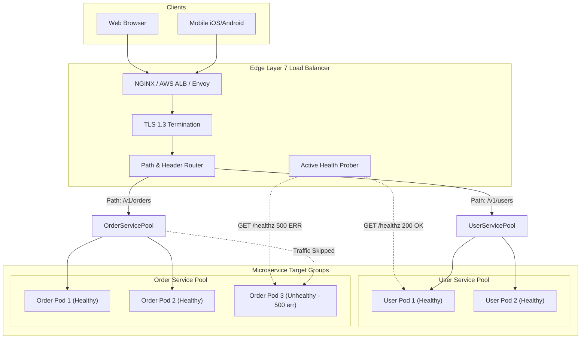

# Load Balancing & Traffic Routing

## 1. One-minute explanation

A **Load Balancer** is a critical network infrastructure component that distributes incoming client traffic across a pool of backend servers to maximize throughput, minimize latency, and eliminate single points of failure. Load balancers operate primarily at **Layer 4 (Transport / TCP / UDP)** for extreme raw packet-forwarding throughput (e.g., AWS NLB, IPVS) or **Layer 7 (Application / HTTP / gRPC)** for intelligent content-based routing, TLS termination, and header inspection (e.g., AWS ALB, NGINX, Envoy). Load balancers continuously monitor backend server health using **Active and Passive Health Checks**, automatically routing traffic away from failing nodes to achieve high availability.

---

## 2. What is it?

### Forward Proxy vs Reverse Proxy vs Load Balancer

```
Forward Proxy (Client-Side Proxy):
[ Client 1 ] ──► [ Forward Proxy (Corporate Gateway / VPN) ] ──► [ Public Internet ]
(Hides client identity; enforces corporate egress filtering & caching)

Reverse Proxy & Load Balancer (Server-Side Ingress):
[ Public Internet ] ──► [ Reverse Proxy / Load Balancer ] ──► [ Backend Server Pool ]
(Hides server backend topology; distributes ingress load, terminates TLS)
```

---

## 3. Why do we need it?

1. **High Availability & Fault Tolerance:** If Server A crashes or experiences hardware failure, the load balancer detects the failure in milliseconds and diverts traffic to Servers B, C, and D with zero client downtime.
2. **Elastic Horizontal Scalability:** Allows backend engineering teams to seamlessly add or remove container replicas in response to traffic spikes without changing DNS records.
3. **Security & Centralized TLS Termination:** Provides a hardened edge shield against DDoS attacks and centralizes SSL certificate management.

---

## 4. How does it work internally?

### 1. Layer 4 vs Layer 7 Load Balancing

| Dimension | Layer 4 (Transport / TCP / UDP) | Layer 7 (Application / HTTP / gRPC) |
| :--- | :--- | :--- |
| **OSI Layer** | Layer 4 (TCP, UDP) | Layer 7 (HTTP, HTTPS, HTTP/2, gRPC, WebSocket)|
| **Inspection Capability** | IP Address, TCP/UDP Ports only | Full HTTP Headers, Cookies, Paths (`/v1/orders`), JSON Body |
| **TLS Decryption** | TLS Passthrough (Raw encrypted packets) | **TLS Termination** (Decrypts and inspects payload) |
| **Performance / Latency**| **Ultra High Throughput ($>1\text{M}$ req/s)**, ultra low CPU | Moderate throughput, higher CPU overhead for parsing |
| **Routing Flexibility** | Simple IP/Port routing | Advanced path routing, canary deploys, A/B testing |
| **Example Technologies**| **AWS NLB**, HAProxy (TCP mode), Linux IPVS | **AWS ALB**, NGINX, Envoy, Traefik, Kong |

---

### 2. Core Load Balancing Algorithms

```
┌──────────────────────────────────────┬─────────────────────────────────────────────────────────────────────────┐
│ Algorithm                            │ How It Operates & Best Use Case                                         │
├──────────────────────────────────────┼─────────────────────────────────────────────────────────────────────────┤
│ **Round Robin**                      │ Cycles through servers sequentially ($1 \to 2 \to 3 \to 1$). Best for    │
│                                      │ homogeneous servers with identical request processing costs.           │
├──────────────────────────────────────┼─────────────────────────────────────────────────────────────────────────┤
│ **Weighted Round Robin**             │ Assigns proportional request volume based on server hardware capacity  │
│                                      │ (e.g., 8-core server gets 2x weight of 4-core server).                 │
├──────────────────────────────────────┼─────────────────────────────────────────────────────────────────────────┤
│ **Least Connections**                │ Routes to the server with the fewest active TCP connections. Ideal for │
│                                      │ long-running requests (WebSocket streams, database queries).           │
├──────────────────────────────────────┼─────────────────────────────────────────────────────────────────────────┤
│ **IP Hash / Consistent Hashing**     │ Hashes client IP or session key to bind client to a specific server.   │
├──────────────────────────────────────┼─────────────────────────────────────────────────────────────────────────┤
│ **Power of Two Random Choices**      │ Picks two servers at random and chooses the one with lower active load.│
│                                      │ Avoids herd behavior in large distributed clusters (NGINX/Envoy).       │
└──────────────────────────────────────┴─────────────────────────────────────────────────────────────────────────┘
```

---

### 3. Health Checking Mechanics
- **Active Health Checks:** Load balancer sends periodic synthetic HTTP requests (e.g., `GET /healthz` every 5 seconds). If a server returns non-2xx or times out 3 consecutive times, it is marked **Unhealthy** and removed from routing.
- **Passive Health Checks (Outlier Detection):** Monitors real client traffic. If a server returns 5 consecutive HTTP 500 errors to real users, it is automatically ejected for a cooldown window.

---

### 4. Sticky Sessions (Session Affinity) & Why They Are an Anti-Pattern
**Sticky Sessions** use a cookie (`Set-Cookie: SERVERID=srv_2`) to force a user's requests to always hit the same backend server instance where their in-memory session was created.

#### Why Sticky Sessions Break Modern Horizontal Scaling:
1. **Uneven Load Distribution (Hotspotting):** A single power-user or enterprise scraper pinned to Server 2 overloads that instance while Servers 1 and 3 sit idle.
2. **Broken Failover & Data Loss:** If Server 2 crashes, all users pinned to Server 2 lose their session state and are abruptly logged out.
3. **Blocks Auto-Scaling & Rolling Deploys:** Instances cannot be safely decommissioned without disrupting active users.
*Modern Solution:* Make backend APIs **100% Stateless** and store session state in a centralized Redis cluster or signed JWTs.

---

## 5. Architecture / Flow



---

## 6. Simple Example: NGINX Layer 7 Load Balancer Configuration

```nginx
# Define backend upstream cluster
upstream backend_cluster {
    least_conn; # Use Least Connections routing algorithm
    
    server 10.0.1.10:8080 weight=3 max_fails=3 fail_timeout=10s;
    server 10.0.1.11:8080 weight=1 max_fails=3 fail_timeout=10s;
    server 10.0.1.12:8080 backup; # Standby failover node
    
    keepalive 32; # Reusable upstream TCP connection pool
}

server {
    listen 443 ssl http2;
    server_name api.example.com;

    ssl_certificate /etc/ssl/fullchain.pem;
    ssl_certificate_key /etc/ssl/privkey.pem;

    location / {
        proxy_pass http://backend_cluster;
        proxy_http_version 1.1;
        proxy_set_header Connection ""; # Enable HTTP keep-alive to upstream
        proxy_set_header Host $host;
        proxy_set_header X-Real-IP $remote_addr;
        proxy_set_header X-Forwarded-For $proxy_add_x_forwarded_for;
        proxy_set_header X-Forwarded-Proto https;
    }
}
```

---

## 7. Production Example: Blue-Green & Canary Traffic Splitting

Modern cloud load balancers enable zero-downtime canary deployments by splitting traffic by percentage weights:

```yaml
# Kubernetes / Istio VirtualService Canary Routing
apiVersion: networking.istio.io/v1alpha3
kind: VirtualService
metadata:
  name: order-service-routing
spec:
  hosts:
  - "order-service.internal"
  http:
  - route:
    - destination:
        host: order-service
        subset: v1-stable
      weight: 90 # 90% traffic to stable production
    - destination:
        host: order-service
        subset: v2-canary
      weight: 10 # 10% traffic to canary release
```

---

## 8. When should we use Layer 4 vs Layer 7?

- **Use Layer 4 (NLB / IPVS):**
  - Ultra-high throughput ($>500,000\text{ req/s}$) where extreme low latency ($<1\text{ms}$) is paramount.
  - Non-HTTP protocols (TCP gaming servers, raw SMTP, database connection proxies, WebSockets at massive scale).
- **Use Layer 7 (ALB / Envoy / NGINX):**
  - Standard REST/GraphQL APIs, microservices, gRPC routing.
  - When routing decisions require inspecting URLs (`/api/v1/checkout` vs `/api/v1/search`), HTTP headers, or JWT claims.

---

## 9. When should we avoid sticky sessions?

- Avoid sticky sessions in all modern cloud-native architectures. Refactor state into Redis to maintain stateless, horizontally scalable services.

---

## 10. Tradeoffs

| Architecture | Throughput | Flexibility | CPU / Memory Cost |
| :--- | :--- | :--- | :--- |
| **Layer 4 Load Balancer** | **Extremely High** | Low (IP/Port only) | Very Low |
| **Layer 7 Load Balancer** | Moderate / High | **Maximum (Headers/Paths/Cookies)** | Moderate (TLS & HTTP Parsing) |

---

## 11. Common Mistakes

1. **Shallow Health Checks:** `GET /healthz` returning 200 OK without verifying that the database connection pool or downstream dependencies are functional.
2. **Deep Health Checks Causing Cascading Failures:** Having `/healthz` execute heavy SQL queries on every probe. When the database slows down, health checks fail, the load balancer kills all healthy app nodes, and causes a total platform outage! *(Best Practice: Health check checks local process and connection liveness; use separate deep readiness probes).*
3. **Closing Upstream TCP Keep-Alive:** Forcing the load balancer to open a fresh TCP connection to backend pods on every single request.

---

## 12. Related Concepts

- [HTTP vs HTTPS & TLS Offloading](file:///home/sameer/backendguide/01-networking/http-vs-https.md)
- [Horizontal vs Vertical Scaling](file:///home/sameer/backendguide/09-scalability/horizontal-vs-vertical-scaling.md)
- [Rate Limiting](file:///home/sameer/backendguide/09-scalability/rate-limiting.md)

---

## 13. Interview Questions

### Q1. What is the fundamental difference between Layer 4 and Layer 7 load balancing?
**Answer:**
- **Layer 4 (Transport Layer):** Operates on TCP/UDP packet headers (IP address and port) without inspecting application-layer data. It does not terminate TLS or parse HTTP. It provides ultra-high packet-forwarding throughput and sub-millisecond latency. (e.g., AWS Network Load Balancer).
- **Layer 7 (Application Layer):** Terminates TLS, parses the full HTTP/gRPC protocol payload, and makes routing decisions based on URL paths (`/orders` vs `/users`), HTTP headers, cookies, or HTTP methods. It enables smart routing, canary deployments, and WAF inspection at the cost of higher CPU utilization. (e.g., AWS Application Load Balancer, Envoy).  
**Why this matters:** Fundamental cloud architecture design question.  
**Possible follow-up:** How does Layer 4 handle TLS Passthrough vs Layer 7 TLS Termination?

### Q2. Why are Sticky Sessions considered an architectural anti-pattern for horizontally scalable backends?
**Answer:** Sticky sessions bind a client's requests to a specific physical backend server using a cookie.
1. **Defeats Load Balancing:** If 10% of users generate 80% of traffic, the servers assigned to those users become saturated (hotspotting), while others remain underutilized.
2. **Fragile Failover:** If a server node crashes, all active users pinned to that node lose their session state and are kicked out of the application.
3. **Prevents Smooth Auto-Scaling:** Instances cannot be automatically scaled down or restarted during rolling deployments without abruptly terminating user workflows.  
*Industry Solution:* Design 100% stateless backends backed by external Redis session stores or signed JWTs.  
**Why this matters:** Differentiates legacy stateful monolithic patterns from modern cloud-native architectures.  
**Possible follow-up:** Is there any legitimate use case for sticky sessions today?

### Q3. Explain the "Power of Two Random Choices" load balancing algorithm.
**Answer:** Instead of querying global connection state across hundreds of backend servers (which creates centralized locking contention) or using simple Round Robin (which ignores server load variations), the load balancer picks **two backend nodes at random** and routes the request to whichever of the two has fewer active connections. Mathematically, this simple local choice achieves near-optimal load distribution ($O(\log \log N)$ maximum queue length) while avoiding herd behavior and centralized synchronization bottlenecks.  
**Why this matters:** Used by high-performance modern proxies like Envoy and NGINX.  
**Possible follow-up:** How does this compare to Least Connections in large distributed topologies?

### Q4. How should you design a production-grade Health Check endpoint (`/healthz`)?
**Answer:**
1. **Liveness Check (`/healthz/liveness`):** Verifies the application process is running and event loop is not deadlocked. Returns `200 OK` instantly with zero external calls.
2. **Readiness Check (`/healthz/readiness`):** Verifies the pod is ready to accept user traffic (internal caches warmed, DB connection pool initialized).
3. **Avoid Cascading Outages:** Do **NOT** perform slow, heavy database queries in liveness probes. If the DB encounters a transient slow-down, failing liveness probes will trigger Kubernetes to restart all healthy application pods simultaneously, causing a full cluster crash.  
**Why this matters:** Essential reliability engineering in Kubernetes/containerized production environments.  
**Possible follow-up:** What is the difference between Active and Passive health checks?

### Q5. What is the role of Upstream Connection Keep-Alive in Load Balancers?
**Answer:** By default, if a load balancer terminates client TLS on the frontend and opens a brand new TCP connection to the backend container on every request, backend CPU is wasted performing thousands of TCP handshakes per second. By enabling **Upstream Keep-Alive Connection Pooling** (`keepalive 32;` in NGINX), the load balancer maintains a persistent pool of established, pre-warmed TCP connections to backend services, reducing internal latency from 5ms to <0.5ms per request.  
**Why this matters:** Massive performance multiplier for high-throughput microservices.  
**Possible follow-up:** How do you handle HTTP/2 multiplexing between load balancer and backend?

---

## 14. Advanced Interview Questions

### Q6. What is Direct Server Return (DSR) in Layer 4 load balancing?
**Answer:** In traditional load balancing, both incoming request packets and outgoing response packets traverse the load balancer. Because internet response traffic (e.g., video streaming, image downloads) is typically $10\times$ larger than request traffic, the load balancer's outbound bandwidth becomes the bottleneck. With **Direct Server Return (DSR)**, incoming client requests pass through the L4 load balancer, but backend servers send response packets **directly back to the client's IP** bypassing the load balancer entirely, unlocking multi-terabit throughput.

---

## 15. Production Scenarios

### Scenario: Intermittent 502 Bad Gateway Errors During Rolling Deployments
**Problem:** During Kubernetes rolling deployments, clients experience a 2-second burst of `502 Bad Gateway` errors.
**Analysis:** When Kubernetes terminates an old pod, it sends `SIGTERM`. The load balancer took 2 seconds to update its target group, continuing to route traffic to the terminating pod.
**Fix:**
1. Add a `preStop` lifecycle hook with a `sleep 5` to allow the load balancer time to drain traffic.
2. Ensure application handles graceful shutdown, completing in-flight requests before exiting.

---

## 16. Debugging Scenarios

### Scenario: Diagnosing Upstream Connection Saturation
Inspect NGINX error logs for:
`no live upstreams while connecting to upstream` or `upstream timed out (110: Connection timed out)`.
Check backend pod CPU saturation, file descriptor exhaustion (`ulimit -n`), and `listen` backlog limits (`somaxconn`).

---

## 17. Common Misconceptions

- *Misconception:* "DNS Round Robin is a full replacement for a load balancer."
  - *Reality:* DNS round-robin lacks real-time health checks, cannot detect failed servers in milliseconds, and is hindered by client-side DNS caching (TTL).
- *Misconception:* "Load balancers never fail."
  - *Reality:* Load balancers are deployed in active-passive or active-active pairs using protocols like VRRP (Virtual Router Redundancy Protocol) or Anycast BGP routing to ensure high availability.

---

## 18. Quick Revision

- Layer 4 (NLB/IPVS) = Ultra-fast TCP/UDP routing without payload parsing.
- Layer 7 (ALB/Envoy) = Smart HTTP/gRPC routing with TLS termination and path inspection.
- Sticky sessions are an anti-pattern; build stateless backends with Redis.
- Separate **Liveness probes** (process alive) from **Readiness probes** (ready for traffic).
- Keep upstream TCP connections pooled and persistent.

---

## 19. Interview-Ready Answer

> "A load balancer distributes incoming network traffic across a cluster of backend servers to optimize resource utilization, eliminate single points of failure, and enable zero-downtime scaling. Layer 4 load balancers forward raw TCP/UDP packets with ultra-high throughput, whereas Layer 7 load balancers terminate TLS and make intelligent routing decisions based on HTTP paths, headers, and methods. In production, we maintain high availability through active health checking and outlier detection, enforce stateless backend design over brittle sticky sessions, and maintain persistent upstream keep-alive connection pools."
