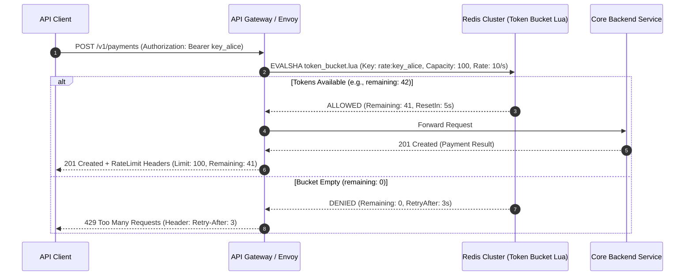

# Rate Limiting & API Protection

## 1. One-minute explanation

Rate limiting is a traffic-shaping and defensive mechanism that constrains the number of requests a client or service can execute within a specified time window. Rate limiters protect backend systems from **Distributed Denial of Service (DDoS)** attacks, brute-force credential stuffing, API abuse, and cascading downstream database saturation. The industry standard algorithms include the **Token Bucket** (which accommodates short traffic bursts while enforcing an average rate), the **Leaky Bucket** (which smooths traffic into a steady stream), and the **Sliding Window Counter** (which provides accurate rolling enforcement with low memory). In production, rate limiters return **HTTP 429 Too Many Requests** alongside headers (`RateLimit-Limit`, `RateLimit-Remaining`, `Retry-After`) and are implemented at the API Gateway layer using Redis.

---

## 2. What is it?

Rate limiting sits between client traffic and backend application services:

```
[ Client Traffic (10,000 req/s) ] 
               │
               ▼
   [ Rate Limiter / API Gateway ] ──► Exceeds 100 req/s? ──► [ HTTP 429 Too Many Requests ]
               │
               ▼ (Allowed 100 req/s)
   [ Protected Backend Services ]
```

---

## 3. Why do we need it?

1. **Security Defense:** Thwarts brute-force login attacks (`POST /login`), credential stuffing, and volumetric DoS attacks.
2. **Fair Usage / Multi-Tenant Isolation:** Prevents a single "noisy neighbor" customer from consuming all database connections and degrading performance for other tenants.
3. **Cost & Quota Governance:** Controls consumption of expensive third-party APIs (e.g., OpenAI tokens, Twilio SMS, payment gateways).
4. **Cascading Failure Protection:** Ensures microservices operate strictly within their designed load capacity.

---

## 4. How does it work internally? The 5 Core Algorithms

```
┌────────────────────────────┬──────────────────┬────────────────────┬───────────────────────────────────────┐
│ Algorithm                  │ Memory Cost      │ Handles Bursts?    │ Core Tradeoff / Limitation            │
├────────────────────────────┼──────────────────┼────────────────────┼───────────────────────────────────────┤
│ **Fixed Window Counter**   │ $O(1)$ (Minimal) │ Yes (Uncontrolled) │ **Boundary Burst Bug** (2x limit spike│
│                            │                  │                    │ at window boundaries).                │
├────────────────────────────┼──────────────────┼────────────────────┼───────────────────────────────────────┤
│ **Sliding Window Log**     │ $O(N)$ (High)    │ Controlled         │ Stores every timestamp; memory grows  │
│                            │                  │                    │ linearly with traffic volume.         │
├────────────────────────────┼──────────────────┼────────────────────┼───────────────────────────────────────┤
│ **Sliding Window Counter** │ $O(1)$ (Low)     │ Smooth rolling     │ Approximation (Assumes uniform request│
│                            │                  │                    │ distribution in previous window).     │
├────────────────────────────┼──────────────────┼────────────────────┼───────────────────────────────────────┤
│ **Token Bucket**           │ $O(1)$ (Low)     │ **Yes (Regulated)**│ **Industry Standard** (Used by Stripe,│
│                            │                  │                    │ AWS, GitHub); permits burst capacity. │
├────────────────────────────┼──────────────────┼────────────────────┼───────────────────────────────────────┤
│ **Leaky Bucket**           │ $O(\text{Queue}) $│ **No (Smooths)**  │ Queues requests and leaks at a fixed  │
│                            │                  │                    │ constant rate; adds latency.          │
└────────────────────────────┴──────────────────┴────────────────────┴───────────────────────────────────────┘
```

### 1. Token Bucket Algorithm (Stripe / AWS Model)
- A bucket has a maximum capacity $B$ and continuously refills with tokens at a constant rate $r$ tokens/second.
- When a request arrives:
  - If tokens $\ge 1$: Consume 1 token and process the request.
  - If tokens $< 1$: Reject immediately with `HTTP 429`.
- *Key Benefit:* Allows short bursts (up to capacity $B$) while strictly guaranteeing the long-term average rate never exceeds $r$.

### 2. The Fixed Window Boundary Problem
If limit is 100 req/minute:
- Client sends 100 requests at 00:59.
- Window resets at 01:00.
- Client sends another 100 requests at 01:01.
- **Result:** The client executed 200 requests within a 2-second window without triggering rate limits!

---

## 5. Architecture / Flow



---

## 6. Simple Example: Redis Sliding Window Counter in Python

```python
import time
import redis

r = redis.Redis(host='localhost', port=6379, db=0)

def is_rate_limited(user_id: str, limit: int = 100, window_sec: int = 60) -> bool:
    """Sliding Window Log using Redis Sorted Sets."""
    current_time = time.time()
    key = f"ratelimit:{user_id}"
    
    pipeline = r.pipeline()
    # 1. Remove timestamps older than the current window
    pipeline.zremrangebyscore(key, 0, current_time - window_sec)
    # 2. Add current request timestamp
    pipeline.zadd(key, {str(current_time): current_time})
    # 3. Count total requests in the window
    pipeline.zcard(key)
    # 4. Set key TTL
    pipeline.expire(key, window_sec)
    
    _, _, request_count, _ = pipeline.execute()
    
    return request_count > limit
```

---

## 7. Production Example: High-Performance Token Bucket with Redis Lua Script

In production, calculating token refill lazily on each request inside an atomic Lua script prevents race conditions and eliminates background timer threads:

```lua
-- KEYS[1]: Rate limit key (e.g. "ratelimit:user_123")
-- ARGV[1]: Max bucket capacity (e.g. 100)
-- ARGV[2]: Refill rate per millisecond (e.g. 0.01 tokens/ms = 10 tokens/sec)
-- ARGV[3]: Current timestamp in milliseconds

local key = KEYS[1]
local capacity = tonumber(ARGV[1])
local refill_rate = tonumber(ARGV[2])
local now = tonumber(ARGV[3])

local data = redis.call("HMGET", key, "tokens", "last_updated")
local tokens = tonumber(data[1])
local last_updated = tonumber(data[2])

if not tokens then
    tokens = capacity
    last_updated = now
else
    -- Calculate tokens accumulated since last request
    local delta = math.max(0, now - last_updated)
    tokens = math.min(capacity, tokens + (delta * refill_rate))
    last_updated = now
end

if tokens >= 1 then
    tokens = tokens - 1
    redis.call("HMSET", key, "tokens", tokens, "last_updated", last_updated)
    redis.call("EXPIRE", key, 60)
    return {1, math.floor(tokens)} -- Allowed (1 = True, Remaining Tokens)
else
    redis.call("HMSET", key, "tokens", tokens, "last_updated", last_updated)
    return {0, 0} -- Denied (0 = False)
end
```

---

## 8. Standard HTTP Rate Limiting Headers (IETF RFC Draft)

Production APIs return structured headers so clients can proactively throttle their requests:

```http
HTTP/1.1 429 Too Many Requests
Content-Type: application/json
RateLimit-Limit: 100
RateLimit-Remaining: 0
RateLimit-Reset: 1724768045
Retry-After: 15

{
  "error": "too_many_requests",
  "message": "Rate limit exceeded. Try again in 15 seconds."
}
```

---

## 9. When should we use it?

- **Per-User / Per-API Key:** Protecting SaaS platform tiers (e.g., Free: 60 rpm, Enterprise: 10,000 rpm).
- **Per-IP:** Mitigating DDoS and bot scrapers on unauthenticated public routes.
- **Per-Endpoint:** Strict limits on expensive operations (e.g., `POST /auth/login` max 5 req/min; `POST /reports/export` max 2 req/min).

---

## 10. Tradeoffs & Bottlenecks

| Factor | Detail |
| :--- | :--- |
| **Latency Overhead** | Adds 0.5–2ms per request for Redis lock/script evaluation at the gateway. |
| **Redis Bottleneck** | A single Redis instance caps at $\approx 80,000$ Lua evaluations/sec; requires Redis Cluster sharding for ultra-scale. |
| **IP Spoofing Risk** | Rate limiting by IP is brittle if clients sit behind NATs/corporate proxies or spoof `X-Forwarded-For`. |

---

## 11. Common Mistakes

1. **Trusting Client `X-Forwarded-For` Headers Naively:** Attackers can inject arbitrary fake IPs to bypass IP-based rate limits unless the upstream load balancer overrides the header.
2. **Lack of Rate Limit Headers on `200 OK` Responses:** Failing to inform clients of remaining quota prevents well-behaved SDKs from self-throttling.
3. **Hardcoding Synchronous Redis Calls Without Fallback:** If the Redis rate limiter crashes, rejecting all client traffic (Fail-Closed) causes total platform outage. Best practice: Fail-Open for non-critical endpoints with alerting.

---

## 12. Related Concepts

- [Redis Caching & Lua Scripts](../06-caching/redis-caching.md)
- [Load Balancing & Reverse Proxies](./load-balancing.md)
- [Race Conditions & Concurrency](../08-concurrency/race-conditions.md)

---

## 13. Interview Questions

### Q1. Compare the Token Bucket and Leaky Bucket algorithms. When would you choose one over the other?
**Answer:**
- **Token Bucket:** Tokens refill at a steady rate into a bucket with capacity $B$. Requests consume tokens. If bursts arrive, all requests are processed immediately as long as tokens are available in the bucket. Once empty, requests are dropped.  
  *Use Case:* General REST APIs (Stripe, AWS) where occasional traffic bursts from web/mobile clients are acceptable.
- **Leaky Bucket:** Requests enter a FIFO queue (bucket) and "leak" out to backend workers at a strictly fixed, constant rate. Excess requests overflow and are dropped.  
  *Use Case:* Ingestion pipelines feeding downstream systems that cannot tolerate any sudden spikes (e.g., third-party webhooks, legacy hardware interfaces).  
**Why this matters:** Core systems design question on traffic shaping.  
**Possible follow-up:** How does Sliding Window Counter compare in terms of memory efficiency?

### Q2. What is the Fixed Window Counter "Boundary Burst" bug and how do you resolve it?
**Answer:** In Fixed Window Counter (e.g., 100 req/minute), if a client sends 100 requests at second 59 and another 100 requests at second 61, the counter resets at the minute boundary. The server receives 200 requests within a 2-second window, doubling the allowed capacity.  
**Resolution:** Use **Sliding Window Counter**, which weights the count of the previous window based on the current timestamp's overlap percentage:
$$\text{Estimated Count} = (\text{Prev Window Count} \times (1 - \text{Overlap Ratio})) + \text{Current Window Count}$$
**Why this matters:** Demonstrates deep mathematical understanding of rate limiter edge cases.  
**Possible follow-up:** What is the memory footprint of a Sliding Window Counter in Redis?

### Q3. How do you implement distributed rate limiting across a cluster of 100 API gateway instances?
**Answer:** 
1. **Centralized Redis Store with Lua Scripts:** All gateway nodes query a shared Redis cluster. The Token Bucket algorithm is computed inside an atomic Lua script to prevent race conditions.
2. **Local Token Batching (High Throughput Optimization):** If hitting Redis on every request saturates the cache, gateway instances borrow "batches" of tokens locally (e.g., each gateway borrows 50 tokens from Redis at a time) and enforces limits in local memory.
3. **Consistent Hashing by Rate Limit Key:** Shard Redis nodes using consistent hashing over the `rate_limit_key` (`user_id` or `api_key`) to distribute load evenly across Redis cluster nodes.  
**Why this matters:** Architecture pattern for multi-million request-per-second platforms.  
**Possible follow-up:** What happens if a Redis cluster node goes down?

### Q4. Should a rate limiter Fail-Open or Fail-Closed when the rate limiting database (Redis) is unreachable?
**Answer:** It depends on the business endpoint criticality:
- **Fail-Open (Recommended for Core Business APIs):** Allow requests to pass through to backend services, emit high-priority alerts to on-call engineers, and rely on downstream database circuit breakers. Better to risk higher load than 100% outage for legitimate users.
- **Fail-Closed (Mandatory for High-Security / Expensive Endpoints):** Block requests on `/login`, `/auth/verify-mfa`, or `/ai/generate-video` to prevent catastrophic brute-force attacks or massive cloud billing spikes during infrastructure failures.  
**Why this matters:** Evaluates senior engineering trade-off judgment under disaster scenarios.  
**Possible follow-up:** How do you implement circuit breakers for rate limiters?

### Q5. What rate limiting keys / dimensions should you configure in a multi-tier production API?
**Answer:** A production architecture enforces **Defense-in-Depth Multi-Dimensional Limits**:
1. **Global Ingress Limit (Per IP / CDN Layer):** Cloudflare/AWS WAF limits raw IPs (e.g., 10,000 req/min) to stop Layer 7 DDoS.
2. **Tenant / Customer Limit (Per API Key / Org ID):** Enforces paid subscription tiers (e.g., Tier 1: 500 rpm, Tier 2: 5,000 rpm).
3. **Per-User Limit (Per `user_id`):** Prevents a single rogue employee script from exhausting an organization's shared API quota.
4. **Per-Resource / Expensive Endpoint Limit:** Restrict heavy compute endpoints (e.g., `POST /reports/pdf` max 5 rpm).  
**Why this matters:** Comprehensive real-world system design.  
**Possible follow-up:** How do you handle clients behind corporate NATs?

---

## 14. Advanced Interview Questions

### Q6. How do you prevent hot-key saturation on Redis when rate limiting a viral public endpoint?
**Answer:** If 1,000,000 unauthenticated users hit `/v1/public-news`, evaluating the single Redis key `ratelimit:ip_anon` causes single-core CPU saturation on Redis.
**Solutions:**
1. **In-Memory Local Rate Limiting:** Enforce local rate limits inside each API Gateway proxy memory using an LFU cache.
2. **Key Sharding / Salt Splitting:** Split the single logical counter across $K$ sub-keys (`ratelimit:public:1`, `ratelimit:public:2`, ... `ratelimit:public:K`). The gateway picks a random shard $1..K$ with capacity $C/K$.

---

## 15. Production Scenarios

### Scenario: Sudden Burst of 429 Errors During Frontend Webhook Outage
**Problem:** A mobile app encounters rate limiting and immediately retries failing requests in a tight `while (true)` loop without backoff, worsening the 429 rate limit storm.
**Fix:**
1. Mobile SDK must parse the `Retry-After: 15` header and delay retries.
2. Enforce **Exponential Backoff with Full Jitter** on all client retry libraries.

---

## 16. Debugging Scenarios

### Scenario: Debugging Redis Rate Limiter Latency Spikes
```bash
# Monitor Redis slow command log
redis-cli slowlog get 10

# Test Lua script execution time
redis-cli --latency-history -h redis-cluster.internal
```

---

## 17. Common Misconceptions

- *Misconception:* "Rate limiting and throttling are identical terms."
  - *Reality:* Rate limiting *rejects* excess requests immediately (HTTP 429). Throttling *delays / queues* excess requests to match a target processing rate.
- *Misconception:* "IP-based rate limiting is 100% reliable for identifying users."
  - *Reality:* Thousands of users in an office or university share a single public NAT IP; aggressive IP rate limiting blocks innocent users.

---

## 18. Quick Revision

- Token Bucket allows controlled bursts; Leaky Bucket forces constant rate.
- Fixed Window suffers from 2x boundary bursts; use Sliding Window Counter.
- Implement in Redis via atomic Lua scripts for sub-millisecond evaluation.
- Always return standard headers: `RateLimit-Limit`, `RateLimit-Remaining`, `Retry-After`.
- Choose **Fail-Open** for business endpoints, **Fail-Closed** for security endpoints.

---

## 19. Interview-Ready Answer

> "Rate limiting protects backend systems from DDoS attacks, API abuse, and cascading downstream saturation by constraining client request throughput. The Token Bucket algorithm is the production gold standard because it accommodates legitimate traffic bursts while enforcing a strict average refill rate. We implement distributed rate limiting at the API Gateway layer using Redis and atomic Lua scripts, returning HTTP 429 Too Many Requests with standard Retry-After headers, and enforce multi-dimensional limits across IPs, API keys, and expensive endpoints."
