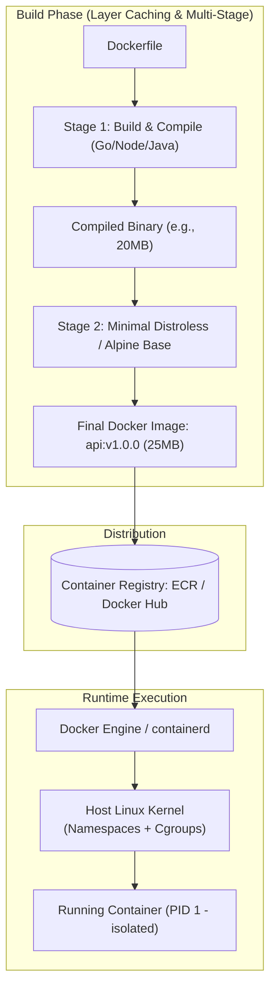

# Docker & Container Architecture

## 1. One-minute explanation

Docker is an open-source containerization platform that packages application code along with all its runtime dependencies, libraries, and system configurations into lightweight, immutable, and reproducible artifacts called **Images**. Unlike Virtual Machines (VMs), which virtualize full hardware and run heavy guest operating systems, Docker containers run directly on the host operating system, sharing the **host Linux kernel**. Docker achieves process isolation and security boundaries using native Linux kernel primitives: **Namespaces** (for process, network, and mount isolation) and **Control Groups (cgroups)** (for CPU, memory, and I/O resource limiting). Multi-stage builds, non-root execution, and layer caching are essential for production-grade container engineering.

---

## 2. What is it?

### Containers vs Virtual Machines

```
┌───────────────────────────────────────┐       ┌───────────────────────────────────────┐
│          Virtual Machine (VM)         │       │            Docker Container           │
├───────────────────────────────────────┤       ├───────────────────────────────────────┤
│  [ App 1 ]   [ App 2 ]   [ App 3 ]    │       │  [ App 1 ]   [ App 2 ]   [ App 3 ]    │
│  [ Libs  ]   [ Libs  ]   [ Libs  ]    │       │  [ Libs  ]   [ Libs  ]   [ Libs  ]    │
│  [ Guest OS: Linux / Windows (GBs) ]  │       ├───────────────────────────────────────┤
├───────────────────────────────────────┤       │     Docker Engine / Containerd        │
│          Hypervisor (Type 1/2)        │       ├───────────────────────────────────────┤
├───────────────────────────────────────┤       │ Shared Host Linux Kernel (Namespaces) │
│       Host OS & Physical Hardware     │       ├───────────────────────────────────────┤
│                                       │       │           Host Physical Hardware      │
└───────────────────────────────────────┘       └───────────────────────────────────────┘
```

| Dimension | Virtual Machine (VM) | Docker Container |
| :--- | :--- | :--- |
| **Architecture** | Virtualizes physical hardware | Isolates OS processes |
| **Kernel** | Each VM runs its own full **Guest OS Kernel** | Shares the **Host Linux Kernel** |
| **Startup Time** | Minutes (Booting full OS) | **Milliseconds** (Starting a process) |
| **Resource Overhead**| Heavy (Gigabytes of RAM per VM) | **Lightweight** (Megabytes of RAM) |
| **Portability** | Heavy VM images (10GB+) | Compact OCI layer images (20MB–200MB) |

---

## 3. Why do we need it?

1. **"It Works On My Machine" Problem Solved:** Guarantees identical runtime environments from developer laptop to CI/CD and production Kubernetes clusters.
2. **High Resource Density:** Run 50 containerized microservices on a single cloud VM that could previously host only 3 full VMs.
3. **Immutable Deployments & Fast Rollbacks:** Deploying a new release means deploying an immutable pre-compiled container image tag.

---

## 4. How does it work internally? Linux Kernel Primitives

A Docker container is **not a real physical entity**—it is simply a standard Linux process running with restricted visibility and resource bounds enforced by three kernel features:

### 1. Linux Namespaces (Isolation Boundaries)
Namespaces restrict **what a process can see**:
- **PID Namespace:** Process isolation (the container process sees itself as `PID 1`).
- **NET Namespace:** Network virtualization (dedicated virtual IP, loopback, routing table, and port bindings).
- **MNT Namespace:** File system mount isolation (isolated root filesystem via `chroot`/`pivot_root`).
- **IPC Namespace:** Inter-process communication isolation (prevents accessing host shared memory).
- **UTS Namespace:** Hostname and domain name isolation.
- **USER Namespace:** Maps container `root` (UID 0) to an unprivileged host UID for security.

### 2. Control Groups (cgroups) (Resource Constraints)
Cgroups restrict **what a process can use**:
- Limits maximum memory (e.g., `memory.max = 512MB` $\to$ triggers OOM killer if exceeded).
- Limits CPU bandwidth (e.g., `cpu.max = 50000 100000` $\to$ restricts to 0.5 CPU core).
- Controls disk I/O throughput and network priority.

### 3. OverlayFS / UnionFS (Layered Storage)
Docker images are built as a stack of read-only cryptographic layers. When a container runs, Docker attaches a thin **Read-Write (R/W) Container Layer** on top. File modifications use **Copy-on-Write (CoW)**: the modified file is copied from the read-only layer into the top R/W layer.

---

## 5. Architecture / Flow



---

## 6. Simple Example: Dockerfile Layer Optimization

### ANTI-PATTERN: Inefficient Dockerfile (Breaks Layer Caching)
```dockerfile
FROM node:18
WORKDIR /app
# BAD: Copying all code before npm install invalidates cache on every single line change!
COPY . .
RUN npm install
CMD ["node", "server.js"]
```

### PRODUCTION PATTERN: Optimized Layer Caching
```dockerfile
FROM node:18-alpine
WORKDIR /app
# 1. Copy only dependency descriptors first
COPY package.json package-lock.json ./
# 2. Install dependencies (Cached unless package.json changes!)
RUN npm ci --only=production
# 3. Copy application source code
COPY . .
CMD ["node", "server.js"]
```

---

## 7. Production Example: Secure Multi-Stage Build (Go / Node.js)

```dockerfile
# -------------------------------------------------------------
# Stage 1: Build Environment
# -------------------------------------------------------------
FROM golang:1.22-alpine AS builder

WORKDIR /build

# Cache Go modules
COPY go.mod go.sum ./
RUN go mod download

# Copy source code and compile statically linked binary
COPY . .
RUN CGO_ENABLED=0 GOOS=linux go build -ldflags="-w -s" -o /app/server .

# -------------------------------------------------------------
# Stage 2: Minimal Production Runtime
# -------------------------------------------------------------
FROM gcr.io/distroless/static-debian12:nonroot

WORKDIR /app

# Copy only the compiled binary from builder stage
COPY --from=builder /app/server /app/server

# Run as non-root user (Security Best Practice)
USER nonroot:nonroot

EXPOSE 8080

ENTRYPOINT ["/app/server"]
```
*Result:* Image size drops from **850MB** (full Go toolchain) to **22MB** (zero OS shell, zero vulnerabilities, no attack surface).

---

## 8. Essential Docker CLI Commands

```bash
# Build with tag
docker build -t my-api:1.0.0 .

# Run with resource constraints, port forwarding, and restart policy
docker run -d \
  --name my-api \
  -p 8080:8080 \
  --cpus="1.5" \
  --memory="512m" \
  --restart=unless-stopped \
  -e ENV=production \
  my-api:1.0.0

# Inspect resource consumption in real-time
docker stats my-api

# Debug inside running container
docker exec -it my-api /bin/sh
```

---

## 9. When should we use it?

- Microservices and cloud-native API deployments.
- CI/CD build runners and reproducible test environments.
- Polyglot backend teams running Go, Python, Node, and Java services uniformly.

---

## 10. When should we avoid it?

- Heavy monolithic databases with massive I/O throughput requirements where raw bare-metal performance optimization is prioritized (though managed cloud DBs run containerized under the hood).
- Ultra-low latency kernel bypass networking applications (e.g., DPDK high-frequency trading).

---

## 11. Common Mistakes

1. **Running Containers as `root`:** Running as root inside the container allows an attacker exploiting a container breakout vulnerability to gain root privileges over the host machine. (Fix: Always define `USER appuser`).
2. **Using `:latest` Image Tag in Production:** Leads to non-deterministic deployments. Always use immutable version tags (`:v1.2.4`) or SHA256 image digests.
3. **Leaving Zombie Processes (Missing PID 1 Signal Forwarding):** Node/Python runtimes do not handle PID 1 signal reaping by default. When Docker sends `SIGTERM`, the app fails to shut down gracefully and is forcefully killed after 10s. (Fix: Use `tini` or `dumb-init`).
4. **Missing `.dockerignore`:** Accidentally copying `.git`, local `.env` secrets, or `node_modules` into the Docker build context.

---

## 12. Related Concepts

- [Horizontal vs Vertical Scaling](../09-scalability/horizontal-vs-vertical-scaling.md)
- [Logging & Observability](../11-observability/logging-metrics-monitoring.md)
- [Load Balancing & Ingress](../09-scalability/load-balancing.md)

---

## 13. Interview Questions

### Q1. How does a Docker Container fundamentally differ from a Virtual Machine?
**Answer:** A Virtual Machine uses a hypervisor to virtualize physical hardware, requiring each VM to boot its own complete guest operating system kernel (consuming gigabytes of RAM and minutes of boot time). A Docker container virtualizes at the OS process level; all containers share the **single host Linux kernel**. Docker uses Linux **Namespaces** to isolate what the process sees and **cgroups** to restrict the CPU and memory it can consume. Containers boot in milliseconds and have negligible RAM overhead.  
**Why this matters:** Foundational DevOps and backend systems interview question.  
**Possible follow-up:** What are the security implications of sharing the host kernel?

### Q2. What is the difference between `CMD` and `ENTRYPOINT` in a Dockerfile?
**Answer:**
- **`ENTRYPOINT`:** Defines the core immutable executable that the container runs. It is not overridden by default arguments passed to `docker run`.
- **`CMD`:** Defines default parameters passed to the `ENTRYPOINT` (or the default command if no `ENTRYPOINT` is defined). It is easily overridden by command-line arguments at runtime.  
*Best Practice Pattern:*
```dockerfile
ENTRYPOINT ["/app/server"]
CMD ["--port=8080", "--env=prod"]
```
Running `docker run my-image --port=9090` overrides only the `CMD` flags while preserving the binary entrypoint.  
**Why this matters:** Differentiates intermediate Docker users from senior container architects.  
**Possible follow-up:** What is the difference between Exec form and Shell form in CMD?

### Q3. How does Docker Layer Caching work and how do you structure a Dockerfile to maximize cache hits?
**Answer:** Docker evaluates Dockerfile instructions sequentially from top to bottom. Each instruction (`RUN`, `COPY`, `ADD`) creates a read-only filesystem layer.
- If an instruction and all previous instructions are unchanged, Docker reuses the cached layer.
- If a layer is invalidated (e.g., `COPY . .` detects a modified file), **all subsequent layers below it are completely invalidated and must rebuild from scratch**.  
*Optimization Strategy:* Place instructions that change **infrequently** (installing OS packages, downloading library dependencies like `package.json` or `go.mod`) at the **top**, and place instructions that change **frequently** (application source code) at the **bottom**.  
**Why this matters:** Speeds up CI/CD build pipelines from 10 minutes to 15 seconds.  
**Possible follow-up:** How does BuildKit remote cache export work?

### Q4. What is a Multi-Stage Docker Build and why is it mandatory for production deployments?
**Answer:** A Multi-Stage Build uses multiple `FROM` statements in a single Dockerfile:
1. **Builder Stage:** Uses a full-featured image containing SDKs, compilers (Go, Rust, TypeScript, Maven), build tools, and test suites to compile the binary.
2. **Final Runtime Stage:** Uses a minimal base image (e.g., Alpine or Distroless) and copies **only the compiled production binary/artifacts** from the builder stage.  
*Benefits:*
- Reduces image size drastically (e.g., from 1.2GB down to 20MB).
- Removes compilers, package managers, and bash shells from production, eliminating 99% of CVE security vulnerabilities.  
**Why this matters:** Security hardening and deployment speed in containerized environments.  
**Possible follow-up:** What is a Distroless image?

### Q5. Why is running containers as the `root` user a critical security hazard?
**Answer:** By default, process UID 0 inside a container maps directly to UID 0 (root) on the host Linux kernel (unless User Namespaces are configured). If an application vulnerability allows a **Container Escape** (e.g., exploiting a kernel flaw or a misconfigured volume mount like `/var/run/docker.sock`), the attacker gains unrestricted root control over the host server, compromising all other containers and infrastructure.  
*Remediation:* Create an unprivileged user in the Dockerfile:
`RUN adduser -D appuser && USER appuser`.  
**Why this matters:** Essential container security posture and compliance.  
**Possible follow-up:** What is `seccomp` and `AppArmor` in container runtime security?

---

## 14. Advanced Interview Questions

### Q6. Why is the "PID 1 Zombie Reaping" problem an issue in Docker, and how do tools like `tini` or `dumb-init` fix it?
**Answer:** In Linux, PID 1 is responsible for reaping "zombie processes" (child processes that have terminated but whose parents never called `wait()`) and forwarding OS signals (`SIGTERM`, `SIGINT`) to child processes. Standard application runtimes (like Node.js, Python, or Java) were not designed to act as init systems (PID 1). They often ignore `SIGTERM`, causing Docker to hang for 10 seconds before forcibly killing the container with `SIGKILL` (preventing graceful database connection closing). Using a lightweight init binary like `tini` (`ENTRYPOINT ["/sbin/tini", "--", "/app/server"]`) properly forwards signals and reaps zombie processes.

---

## 15. Production Scenarios

### Scenario: Container Terminated with Exit Code 137
**Problem:** In production Kubernetes, an API container randomly crashes with `Exit Code 137`.
**Analysis:** Exit Code 137 indicates `128 + 9 (SIGKILL)`. The Linux kernel **OOM (Out-Of-Memory) Killer** terminated the container because its memory usage exceeded the configured cgroup memory limit (`--memory=512m` / `resources.limits.memory`).
**Fix:** Profile application memory leaks (e.g., unclosed streams or unbounded in-memory caches), increase memory limits, and tune JVM/Go heap allocation flags.

---

## 16. Debugging Scenarios

### Scenario: Inspecting Image Layers & Bloat Using `dive` or `docker history`
```bash
# View layer sizes and command instructions
docker history --no-trunc my-api:latest

# Analyze image layer contents using dive CLI
dive my-api:latest
```

---

## 17. Common Misconceptions

- *Misconception:* "Docker containers are completely isolated lightweight virtual machines."
  - *Reality:* Containers are just isolated host processes sharing the same kernel. A kernel panic caused by one container crashes the entire physical host machine.
- *Misconception:* "Data written inside a container is automatically persisted."
  - *Reality:* Container writable layers are ephemeral; destroying the container deletes all internal state unless mounted to an external **Docker Volume** or persistent storage.

---

## 18. Quick Revision

- Containers share the host kernel; VMs run full guest OS on a hypervisor.
- Isolation is enforced via **Namespaces** (visibility) and **cgroups** (resource limits).
- Optimize caching by copying dependencies (`package.json`) before application code.
- Use **Multi-Stage builds** and **Distroless** images for security and tiny payloads.
- Never run production containers as `root`; always use `dumb-init` / `tini` for PID 1.

---

## 19. Interview-Ready Answer

> "Docker packages applications into immutable, portable container images that share the host Linux kernel, eliminating the heavy overhead of traditional virtual machines. Process isolation and resource governance are enforced natively by kernel Namespaces and Control Groups (cgroups). In production, we write optimized multi-stage Dockerfiles that leverage layer caching for lightning-fast CI builds, run as non-privileged non-root users on minimal Distroless base images to minimize the CVE attack surface, and configure init systems to ensure graceful shutdown signal handling."
