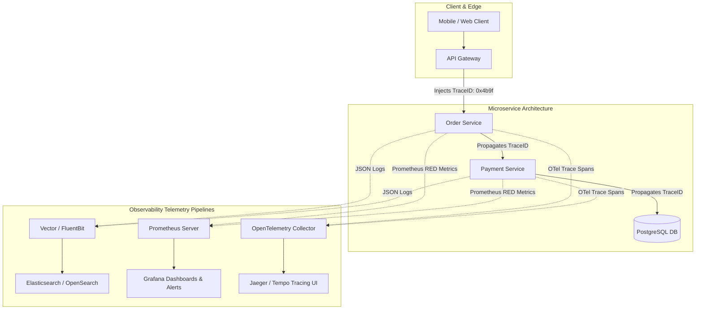

# Observability: Logging, Metrics & Distributed Tracing

## 1. One-minute explanation

**Observability** is the degree to which you can infer the internal execution state and health of a distributed system based solely on its external outputs. Unlike traditional passive monitoring (which tracks pre-defined "known-unknowns" via dashboards), observability enables engineers to debug novel, unpredictable failure modes ("unknown-unknowns"). Observability is anchored by the **Three Pillars**: **Structured Logs** (discrete event records formatted in JSON with contextual metadata), **Metrics** (aggregatable numerical time-series tracked via RED and USE methods), and **Distributed Traces** (end-to-end request journeys tracked across microservices via W3C `traceparent` context propagation). Engineering teams define **SLIs, SLOs, and Error Budgets** to balance deployment velocity against system reliability.

---

## 2. What is it? Monitoring vs Observability

```
Monitoring (Passive / Reactive):
- "Is the CPU above 90%?"
- "Is the server throwing 500 errors?"
- Tells you THAT something is broken based on pre-configured alert thresholds.

Observability (Active / Exploratory):
- "Why are users in Germany using iOS on cellular networks experiencing 4-second latency during checkout?"
- Allows you to ask open-ended questions about complex distributed interactions without deploying new code.
```

---

## 3. The Three Pillars of Observability

```
┌─────────────────┬───────────────────────────────────┬────────────────────────────────────────┐
│ Pillar          │ What Question It Answers          │ Typical Format & Storage Tech          │
├─────────────────┼───────────────────────────────────┼────────────────────────────────────────┤
│ **Logs**        │ *"What happened at timestamp T?"* │ Structured JSON (Elasticsearch, Loki)  │
│ **Metrics**     │ *"Is the system healthy now?"*    │ Time-Series Floats (Prometheus, M3DB)  │
│ **Traces**      │ *"Where was time spent across     │ Spans with TraceID (Jaeger, Tempo,     │
│                 │  microservice network hops?"*     │ OpenTelemetry)                         │
└─────────────────┴───────────────────────────────────┴────────────────────────────────────────┘
```

---

## 4. How does it work internally?

### 1. Structured Logging & Context Propagation
Unstructured string logs (`log.info("User logged in: " + userId)`) are impossible to parse and filter at scale. **Structured JSON Logs** treat logs as queryable database records:

```json
{
  "timestamp": "2026-08-27T10:14:02.120Z",
  "level": "ERROR",
  "service": "payment-service",
  "trace_id": "4bf92f3577b34da6a3ce929d0e0e4736",
  "span_id": "00f067aa0ba902b7",
  "user_id": "usr_9981",
  "endpoint": "POST /v1/charges",
  "http_status": 502,
  "duration_ms": 312.4,
  "error_code": "GATEWAY_TIMEOUT",
  "message": "Payment provider timed out after 300ms"
}
```

### 2. Correlation IDs & Distributed Tracing (OpenTelemetry)
When a client request touches 6 microservices, a **Correlation ID / Trace ID** is injected at the API Gateway and propagated across HTTP/gRPC headers using the **W3C Trace Context standard**:
`traceparent: 00-4bf92f3577b34da6a3ce929d0e0e4736-00f067aa0ba902b7-01`

```
[ API Gateway ] ──(TraceID: abc)──► [ Order Svc ] ──(TraceID: abc)──► [ Payment Svc ]
       │                                                                    │
       ▼                                                                    ▼
 (Emits Span 1)                                                       (Emits Span 2)
```

---

### 3. Metrics Architecture & Frameworks

#### Metric Types
1. **Counter:** Monotonically increasing counter (e.g., `http_requests_total`). Only goes up (resets on restart).
2. **Gauge:** Value that goes up and down (e.g., `cpu_utilization_percent`, `active_db_connections`).
3. **Histogram:** Samples observations into configurable buckets to calculate **Percentiles (p50, p95, p99)**.

#### The RED Method (For Request-Driven APIs)
- **Rate:** Requests per second ($\text{req/s}$).
- **Errors:** Number of failing requests per second (e.g., HTTP 5xx).
- **Duration:** Latency distribution of requests.

#### The USE Method (For Infrastructure Resources - CPU/Disk/Memory)
- **Utilization:** Percentage of time the resource was busy (e.g., CPU 75%).
- **Saturation:** Degree to which extra work is queued (e.g., Linux load average, thread pool queue depth).
- **Errors:** Hardware/system error events (e.g., dropped network packets).

---

### 4. Latency Percentiles: Why "Average Latency" is a Dangerous Lie

Consider 100 API requests:
- 99 requests take **10ms**.
- 1 request hangs for **10,000ms (10 seconds)**.
$$\text{Average (Arithmetic Mean)} = \frac{(99 \times 10) + 10000}{100} = 109.9\text{ms}$$
The average latency is **110ms**, which appears healthy on a dashboard. However, 1% of all customers experienced a catastrophic 10-second freeze!

```
Percentile Definitions:
- p50 (Median): 50% of requests are faster than this value. Represents typical user experience.
- p95: 95% of requests are faster than this value.
- p99 (Tail Latency): 99% of requests are faster; highlights the slowest 1 in 100 requests.
- p99.9: The slowest 1 in 1,000 requests (critical for multi-service microservice chains).
```

---

### 5. SLI vs SLO vs SLA & Error Budgets

```
┌───────────────────────────────────────┬─────────────────────────────────────────────────────────────────────────┐
│ Concept                               │ Definition & Real-World Example                                         │
├───────────────────────────────────────┼─────────────────────────────────────────────────────────────────────────┤
│ **SLI (Service Level Indicator)**     │ What you measure: "Percentage of successful HTTP requests served in     │
│                                       │ less than 200ms."                                                       │
├───────────────────────────────────────┼─────────────────────────────────────────────────────────────────────────┤
│ **SLO (Service Level Objective)**     │ Internal target set by engineering: "SLI must be >= 99.9% over a 30-day │
│                                       │ rolling window."                                                        │
├───────────────────────────────────────┼─────────────────────────────────────────────────────────────────────────┤
│ **SLA (Service Level Agreement)**     │ Legal contract with customers: "If availability drops below 99.5%,      │
│                                       │ customer receives a 20% billing credit."                                │
├───────────────────────────────────────┼─────────────────────────────────────────────────────────────────────────┤
│ **Error Budget**                      │ 100% - SLO (e.g., 0.1% allowable failure). Used to balance feature      │
│                                       │ velocity against reliability investments.                               │
└───────────────────────────────────────┴─────────────────────────────────────────────────────────────────────────┘
```

---

## 5. Architecture / Flow



---

## 6. Simple Example: Prometheus RED Metrics in Python

```python
from prometheus_client import Counter, Histogram
import time

# 1. Rate & Errors (Counter)
REQUEST_COUNT = Counter(
    'http_requests_total', 
    'Total HTTP Requests', 
    ['method', 'endpoint', 'status_code']
)

# 2. Duration (Histogram for p50/p95/p99)
REQUEST_DURATION = Histogram(
    'http_request_duration_seconds', 
    'HTTP request latency in seconds', 
    ['endpoint'],
    buckets=[0.01, 0.05, 0.1, 0.25, 0.5, 1.0, 2.5, 5.0]
)

def handle_request(method, endpoint):
    start_time = time.time()
    status = 200
    try:
        # Business logic here
        return {"status": "success"}
    except Exception:
        status = 500
        raise
    finally:
        duration = time.time() - start_time
        REQUEST_COUNT.labels(method=method, endpoint=endpoint, status_code=status).inc()
        REQUEST_DURATION.labels(endpoint=endpoint).observe(duration)
```

---

## 7. Production Example: PromQL Alerting Rules

```yaml
# Prometheus AlertManager Rules
groups:
- name: api_slo_alerts
  rules:
  # Alert if p99 latency exceeds 500ms for 5 consecutive minutes
  - alert: HighTailLatencyP99
    expr: histogram_quantile(0.99, sum(rate(http_request_duration_seconds_bucket[5m])) by (le)) > 0.5
    for: 5m
    labels:
      severity: critical
    annotations:
      summary: "High p99 Latency on API Gateway (>500ms)"
      description: "p99 latency is currently {{ $value }}s for 5m"

  # Alert if error rate exceeds 1% of total traffic (SLO breach)
  - alert: HighHTTP5xxErrorRate
    expr: (sum(rate(http_requests_total{status_code=~"5.."}[5m])) / sum(rate(http_requests_total[5m]))) * 100 > 1.0
    for: 2m
    labels:
      severity: page
    annotations:
      summary: "5xx Error rate is above 1%"
```

---

## 8. When should we use it?

- **Structured Logs:** Diagnostic debugging, audit trails, and security compliance.
- **Metrics:** Real-time dashboards, auto-scaling triggers (HPA in Kubernetes), and SLO threshold alerting.
- **Distributed Traces:** Performance profiling and identifying bottleneck microservices across multi-hop RPC requests.

---

## 9. When should we avoid excessive telemetry?

- High-frequency debug logging in tight loops (`100,000 logs/sec`) creates massive disk I/O saturation and ballooning cloud logging bills.
- Cardinality explosion in metrics (e.g., using `user_id` as a Prometheus label dimension).

---

## 10. Tradeoffs: The High-Cardinality Trap

| Dimension | Low Cardinality (Safe) | High Cardinality (Dangerous) |
| :--- | :--- | :--- |
| **Examples** | `status_code="200"`, `region="us-east"` | `user_id="usr_849204"`, `email="alice@..."` |
| **Time Series Created** | $\approx 20$ time series | **Millions of unique time series** |
| **Memory Footprint** | Few Kilobytes | **Gigabytes of RAM / Prometheus OOM Crash** |
| **Rule** | Use in **Metrics** labels | Put high-cardinality values strictly in **Logs & Traces** |

---

## 11. Common Mistakes

1. **Prometheus Cardinality Explosion:** Adding dynamic UUIDs or timestamps as Prometheus label keys, crashing the Prometheus server.
2. **Alert Fatigue:** Setting alerts on raw CPU or noisy transient spikes instead of user-impacting symptoms (SLOs / Error rates).
3. **Missing Correlation IDs:** Printing logs without a `trace_id`, forcing engineers during an outage to manually match timestamps across 15 microservices.

---

## 12. Related Concepts

- [Microservices & Kafka](file:///home/sameer/backendguide/07-messaging/message-queues-kafka.md)
- [Load Balancing & Health Checks](file:///home/sameer/backendguide/09-scalability/load-balancing.md)
- [Docker Container Monitoring](file:///home/sameer/backendguide/10-containers/docker.md)

---

## 13. Interview Questions

### Q1. Why is relying on "Average Latency" misleading, and why is tail latency (p99 / p99.9) critical in microservice architectures?
**Answer:** Average (mean) latency obscures bimodal distributions and severe outlier performance. If an API handles 1,000 requests where 990 take 5ms and 10 take 10 seconds, the average latency is ~105ms (which hides the 10-second stall).  
**In Microservices:** If a user request triggers parallel calls to 20 microservices, the total request latency is bounded by the **slowest microservice**. If each service has a 1% chance of hitting a p99 latency spike ($0.01$), the probability that the composite user request experiences a spike is:
$$1 - (1 - 0.01)^{20} \approx 18.2\%$$
Nearly **1 in 5 user requests** will experience severe tail latency degradation.  
**Why this matters:** The foundational mathematical principle behind microservice performance engineering.  
**Possible follow-up:** How does speculative retry (hedged requests) mitigate tail latency?

### Q2. Explain the difference between an SLI, an SLO, an SLA, and an Error Budget.
**Answer:**
- **SLI (Service Level Indicator):** A quantitative measurement of service performance in real time (e.g., `successful_requests / total_requests`).
- **SLO (Service Level Objective):** An internal target reliability threshold agreed upon by the engineering team (e.g., `99.9% successful requests over 30 days`).
- **SLA (Service Level Agreement):** A legal/contractual commitment to customers with financial or service penalties if breached (e.g., `99.5% uptime or 10% refund`). The SLA is always set lower than the internal SLO.
- **Error Budget:** The allowable room for failure ($100\% - \text{SLO} = 0.1\%$). If the error budget is healthy, teams ship new features rapidly. If the error budget is exhausted, feature deployments halt and focus shifts 100% to reliability.  
**Why this matters:** Core Google Site Reliability Engineering (SRE) philosophy.  
**Possible follow-up:** What is a multi-window multi-burn-rate alert?

### Q3. What is the Metric Cardinality Explosion problem in time-series monitoring systems like Prometheus?
**Answer:** In Prometheus, every unique combination of metric name and key-value label pairs creates a distinct in-memory **Time Series**. If a metric `http_requests_total` has labels:
- `endpoint` (10 values)
- `status` (5 values)
- `user_id` (1,000,000 values)  
The total number of time-series generated is $10 \times 5 \times 1,000,000 = 50,000,000$ time series! This exhausts RAM, causes severe disk churn, and crashes the Prometheus TSDB engine.  
*Rule:* Keep label dimensions bounded and low-cardinality; store high-cardinality identifiers (`user_id`, `order_id`) exclusively in structured logs and trace spans.  
**Why this matters:** One of the most frequent causes of monitoring infrastructure outages.  
**Possible follow-up:** How does OpenTelemetry Collector filter or drop high-cardinality attributes?

### Q4. How does Context Propagation work across distributed microservices in OpenTelemetry?
**Answer:** Distributed tracing requires correlating events across network boundaries.
1. When a client request enters the API Gateway, the gateway generates a unique 128-bit **Trace ID** and 64-bit **Span ID**.
2. When the gateway calls downstream services via HTTP or gRPC, it injects the IDs into transport headers following the **W3C Trace Context standard**:
   `traceparent: 00-4bf92f3577b34da6a3ce929d0e0e4736-00f067aa0ba902b7-01`
3. The downstream service extracts the header, creates a child span referencing the parent Span ID, and passes the updated header to subsequent calls.
4. Spans are asynchronously exported to a tracing backend (Jaeger/Tempo) which stitches spans into a visual execution waterfall graph.  
**Why this matters:** Essential for debugging distributed latency bottlenecks.  
**Possible follow-up:** What is Trace Sampling (Head vs Tail sampling)?

### Q5. What is the difference between Head-Based Sampling and Tail-Based Sampling in distributed tracing?
**Answer:**
- **Head-Based Sampling:** The sampling decision is made at the **start of the request** (e.g., sample 1% of all incoming requests randomly). It is lightweight and easy to implement, but runs the risk of missing rare, intermittent errors or high-latency tail events.
- **Tail-Based Sampling:** Telemetry nodes collect and buffer all spans in memory until the request completes. The sampling decision is made at the **end of the trace**: if the trace contained an HTTP 500 error or exceeded 2 seconds of latency, it is 100% retained; if it was a fast 200 OK, it is discarded.  
**Why this matters:** Maximizes tracing signal-to-noise ratio while controlling storage costs.  
**Possible follow-up:** How does the OpenTelemetry Collector implement tail-based sampling?

---

## 14. Advanced Interview Questions

### Q6. How do you design an alerting strategy to avoid Alert Fatigue?
**Answer:**
1. **Alert on Symptoms, Not Causes:** Alert on user-impacting symptoms (e.g., Error Budget Burn Rate, elevated 5xx error percentage, high p99 latency), NOT volatile causes (e.g., "Single server CPU hit 92%").
2. **Actionable Alerts:** Every page/alert must have an associated runbook link with clear remediation steps. If an alert requires no human action, it should be a dashboard metric, not a pager alert.
3. **Multi-Window Burn Rate Alerts:** Trigger urgent pages only when the error budget is burning fast enough to consume 2% of the budget in 1 hour (Google SRE recommendation).

---

## 15. Production Scenarios

### Scenario: High API Latency Across 20 Microservices with Zero Error Logs
**Problem:** Users report 5-second checkout latency, but all microservice application logs show `status: 200 OK` and zero error stacktraces.
**Analysis:** Open distributed trace waterfall view in Jaeger. The trace reveals that while individual services take only 15ms of compute, the request was sequentially calling an external fraud API 8 times in a loop, with each external call taking 600ms.
**Fix:** Refactor the sequential calls into a single batched parallel RPC call with an aggressive 300ms timeout.

---

## 16. Debugging Scenarios

### Scenario: Finding All Correlated Logs for a Failed User Request
```bash
# Query Elasticsearch / Loki by trace_id extracted from error response
curl -X GET "http://elasticsearch:9200/logs-*/_search" -H 'Content-Type: application/json' -d'
{
  "query": {
    "term": { "trace_id": "4bf92f3577b34da6a3ce929d0e0e4736" }
  },
  "sort": [{ "timestamp": "asc" }]
}'
```

---

## 17. Common Misconceptions

- *Misconception:* "100% Uptime (Zero downtime) is the best goal for any system."
  - *Reality:* Achieving 100% availability is economically unfeasible and stifles feature velocity. The Error Budget framework explicitly embraces controlled, acceptable failure to ship faster.
- *Misconception:* "Logs are sufficient for real-time alerting."
  - *Reality:* Parsing, indexing, and querying gigabytes of text logs is too slow and compute-heavy for sub-minute alerting; lightweight numeric metrics are used for real-time alerting.

---

## 18. Quick Revision

- Three Pillars: Structured Logs (Events), Metrics (Time-series), Traces (Journeys).
- Always use **p95 / p99 percentiles**; never rely on average latency.
- RED method for APIs (Rate, Errors, Duration); USE method for hardware.
- Propagate **Trace Context** using W3C headers across microservices.
- Guard against **High Cardinality** in metric label dimensions.

---

## 19. Interview-Ready Answer

> "Observability enables engineers to infer internal system states and diagnose novel distributed failures through external telemetry. It is anchored by the Three Pillars: structured JSON logs for discrete event debugging, metrics aggregated via the RED and USE methods for real-time alerting on p95/p99 tail latencies, and distributed tracing via OpenTelemetry to map end-to-end request latency across microservices. In production, we define SLIs and SLOs to manage our Error Budget, ensuring that reliability objectives govern deployment velocity without triggering alert fatigue."
